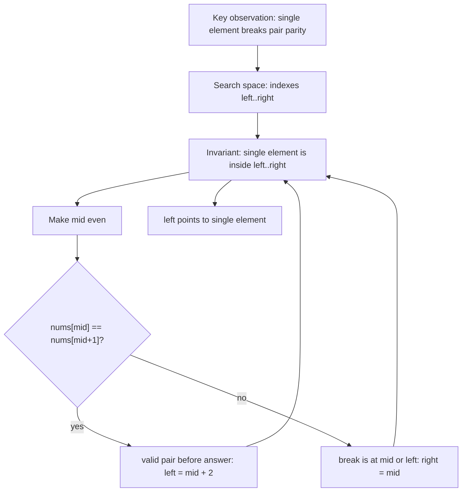
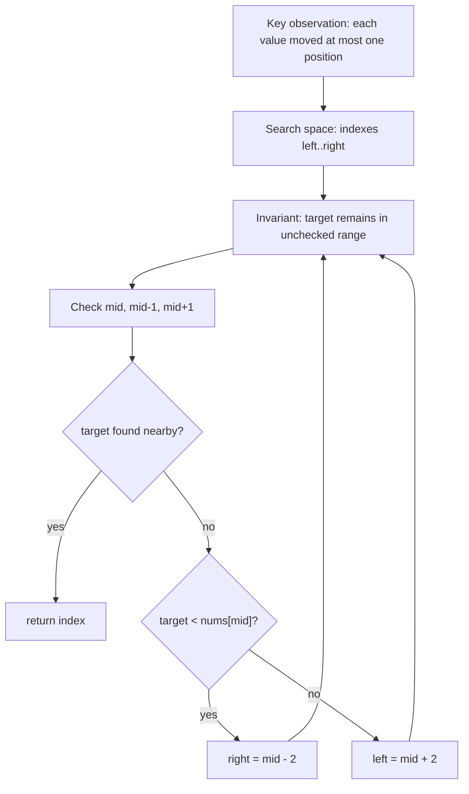

# LC 540 - Single Element in Sorted Array

TODO: Review final placement. Original category is Index Twist, which is not part of the requested Binary Search target folder list.

LeetCode Link: https://leetcode.com/problems/single-element-in-a-sorted-array/
Pattern: Binary Search
Category: Index Twist
Difficulty: Medium
Status:

## 1. Problem Statement

Given a sorted array where every element appears exactly twice except one element that appears once, return the single element.

## 2. Pattern Recognition

| Item | Notes |
| :--- | :--- |
| Clues | Sorted array, pairs, exactly one single element. |
| Category | Index Twist |
| Search Space | Index range `[0, n - 1]` |
| Monotonic Property | Before the single element, pairs start at even indexes; after it, pairs start at odd indexes. |
| Invariant | The single element always remains inside `[left, right]`. |

## 3. Brute Force Approach

- Scan the array and compare neighboring elements.
- Return the element that does not match its neighbor.

Why inefficient:

- It uses `O(n)` time.
- The sorted pair structure gives enough information to discard half the array.

## 4. Intuition Shift / Aha Moment

In a perfect paired array:

```text
index: 0 1 2 3 4 5
value: a a b b c c
```

Pairs start at even indexes. The single element breaks this alignment.

- If `mid` is made even and `nums[mid] == nums[mid + 1]`, the single element is after this pair.
- Otherwise, the single element is at `mid` or before it.

## 5. Optimized Algorithm

Steps:

1. Set `left = 0`, `right = n - 1`.
2. While `left < right`:
   - Compute `mid`.
   - If `mid` is odd, move it one step left so it points to the first index of a pair.
   - If `nums[mid] == nums[mid + 1]`, discard this valid pair and everything before it.
   - Else, keep the left half including `mid`.
3. Return `nums[left]`.

Pseudocode:

```text
left = 0
right = n - 1

while left < right:
    mid = left + (right - left) / 2
    if mid is odd:
        mid = mid - 1

    if nums[mid] == nums[mid + 1]:
        left = mid + 2
    else:
        right = mid

return nums[left]
```

## 6. Dry Run

Example:

```text
nums = [1, 1, 2, 3, 3, 4, 4]
```

| Step | left | right | mid | Check | Movement |
| :--- | :--- | :--- | :--- | :--- | :--- |
| 1 | 0 | 6 | 3 -> 2 | `nums[2] != nums[3]` | `right = 2` |
| 2 | 0 | 2 | 1 -> 0 | `nums[0] == nums[1]` | `left = 2` |
| End | 2 | 2 | - | single found | return `nums[2] = 2` |

## 7. Edge Cases

- Array has one element.
- Single element is at the beginning.
- Single element is at the end.
- Single element is in the middle.
- Always ensure `mid + 1` is valid by using `left < right`.

## 8. Complexity

| Type | Complexity | Reason |
| :--- | :--- | :--- |
| Time | `O(log n)` | Half the search space is removed each step. |
| Space | `O(1)` | Only pointers are used. |

## 9. C++ Code

```cpp
class Solution {
public:
    int singleNonDuplicate(vector<int>& nums) {
        int left = 0;
        int right = nums.size() - 1;

        while (left < right) {
            int mid = left + (right - left) / 2;

            if (mid % 2 == 1) {
                mid--;
            }

            if (nums[mid] == nums[mid + 1]) {
                left = mid + 2;
            } else {
                right = mid;
            }
        }

        return nums[left];
    }
};
```

## 10. Interview One-Liner

The single element shifts pair alignment, so checking whether an even index still starts a valid pair tells which half contains the answer.

## 11. Image / Visual Reference

TODO: Original note referenced missing image asset `Images/LC_540_Single_Element_In_Sorted_Array.png`. Keep this placeholder until the source image is available.


# Binary Search in Nearly Sorted Array

TODO: Review final placement. Original category is Index Twist, which is not part of the requested Binary Search target folder list.

LeetCode Link:
Pattern: Binary Search
Category: Index Twist
Difficulty:
Status:

## 1. Problem Statement

Given a nearly sorted array where each element may be at its correct sorted position, one position left, or one position right, find the index of a target value.

## 2. Pattern Recognition

| Item | Notes |
| :--- | :--- |
| Clues | Array is almost sorted, target may be near `mid`. |
| Category | Index Twist |
| Search Space | Index range `[0, n - 1]` |
| Monotonic Property | After checking `mid`, `mid - 1`, and `mid + 1`, values on one side can still be discarded using sorted order. |
| Invariant | If the target exists, it remains inside the unsearched range after the nearby positions are checked. |

## 3. Brute Force Approach

- Scan every index.
- Return the index where `arr[i] == target`.

Why inefficient:

- It ignores that the array is still mostly sorted.
- After checking the local neighborhood around `mid`, binary search can remove almost half the array.

## 4. Intuition Shift / Aha Moment

In a nearly sorted array, `target` may not be exactly at `mid`, but if it belongs near `mid`, it can only be at:

```text
mid - 1, mid, or mid + 1
```

Once those three positions are checked:

- If `target < arr[mid]`, it must be on the left side before `mid - 1`.
- If `target > arr[mid]`, it must be on the right side after `mid + 1`.

## 5. Optimized Algorithm

Steps:

1. Set `left = 0`, `right = n - 1`.
2. While `left <= right`:
   - Compute `mid`.
   - Check `arr[mid]`.
   - Check `arr[mid - 1]` if valid.
   - Check `arr[mid + 1]` if valid.
   - If `target < arr[mid]`, move `right = mid - 2`.
   - Else move `left = mid + 2`.
3. Return `-1` if not found.

Pseudocode:

```text
while left <= right:
    mid = left + (right - left) / 2

    check mid
    check mid - 1
    check mid + 1

    if target < arr[mid]:
        right = mid - 2
    else:
        left = mid + 2

return -1
```

## 6. Dry Run

Example:

```text
arr = [10, 3, 40, 20, 50, 80, 70]
target = 40
```

| Step | left | right | mid | Checks | Movement |
| :--- | :--- | :--- | :--- | :--- | :--- |
| 1 | 0 | 6 | 3 | `arr[3]=20`, `arr[2]=40` | found at `2` |

Answer: `2`

Another movement example:

```text
arr = [10, 3, 40, 20, 50, 80, 70], target = 70
```

| Step | left | right | mid | Checks | Movement |
| :--- | :--- | :--- | :--- | :--- | :--- |
| 1 | 0 | 6 | 3 | `20, 40, 50` | `target > arr[mid]`, so `left = 5` |
| 2 | 5 | 6 | 5 | `80, 70` | found at `6` |

## 7. Edge Cases

- Empty array.
- One element.
- Target at index `0`.
- Target at last index.
- Need boundary checks before accessing `mid - 1` or `mid + 1`.
- Target not present.

## 8. Complexity

| Type | Complexity | Reason |
| :--- | :--- | :--- |
| Time | `O(log n)` | Each step removes almost half the range. |
| Space | `O(1)` | Only pointers are used. |

## 9. C++ Code

```cpp
int searchNearlySorted(vector<int>& nums, int target) {
    int left = 0;
    int right = nums.size() - 1;

    while (left <= right) {
        int mid = left + (right - left) / 2;

        if (nums[mid] == target) {
            return mid;
        }

        if (mid - 1 >= left && nums[mid - 1] == target) {
            return mid - 1;
        }

        if (mid + 1 <= right && nums[mid + 1] == target) {
            return mid + 1;
        }

        if (target < nums[mid]) {
            right = mid - 2;
        } else {
            left = mid + 2;
        }
    }

    return -1;
}
```

## 10. Interview One-Liner

Because each value can move by at most one position, checking `mid` and its two neighbors restores the normal binary-search discard rule.

## 11. Image / Visual Reference

TODO: Original note referenced missing image asset `Images/Binary_Search_In_Nearly_Sorted_Array.png`. Keep this placeholder until the source image is available.
