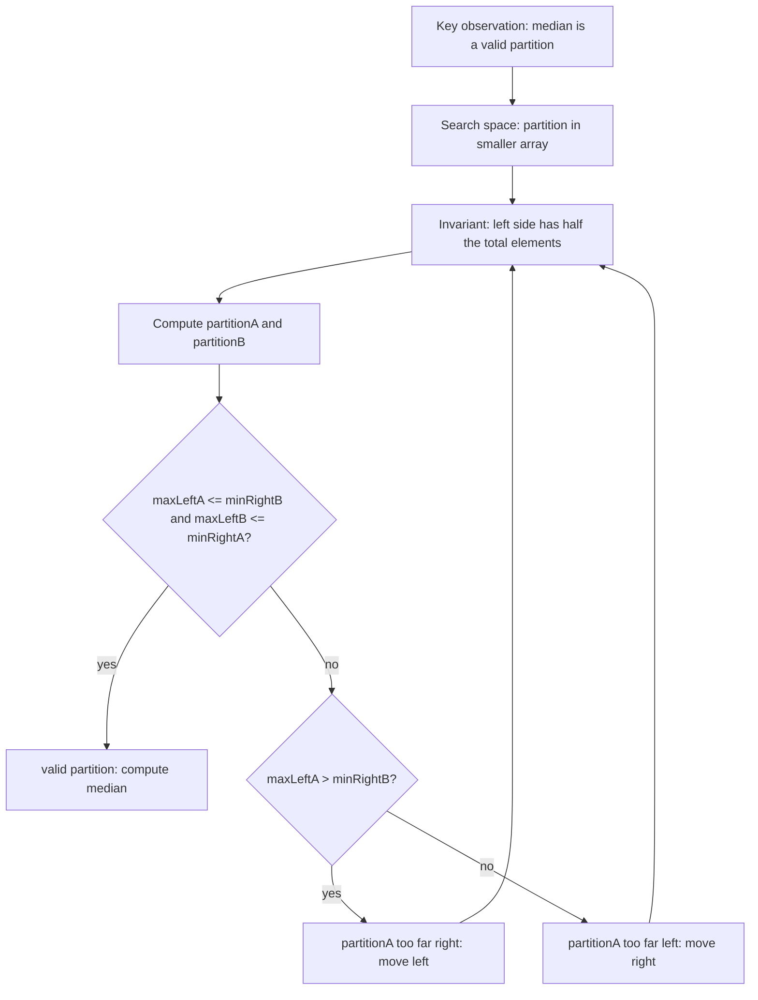

# LC 4 - Median of Two Sorted Arrays

TODO: Review final placement. Original category is Special Partition Search, not Binary Search on Answer in these notes.

LeetCode Link: https://leetcode.com/problems/median-of-two-sorted-arrays/
Pattern: Binary Search
Category: Binary Search on Partition
Difficulty: Hard
Status:

## 1. Problem Statement

Given two sorted arrays, find the median value of the combined sorted order without fully merging both arrays.

## 2. Pattern Recognition

| Item               | Notes                                                                                                   |
| :----------------- | :------------------------------------------------------------------------------------------------------ |
| Clues              | Two sorted arrays, median, required logarithmic time.                                                   |
| Category           | Binary Search on Partition                                                                              |
| Search Space       | Partition position in the smaller array                                                                 |
| Monotonic Property | If the left partition of array A is too large, move partition left; if too small, move partition right. |
| Invariant          | The correct partition keeps exactly half the elements on the left and satisfies `maxLeft <= minRight`.  |

## 3. Brute Force Approach

- Merge both arrays like merge sort.
- Find the middle element or average of two middle elements.

Why inefficient:

- Full merge takes `O(m + n)` time and extra space.
- Since both arrays are already sorted, we only need the correct partition, not the full merged array.

## 4. Intuition Shift / Aha Moment

Median splits the combined sorted array into two halves.

Instead of merging, choose a partition:

```text
left half size = (m + n + 1) / 2
```

For a valid partition:

```text
max(left side) <= min(right side)
```

Binary search only the smaller array's partition. The other array's partition is forced by the required left-half size.

## 5. Optimized Algorithm

Steps:

1. Always binary search the smaller array.
2. Let `partitionA` be the cut in array A.
3. Let `partitionB = halfSize - partitionA`.
4. Read boundary values:
   - `maxLeftA`
   - `minRightA`
   - `maxLeftB`
   - `minRightB`
5. If both left sides are `<=` both right sides, partition is valid.
6. If `maxLeftA > minRightB`, move partitionA left.
7. Else move partitionA right.

Pseudocode:

```text
if nums1 is larger:
    swap arrays

left = 0
right = size of smaller array
half = (m + n + 1) / 2

while left <= right:
    partitionA = midpoint
    partitionB = half - partitionA

    if valid partition:
        return median
    else if maxLeftA > minRightB:
        right = partitionA - 1
    else:
        left = partitionA + 1
```

## 6. Dry Run

Example:

```text
nums1 = [1, 3]
nums2 = [2]
```

Search smaller array:

```text
A = [2]
B = [1, 3]
total = 3
half = 2
```

| Step | left | right | partitionA | partitionB | Boundary Check                                                        | Movement                                |
| :--- | :--- | :---- | :--------- | :--------- | :-------------------------------------------------------------------- | :-------------------------------------- |
| 1    | 0    | 1     | 0          | 2          | `maxLeftB = 3 > minRightA = 2`                                        | A has too few left elements, move right |
| 2    | 1    | 1     | 1          | 1          | `maxLeftA = 2 <= minRightB = 3` and `maxLeftB = 1 <= minRightA = INF` | valid                                   |

Odd total length:

```text
median = max(maxLeftA, maxLeftB) = max(2, 1) = 2
```

## 7. Edge Cases

- One array is empty.
- Total length is odd.
- Total length is even.
- All elements of one array are smaller than the other.
- Duplicate values.
- Very different array sizes.
- Use sentinel values for empty partition sides.

## 8. Complexity

| Type  | Complexity          | Reason                                            |
| :---- | :------------------ | :------------------------------------------------ |
| Time  | `O(log(min(m, n)))` | Binary search only the smaller array's partition. |
| Space | `O(1)`              | No merged array is created.                       |

## 9. C++ Code

```cpp
class Solution {
public:
    double findMedianSortedArrays(vector<int>& nums1, vector<int>& nums2) {
        if (nums1.size() > nums2.size()) {
            return findMedianSortedArrays(nums2, nums1);
        }

        int m = nums1.size();
        int n = nums2.size();
        int left = 0;
        int right = m;
        int halfSize = (m + n + 1) / 2;

        while (left <= right) {
            int partitionA = left + (right - left) / 2;
            int partitionB = halfSize - partitionA;

            int maxLeftA = (partitionA == 0) ? INT_MIN : nums1[partitionA - 1];
            int minRightA = (partitionA == m) ? INT_MAX : nums1[partitionA];

            int maxLeftB = (partitionB == 0) ? INT_MIN : nums2[partitionB - 1];
            int minRightB = (partitionB == n) ? INT_MAX : nums2[partitionB];

            if (maxLeftA <= minRightB && maxLeftB <= minRightA) {
                if ((m + n) % 2 == 1) {
                    return max(maxLeftA, maxLeftB);
                }

                return (max(maxLeftA, maxLeftB) + min(minRightA, minRightB)) / 2.0;
            }

            if (maxLeftA > minRightB) {
                right = partitionA - 1;
            } else {
                left = partitionA + 1;
            }
        }

        return 0.0;
    }
};
```

## 10. Interview One-Liner

The median is found by binary searching a valid partition where every value on the combined left half is less than or equal to every value on the combined right half.

## 11. Image / Visual Reference

TODO: Original note referenced missing image asset `Images/LC_4_Median_Of_Two_Sorted_Arrays.png`. Keep this placeholder until the source image is available.


