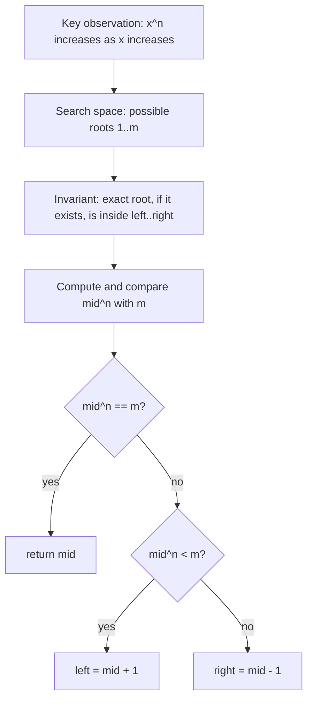
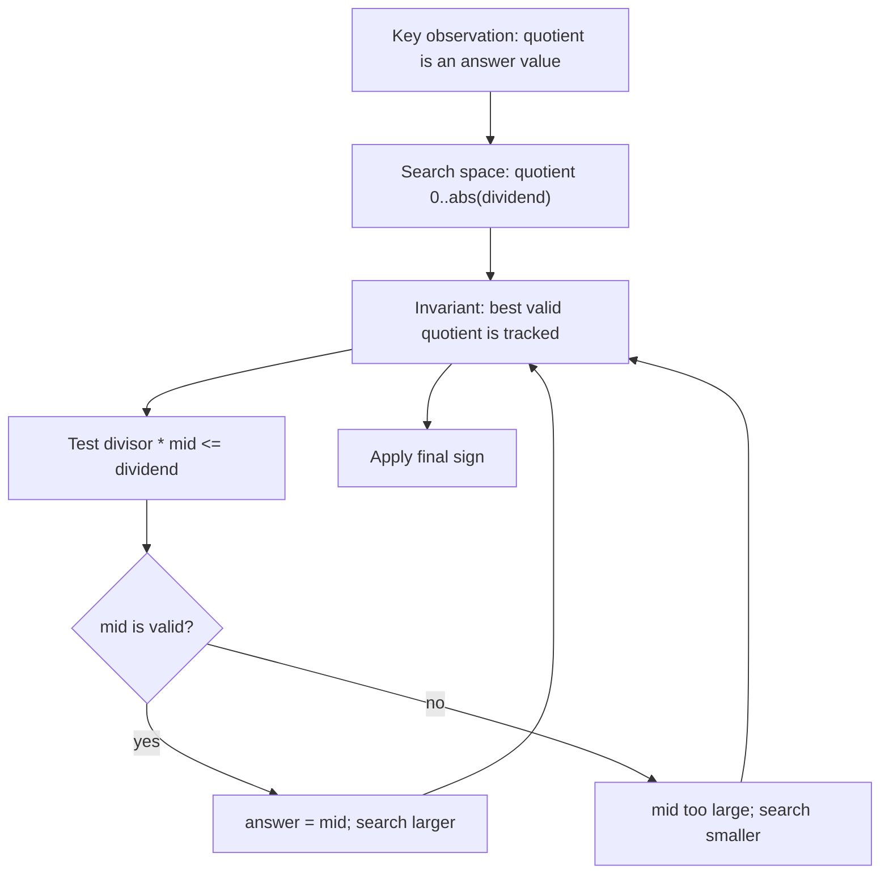
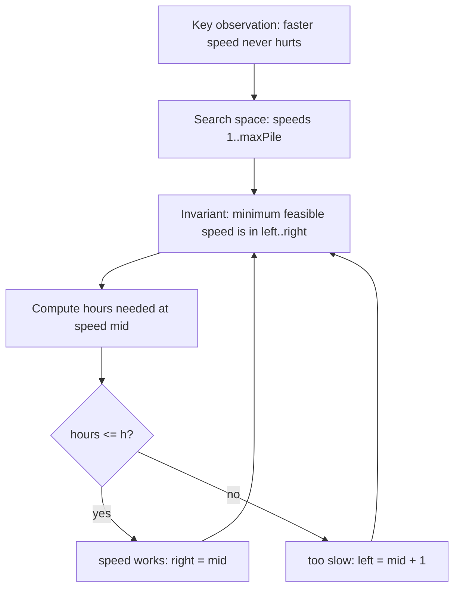
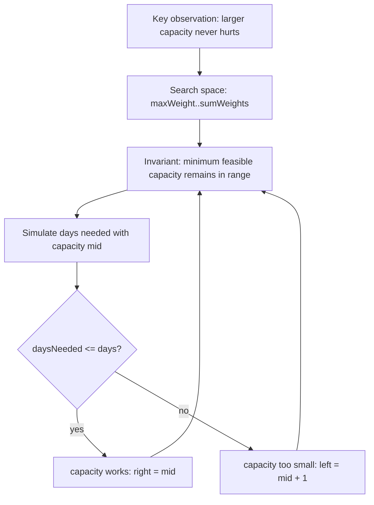
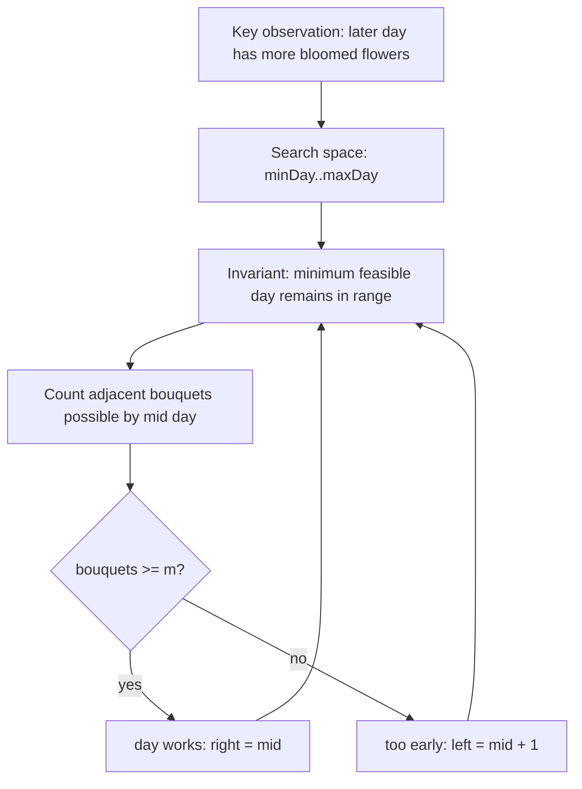
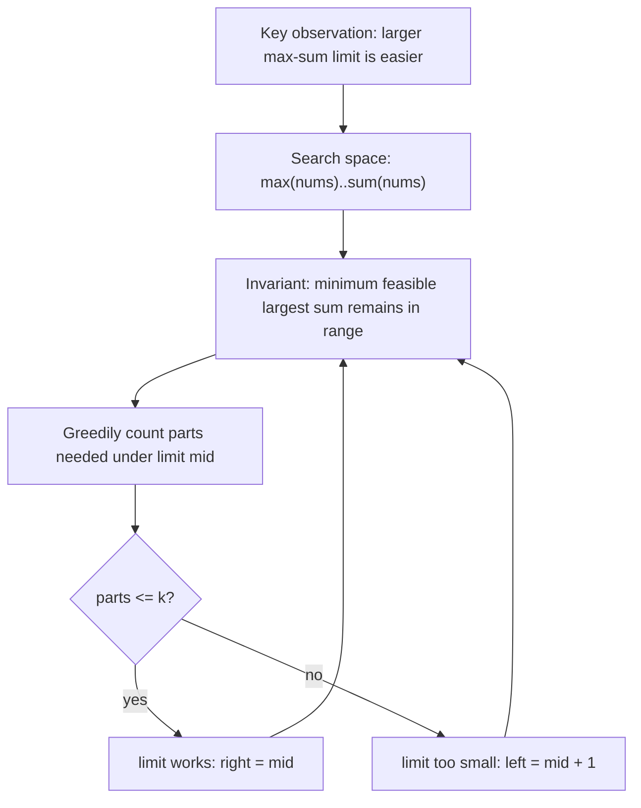
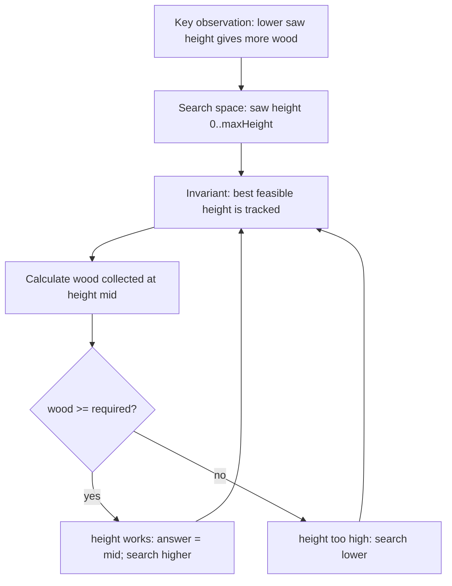
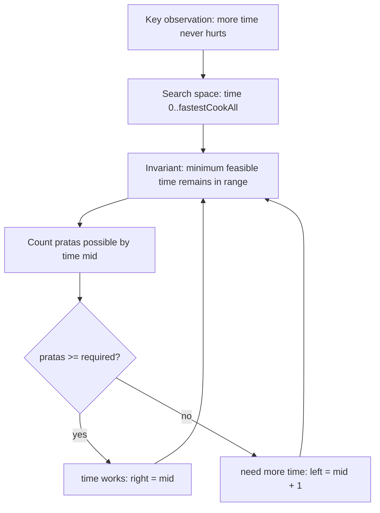

# Nth Root of Number

## Pattern

Binary Search / Binary Search on Answer

## Visual Intuition


LeetCode Link:
Pattern: Binary Search
Category: Binary Search On Answer
Difficulty:
Status:

## 1. Problem Statement

Given two numbers `n` and `m`, find the integer `n`th root of `m`. Return the root if an exact integer root exists; otherwise return `-1`.

## 2. Pattern Recognition

| Item | Notes |
| :--- | :--- |
| Clues | Need a value `x` such that `x^n == m`. |
| Category | Binary Search On Answer |
| Search Space | Possible root values `[1, m]` |
| Monotonic Property | As `x` increases, `x^n` also increases. |
| Invariant | If an exact root exists, it stays inside `[left, right]`. |

## 3. Brute Force Approach

- Try every number from `1` to `m`.
- Compute `x^n`.
- If it equals `m`, return `x`.

Why inefficient:

- It can take `O(m)` tries.
- The value `x^n` grows monotonically, so we can discard half the possible roots.

## Search Space Design

1. Actual answer being searched:
   - The integer root `x`.
   - We are asking: "Which number, when raised to power `n`, becomes `m`?"

2. Lower bound `low`:
   - `low = 1`.
   - The smallest useful positive root is `1`.
   - The answer cannot be smaller because positive integer roots do not go below `1` for positive `m`.

3. Upper bound `high`:
   - `high = m`.
   - `m` itself is always a safe upper limit because no positive integer root of `m` needs to be greater than `m`.
   - For example, if `m = 27`, checking roots beyond `27` is meaningless because `28^n` is already greater than `27`.

4. Why answer lies inside `[low, high]`:
   - If an integer root exists, it must be at least `1`.
   - It also cannot exceed `m`.
   - So every possible valid root lives inside `[1, m]`.

Search Space:

```text
[1 ------------------------ m]
 possible integer roots
```

### Bound Validation

- Could the answer ever be smaller than `low`?
  - No. A positive integer root smaller than `1` is not valid.
- Could the answer ever be larger than `high`?
  - No. Any number greater than `m` raised to a positive power will exceed `m`.

Real-world meaning:

- You are guessing the base/root.
- Small guesses produce smaller powers; large guesses produce larger powers.

## 4. Intuition Shift / Aha Moment

We are not searching an array. We are searching the answer value.

- If `mid^n == m`, `mid` is the answer.
- If `mid^n < m`, the root must be larger.
- If `mid^n > m`, the root must be smaller.

Use early stopping while multiplying to avoid overflow.

## 5. Optimized Algorithm

Steps:

1. Set `left = 1`, `right = m`.
2. While `left <= right`:
   - Compute `mid`.
   - Compare `mid^n` with `m`.
   - Return `mid` if equal.
   - Move right if too large.
   - Move left if too small.
3. Return `-1` if no exact integer root exists.

Pseudocode:

```text
left = 1
right = m

while left <= right:
    mid = left + (right - left) / 2
    result = comparePower(mid, n, m)

    if result == equal:
        return mid
    if result == too small:
        left = mid + 1
    else:
        right = mid - 1

return -1
```

## 6. Dry Run

Example:

```text
n = 3, m = 27
```

| Step | left | right | mid | mid^3 compared to 27 | Movement |
| :--- | :--- | :--- | :--- | :--- | :--- |
| 1 | 1 | 27 | 14 | too large | `right = 13` |
| 2 | 1 | 13 | 7 | too large | `right = 6` |
| 3 | 1 | 6 | 3 | equal | return `3` |

## 7. Edge Cases

- `m == 1`, answer is `1`.
- `n == 1`, answer is `m`.
- No exact root exists.
- Large `m`, avoid multiplication overflow.
- Root is `1`.

## 8. Complexity

| Type | Complexity | Reason |
| :--- | :--- | :--- |
| Time | `O(n * log m)` | Each binary-search check multiplies up to `n` times. |
| Space | `O(1)` | Only counters and pointers are used. |

## 9. C++ Code

```cpp
int comparePower(long long base, int power, long long target) {
    long long value = 1;

    for (int i = 0; i < power; i++) {
        value *= base;

        if (value > target) {
            return 1;
        }
    }

    if (value == target) {
        return 0;
    }

    return -1;
}

int nthRoot(int n, int m) {
    int left = 1;
    int right = m;

    while (left <= right) {
        int mid = left + (right - left) / 2;
        int comparison = comparePower(mid, n, m);

        if (comparison == 0) {
            return mid;
        }

        if (comparison < 0) {
            left = mid + 1;
        } else {
            right = mid - 1;
        }
    }

    return -1;
}
```

## 10. Interview One-Liner

Because `x^n` increases as `x` increases, the possible root values form a monotonic answer space.

## 11. Image / Visual Reference

TODO: Original note referenced missing image asset `Images/Nth_Root_Of_Number.png`. Keep this placeholder until the source image is available.


# Divide Two Numbers Using Binary Search

## Pattern

Binary Search / Binary Search on Answer

LeetCode Link:
Pattern: Binary Search
Category: Binary Search On Answer
Difficulty:
Status:

## 1. Problem Statement

Given a dividend and divisor, compute the integer quotient without using multiplication, division, or modulo in the main division logic.

## 2. Pattern Recognition

| Item | Notes |
| :--- | :--- |
| Clues | Need quotient, can test whether `divisor * mid <= dividend`. |
| Category | Binary Search On Answer |
| Search Space | Possible absolute quotient values `[0, abs(dividend)]` |
| Monotonic Property | If `divisor * mid <= dividend`, then all smaller quotients also work. |
| Invariant | The best valid quotient remains inside the current answer range. |

## 3. Brute Force Approach

- Repeatedly subtract divisor from dividend.
- Count how many times subtraction is possible.

Why inefficient:

- For large numbers, repeated subtraction can take `O(quotient)` time.
- The quotient is an ordered answer space, so binary search can find the largest valid quotient.

## Search Space Design

1. Actual answer being searched:
   - The absolute quotient.
   - We are asking: "What is the largest integer `q` such that `divisor * q <= dividend`?"

2. Lower bound `low`:
   - `low = 0`.
   - The smallest possible quotient is `0`, which happens when the dividend is smaller than the divisor.
   - The answer can never be smaller because integer division magnitude cannot be negative after converting both numbers to positive values.

3. Upper bound `high`:
   - `high = abs(dividend)`.
   - A quotient larger than the dividend magnitude is never needed when the divisor magnitude is at least `1`.
   - Example: `10 / 3` can never have quotient greater than `10`.

4. Why answer lies inside `[low, high]`:
   - The absolute quotient cannot go below `0`.
   - It cannot exceed the absolute dividend.
   - So the correct quotient magnitude must be inside this range.

Search Space:

```text
[0 ------------------------ abs(dividend)]
 possible quotient values
```

### Bound Validation

- Could the answer ever be smaller than `low`?
  - No. We search the positive quotient first, so the smallest magnitude is `0`.
- Could the answer ever be larger than `high`?
  - No. Dividing by a number with magnitude at least `1` cannot produce a quotient magnitude larger than the dividend magnitude.

Real-world meaning:

- You are guessing how many full times the divisor can fit into the dividend.
- If the guess fits, try a bigger guess; if it does not, try smaller.

## 4. Intuition Shift / Aha Moment

We can ask a yes/no question:

```text
Is divisor * mid <= dividend?
```

- If yes, `mid` is a possible quotient, but maybe we can go larger.
- If no, `mid` is too large, so go smaller.

This is a last-true binary search.

## 5. Optimized Algorithm

Steps:

1. Handle overflow case `INT_MIN / -1`.
2. Work with positive `long long` absolute values.
3. Binary search quotient from `0` to `abs(dividend)`.
4. If `divisor * mid <= dividend`, save `mid` and move right.
5. Else move left.
6. Apply the final sign.

Pseudocode:

```text
left = 0
right = abs(dividend)
answer = 0

while left <= right:
    mid = left + (right - left) / 2

    if divisor * mid <= dividend:
        answer = mid
        left = mid + 1
    else:
        right = mid - 1

apply sign
```

## 6. Dry Run

Example:

```text
dividend = 10, divisor = 3
```

| Step | left | right | mid | `3 * mid <= 10` | Movement |
| :--- | :--- | :--- | :--- | :--- | :--- |
| 1 | 0 | 10 | 5 | false | `right = 4` |
| 2 | 0 | 4 | 2 | true | `answer = 2`, `left = 3` |
| 3 | 3 | 4 | 3 | true | `answer = 3`, `left = 4` |
| 4 | 4 | 4 | 4 | false | `right = 3` |

Answer: `3`

## 7. Edge Cases

- Dividend is `0`.
- Divisor is `1` or `-1`.
- `INT_MIN / -1` overflows, return `INT_MAX`.
- Negative dividend or divisor.
- Both numbers negative.
- Large values, use `long long`.

## 8. Complexity

| Type | Complexity | Reason |
| :--- | :--- | :--- |
| Time | `O(log |dividend|)` | Binary search over quotient values. |
| Space | `O(1)` | Only pointer variables are used. |

## 9. C++ Code

```cpp
class Solution {
public:
    int divide(int dividend, int divisor) {
        if (dividend == INT_MIN && divisor == -1) {
            return INT_MAX;
        }

        long long positiveDividend = llabs((long long)dividend);
        long long positiveDivisor = llabs((long long)divisor);

        long long left = 0;
        long long right = positiveDividend;
        long long answer = 0;

        while (left <= right) {
            long long mid = left + (right - left) / 2;

            if (positiveDivisor * mid <= positiveDividend) {
                answer = mid;
                left = mid + 1;
            } else {
                right = mid - 1;
            }
        }

        bool isNegative = (dividend < 0) ^ (divisor < 0);
        if (isNegative) {
            answer = -answer;
        }

        return (int)answer;
    }
};
```

## 10. Interview One-Liner

The quotient is the largest number whose product with the divisor does not exceed the dividend, so binary search the quotient.

## 11. Image / Visual Reference

TODO: Original note referenced missing image asset `Images/Divide_Two_Numbers_Using_Binary_Search.png`. Keep this placeholder until the source image is available.


# LC 875 - Koko Eating Bananas

## Pattern

Binary Search / Binary Search on Answer

LeetCode Link: https://leetcode.com/problems/koko-eating-bananas/
Pattern: Binary Search
Category: Binary Search On Answer
Difficulty: Medium
Status:

## 1. Problem Statement

Koko has several banana piles and `h` hours. Find the minimum eating speed `k` bananas per hour so she can finish all piles within `h` hours.

## 2. Pattern Recognition

| Item | Notes |
| :--- | :--- |
| Clues | Minimum speed, finish within given hours, feasibility check. |
| Category | Binary Search On Answer |
| Search Space | Eating speeds `[1, max(piles)]` |
| Monotonic Property | If speed `k` works, any speed greater than `k` also works. |
| Invariant | The minimum feasible speed remains inside `[left, right]`. |

## 3. Brute Force Approach

- Try every speed from `1` to `max(piles)`.
- For each speed, compute total hours needed.
- Return the first speed that works.

Why inefficient:

- If pile values are large, testing every speed is too slow.
- Feasibility is monotonic, so binary search can skip many speeds.

## Search Space Design

1. Actual answer being searched:
   - Koko's eating speed `k`, measured in bananas per hour.
   - We are searching for the minimum speed that still finishes all piles within `h` hours.

2. Lower bound `low`:
   - `low = 1`.
   - Koko must eat at least one banana per hour for progress to happen.
   - A speed below `1` means she eats `0` bananas per hour, so she can never finish.

3. Upper bound `high`:
   - `high = max(piles)`.
   - If Koko can eat the largest pile in one hour, then every pile can be finished in at most one hour.
   - Eating faster than the largest pile gives no extra practical benefit because she cannot eat from two piles in the same hour.

4. Why answer lies inside `[low, high]`:
   - The answer must be at least `1` to make progress.
   - The answer never needs to exceed the largest pile.
   - Therefore the minimum valid speed must be inside this range.

Search Space:

```text
[1 ------------------------ max(piles)]
 slow speeds              fast speeds
```

### Bound Validation

- Could the answer ever be smaller than `low`?
  - No. A speed below `1` means no bananas are eaten per hour.
- Could the answer ever be larger than `high`?
  - No. Once Koko can finish the biggest pile in one hour, faster speeds do not reduce a pile below one hour.

Real-world meaning:

- `low` is the slowest speed that still means eating.
- `high` is the speed that is definitely enough for every individual pile.

## 4. Intuition Shift / Aha Moment

This is not searching in the pile array. It is searching the answer speed.

For a speed `mid`:

- If Koko can finish within `h`, try a smaller speed.
- If she cannot finish, speed is too slow, so go larger.

This is a minimum-feasible binary search.

## 5. Optimized Algorithm

Steps:

1. Set `left = 1`, `right = max(piles)`.
2. While `left < right`:
   - Let `mid` be the trial speed.
   - Compute hours needed using ceiling division.
   - If hours `<= h`, keep `mid` as possible and search smaller.
   - Else search larger.
3. Return `left`.

Pseudocode:

```text
left = 1
right = max(piles)

while left < right:
    speed = left + (right - left) / 2

    if canFinish(speed):
        right = speed
    else:
        left = speed + 1

return left
```

## 6. Dry Run

Example:

```text
piles = [3, 6, 7, 11], h = 8
```

| Step | left | right | mid speed | Hours Needed | Movement |
| :--- | :--- | :--- | :--- | :--- | :--- |
| 1 | 1 | 11 | 6 | `1+1+2+2 = 6` | works, `right = 6` |
| 2 | 1 | 6 | 3 | `1+2+3+4 = 10` | too slow, `left = 4` |
| 3 | 4 | 6 | 5 | `1+2+2+3 = 8` | works, `right = 5` |
| 4 | 4 | 5 | 4 | `1+2+2+3 = 8` | works, `right = 4` |
| End | 4 | 4 | - | - | return `4` |

## 7. Edge Cases

- Only one pile.
- `h == piles.size()`, speed must be at least max pile.
- Very large pile values.
- Use integer ceiling division: `(pile + speed - 1) / speed`.
- Total hours can be large, use `long long`.

## 8. Complexity

| Type | Complexity | Reason |
| :--- | :--- | :--- |
| Time | `O(n log maxPile)` | Each speed check scans all piles. |
| Space | `O(1)` | Only counters and pointers are used. |

## 9. C++ Code

```cpp
class Solution {
private:
    bool canFinish(vector<int>& piles, int hoursLimit, int speed) {
        long long hoursNeeded = 0;

        for (int pile : piles) {
            hoursNeeded += (pile + speed - 1) / speed;
        }

        return hoursNeeded <= hoursLimit;
    }

public:
    int minEatingSpeed(vector<int>& piles, int h) {
        int left = 1;
        int right = *max_element(piles.begin(), piles.end());

        while (left < right) {
            int mid = left + (right - left) / 2;

            if (canFinish(piles, h, mid)) {
                right = mid;
            } else {
                left = mid + 1;
            }
        }

        return left;
    }
};
```

## 10. Interview One-Liner

Eating speed is monotonic: once a speed can finish on time, every faster speed can also finish, so binary search the minimum feasible speed.

## 11. Image / Visual Reference

TODO: Original note referenced missing image asset `Images/LC_875_Koko_Eating_Bananas.png`. Keep this placeholder until the source image is available.


# LC 1011 - Capacity to Ship Packages Within D Days

## Pattern

Binary Search / Binary Search on Answer

LeetCode Link: https://leetcode.com/problems/capacity-to-ship-packages-within-d-days/
Pattern: Binary Search
Category: Binary Search On Answer
Difficulty: Medium
Status:

## 1. Problem Statement

Given package weights in order and a number of days, find the minimum ship capacity needed to ship all packages within that many days.

## 2. Pattern Recognition

| Item | Notes |
| :--- | :--- |
| Clues | Minimum capacity, finish within `D` days, order must be preserved. |
| Category | Binary Search On Answer |
| Search Space | Capacity range `[max(weights), sum(weights)]` |
| Monotonic Property | If a capacity works, any larger capacity also works. |
| Invariant | The minimum feasible capacity remains inside `[left, right]`. |

## 3. Brute Force Approach

- Try every capacity from `max(weights)` to `sum(weights)`.
- Simulate shipping packages for each capacity.
- Return the first capacity that finishes within `days`.

Why inefficient:

- The capacity range can be very large.
- Feasibility is monotonic, so testing every capacity wastes work.

## Search Space Design

1. Actual answer being searched:
   - Ship capacity.
   - We are searching for the minimum daily capacity that ships all packages within the given number of days.

2. Lower bound `low`:
   - `low = max(weights)`.
   - The ship must be able to carry the heaviest single package.
   - If capacity is smaller than the heaviest package, that package can never be shipped.

3. Upper bound `high`:
   - `high = sum(weights)`.
   - A ship with capacity equal to the total weight can carry everything in one day.
   - No answer needs to be larger because carrying all packages at once is already the maximum useful capacity.

4. Why answer lies inside `[low, high]`:
   - It cannot be below the heaviest package.
   - It does not need to exceed the total weight.
   - So the minimum feasible capacity must be somewhere between those two values.

Search Space:

```text
[max(weights) ------------------------ sum(weights)]
 barely fits one package              fits all packages in one day
```

### Bound Validation

- Could the answer ever be smaller than `low`?
  - No. The largest package would not fit on the ship.
- Could the answer ever be larger than `high`?
  - No. `sum(weights)` already ships everything in one day, so larger capacity is unnecessary.

Real-world meaning:

- `low` means the ship can at least carry every individual package.
- `high` means the ship can carry the entire conveyor in one trip.

## 4. Intuition Shift / Aha Moment

This is not about searching the package array. It is about searching the answer capacity.

- If capacity `mid` ships within `days`, try smaller capacity.
- If capacity `mid` needs too many days, capacity is too small, so go larger.

This is a minimum-feasible binary search.

## 5. Optimized Algorithm

Steps:

1. Set `left = max(weights)` because capacity must carry the heaviest package.
2. Set `right = sum(weights)` because one day can carry everything.
3. Binary search capacity.
4. For each `mid`, simulate how many days are needed.
5. If days needed `<= days`, move `right = mid`.
6. Else move `left = mid + 1`.

Pseudocode:

```text
left = max(weights)
right = sum(weights)

while left < right:
    capacity = left + (right - left) / 2

    if canShip(capacity):
        right = capacity
    else:
        left = capacity + 1

return left
```

## 6. Dry Run

Example:

```text
weights = [1,2,3,4,5,6,7,8,9,10], days = 5
```

| Step | left | right | mid capacity | Days Needed | Movement |
| :--- | :--- | :--- | :--- | :--- | :--- |
| 1 | 10 | 55 | 32 | 2 | works, `right = 32` |
| 2 | 10 | 32 | 21 | 3 | works, `right = 21` |
| 3 | 10 | 21 | 15 | 5 | works, `right = 15` |
| 4 | 10 | 15 | 12 | 6 | too small, `left = 13` |
| 5 | 13 | 15 | 14 | 6 | too small, `left = 15` |
| End | 15 | 15 | - | - | return `15` |

## 7. Edge Cases

- `days == 1`, capacity must be `sum(weights)`.
- `days == weights.size()`, capacity must be `max(weights)`.
- Very large sums, use safe integer types if constraints require.
- Package order cannot be changed.
- One package.

## 8. Complexity

| Type | Complexity | Reason |
| :--- | :--- | :--- |
| Time | `O(n log(sum - max))` | Each capacity check scans all weights. |
| Space | `O(1)` | Only counters and pointers are used. |

## 9. C++ Code

```cpp
class Solution {
private:
    bool canShip(vector<int>& weights, int daysLimit, int capacity) {
        int daysNeeded = 1;
        int currentLoad = 0;

        for (int weight : weights) {
            if (currentLoad + weight > capacity) {
                daysNeeded++;
                currentLoad = 0;
            }

            currentLoad += weight;
        }

        return daysNeeded <= daysLimit;
    }

public:
    int shipWithinDays(vector<int>& weights, int days) {
        int left = *max_element(weights.begin(), weights.end());
        int right = accumulate(weights.begin(), weights.end(), 0);

        while (left < right) {
            int mid = left + (right - left) / 2;

            if (canShip(weights, days, mid)) {
                right = mid;
            } else {
                left = mid + 1;
            }
        }

        return left;
    }
};
```

## 10. Interview One-Liner

Capacity is monotonic: once a ship capacity can finish within the deadline, every larger capacity can also finish.

## 11. Image / Visual Reference

TODO: Original note referenced missing image asset `Images/LC_1011_Capacity_To_Ship_Packages_Within_D_Days.png`. Keep this placeholder until the source image is available.


# LC 1482 - Minimum Days to Make Bouquets

## Pattern

Binary Search / Binary Search on Answer

LeetCode Link: https://leetcode.com/problems/minimum-number-of-days-to-make-m-bouquets/
Pattern: Binary Search
Category: Binary Search On Answer
Difficulty: Medium
Status:

## 1. Problem Statement

Given bloom days of flowers, make `m` bouquets using `k` adjacent bloomed flowers per bouquet. Return the minimum day needed, or `-1` if impossible.

## 2. Pattern Recognition

| Item | Notes |
| :--- | :--- |
| Clues | Minimum day, adjacent flowers, possible/impossible check. |
| Category | Binary Search On Answer |
| Search Space | Days from `min(bloomDay)` to `max(bloomDay)` |
| Monotonic Property | If bouquets can be made by day `x`, they can also be made by any later day. |
| Invariant | The minimum feasible day remains inside `[left, right]`. |

## 3. Brute Force Approach

- Try each day from minimum bloom day to maximum bloom day.
- For each day, scan flowers and count adjacent bloomed groups.
- Return the first day that can make `m` bouquets.

Why inefficient:

- The day range can be very large.
- Feasibility only changes from false to true once, so binary search is better.

## Search Space Design

1. Actual answer being searched:
   - The day number.
   - We are searching for the earliest day when enough adjacent flowers have bloomed to make all bouquets.

2. Lower bound `low`:
   - `low = min(bloomDay)`.
   - Before the earliest flower blooms, zero flowers are available.
   - The answer cannot be earlier because no bouquet can start before any flower has bloomed.

3. Upper bound `high`:
   - `high = max(bloomDay)`.
   - By the latest bloom day, every flower has bloomed.
   - If making bouquets is possible at all, this day is guaranteed to work.

4. Why answer lies inside `[low, high]`:
   - Before `min(bloomDay)`, there are no usable flowers.
   - After `max(bloomDay)`, all flowers are already available.
   - So the first feasible day must occur inside this range.

Search Space:

```text
[min(bloomDay) ------------------------ max(bloomDay)]
 first flower blooms                   all flowers bloomed
```

### Bound Validation

- Could the answer ever be smaller than `low`?
  - No. No flower has bloomed yet.
- Could the answer ever be larger than `high`?
  - No. If bouquets are possible, all flowers being bloomed is the strongest possible condition.

Real-world meaning:

- `low` is the first day any flower becomes usable.
- `high` is the day the garden is fully bloomed.

## 4. Intuition Shift / Aha Moment

Ask:

```text
Can I make m bouquets by day mid?
```

- If yes, try an earlier day.
- If no, need more flowers to bloom, so try a later day.

This is a first-true search over days.

## 5. Optimized Algorithm

Steps:

1. If `m * k > bloomDay.size()`, return `-1`.
2. Set `left = min(bloomDay)`, `right = max(bloomDay)`.
3. Binary search day.
4. For each day, scan the array:
   - Count consecutive flowers with `bloomDay[i] <= day`.
   - Every time count reaches `k`, form one bouquet and reset count.
5. If enough bouquets are possible, move left.
6. Else move right.

Pseudocode:

```text
if m * k > n:
    return -1

while left < right:
    day = left + (right - left) / 2

    if canMake(day):
        right = day
    else:
        left = day + 1

return left
```

## 6. Dry Run

Example:

```text
bloomDay = [1, 10, 3, 10, 2], m = 3, k = 1
```

| Step | left | right | mid day | Bouquets Possible | Movement |
| :--- | :--- | :--- | :--- | :--- | :--- |
| 1 | 1 | 10 | 5 | 3 | works, `right = 5` |
| 2 | 1 | 5 | 3 | 3 | works, `right = 3` |
| 3 | 1 | 3 | 2 | 2 | not enough, `left = 3` |
| End | 3 | 3 | - | - | return `3` |

## 7. Edge Cases

- Impossible when `m * k > n`.
- `k == 1`, only count bloomed flowers.
- Adjacent requirement breaks bouquet streaks.
- All flowers bloom same day.
- Large `m * k`, use `long long` for the impossibility check.

## 8. Complexity

| Type | Complexity | Reason |
| :--- | :--- | :--- |
| Time | `O(n log(maxDay - minDay))` | Each day check scans all flowers. |
| Space | `O(1)` | Only counters and pointers are used. |

## 9. C++ Code

```cpp
class Solution {
private:
    bool canMakeBouquets(vector<int>& bloomDay, int day, int bouquetsNeeded, int flowersPerBouquet) {
        int bouquets = 0;
        int consecutiveFlowers = 0;

        for (int bloom : bloomDay) {
            if (bloom <= day) {
                consecutiveFlowers++;

                if (consecutiveFlowers == flowersPerBouquet) {
                    bouquets++;
                    consecutiveFlowers = 0;
                }
            } else {
                consecutiveFlowers = 0;
            }
        }

        return bouquets >= bouquetsNeeded;
    }

public:
    int minDays(vector<int>& bloomDay, int m, int k) {
        if ((long long)m * k > bloomDay.size()) {
            return -1;
        }

        int left = *min_element(bloomDay.begin(), bloomDay.end());
        int right = *max_element(bloomDay.begin(), bloomDay.end());

        while (left < right) {
            int mid = left + (right - left) / 2;

            if (canMakeBouquets(bloomDay, mid, m, k)) {
                right = mid;
            } else {
                left = mid + 1;
            }
        }

        return left;
    }
};
```

## 10. Interview One-Liner

Day is monotonic: once enough adjacent flowers have bloomed by a day, every later day also works.

## 11. Image / Visual Reference

TODO: Original note referenced missing image asset `Images/LC_1482_Minimum_Days_To_Make_Bouquets.png`. Keep this placeholder until the source image is available.


# LC 1552 - Aggressive Cows / Magnetic Force

## Pattern

Binary Search / Binary Search on Answer

LeetCode Link: https://leetcode.com/problems/magnetic-force-between-two-balls/
Pattern: Binary Search
Category: Binary Search On Answer
Difficulty: Medium
Status:

## 1. Problem Statement

Given basket positions and `m` balls, place the balls so the minimum distance between any two balls is as large as possible.

## 2. Pattern Recognition

| Item | Notes |
| :--- | :--- |
| Clues | Maximize minimum distance, placement feasibility. |
| Category | Binary Search On Answer |
| Search Space | Distances from `1` to `max(position) - min(position)` |
| Monotonic Property | If distance `d` is possible, every smaller distance is also possible. |
| Invariant | The maximum feasible distance remains tracked while searching `[left, right]`. |

## 3. Brute Force Approach

- Try every possible distance.
- For each distance, greedily check if `m` balls can be placed.
- Keep the largest distance that works.

Why inefficient:

- The distance range can be large.
- Feasibility is monotonic, so binary search can find the largest working distance faster.

## Search Space Design

1. Actual answer being searched:
   - The minimum distance between any two placed balls.
   - We are searching for the largest distance that still allows placing all balls.

2. Lower bound `low`:
   - `low = 1`.
   - Positions are integer coordinates, so the smallest meaningful positive separation is `1`.
   - A distance below `1` does not represent a useful positive gap.

3. Upper bound `high`:
   - `high = max(position) - min(position)`.
   - The farthest any two balls can be apart is the distance between the first and last basket.
   - The minimum pair distance cannot be larger than the entire available range.

4. Why answer lies inside `[low, high]`:
   - We need a positive distance, so it starts at `1`.
   - No placement can force every pair to be farther apart than the full basket span.
   - So the best minimum distance lies inside this range.

Search Space:

```text
[1 ------------------------ max(position)-min(position)]
 tight placement           full basket span
```

### Bound Validation

- Could the answer ever be smaller than `low`?
  - No. We are maximizing a positive distance between different basket positions.
- Could the answer ever be larger than `high`?
  - No. Two balls cannot be farther apart than the leftmost and rightmost baskets.

Real-world meaning:

- `low` means balls are barely separated.
- `high` means using the entire line of baskets as the maximum possible spread.

## 4. Intuition Shift / Aha Moment

Ask:

```text
Can I place all balls with at least mid distance apart?
```

- If yes, try a larger distance.
- If no, distance is too ambitious, so try smaller.

This is a max-feasible binary search.

## 5. Optimized Algorithm

Steps:

1. Sort positions.
2. Set `left = 1`, `right = last - first`.
3. Binary search distance.
4. Feasibility check:
   - Place first ball at first position.
   - Greedily place next ball whenever distance from last placed ball is at least `mid`.
5. If possible, save answer and search larger.
6. Else search smaller.

Pseudocode:

```text
sort(position)
left = 1
right = position[n - 1] - position[0]
answer = 0

while left <= right:
    distance = left + (right - left) / 2

    if canPlace(distance):
        answer = distance
        left = distance + 1
    else:
        right = distance - 1

return answer
```

## 6. Dry Run

Example:

```text
position = [1, 2, 3, 4, 7], m = 3
```

| Step | left | right | mid distance | Can Place? | Movement |
| :--- | :--- | :--- | :--- | :--- | :--- |
| 1 | 1 | 6 | 3 | yes: place `1,4,7` | `answer = 3`, `left = 4` |
| 2 | 4 | 6 | 5 | no | `right = 4` |
| 3 | 4 | 4 | 4 | no | `right = 3` |
| End | 4 | 3 | - | - | return `3` |

## 7. Edge Cases

- `m == 2`, answer can be full range.
- Positions are unsorted.
- Duplicate-like close positions.
- Very large coordinates.
- Need largest feasible value, not smallest feasible value.

## 8. Complexity

| Type | Complexity | Reason |
| :--- | :--- | :--- |
| Time | `O(n log n + n log range)` | Sort plus feasibility checks. |
| Space | `O(1)` extra | Sorting may use implementation-dependent stack space. |

## 9. C++ Code

```cpp
class Solution {
private:
    bool canPlace(vector<int>& position, int ballsNeeded, int distance) {
        int ballsPlaced = 1;
        int lastPosition = position[0];

        for (int i = 1; i < position.size(); i++) {
            if (position[i] - lastPosition >= distance) {
                ballsPlaced++;
                lastPosition = position[i];
            }
        }

        return ballsPlaced >= ballsNeeded;
    }

public:
    int maxDistance(vector<int>& position, int m) {
        sort(position.begin(), position.end());

        int left = 1;
        int right = position.back() - position.front();
        int answer = 0;

        while (left <= right) {
            int mid = left + (right - left) / 2;

            if (canPlace(position, m, mid)) {
                answer = mid;
                left = mid + 1;
            } else {
                right = mid - 1;
            }
        }

        return answer;
    }
};
```

## 10. Interview One-Liner

The minimum distance is monotonic in reverse: if a distance is placeable, every smaller distance is also placeable, so binary search the largest feasible distance.

## 11. Image / Visual Reference

TODO: Original note referenced missing image asset `Images/LC_1552_Aggressive_Cows_Magnetic_Force.png`. Keep this placeholder until the source image is available.


# LC 410 - Split Array Largest Sum

## Pattern

Binary Search / Binary Search on Answer

LeetCode Link: https://leetcode.com/problems/split-array-largest-sum/
Pattern: Binary Search
Category: Binary Search On Answer
Difficulty: Hard
Status:

## 1. Problem Statement

Given an array and an integer `k`, split the array into `k` non-empty continuous parts so that the largest part sum is as small as possible.

## 2. Pattern Recognition

| Item | Notes |
| :--- | :--- |
| Clues | Minimize the largest subarray sum, continuous splits, fixed number of parts. |
| Category | Binary Search On Answer |
| Search Space | Largest allowed sum from `max(nums)` to `sum(nums)` |
| Monotonic Property | If max sum limit `x` works, any larger limit also works. |
| Invariant | The minimum feasible largest sum remains inside `[left, right]`. |

## 3. Brute Force Approach

- Try all possible ways to split the array into `k` parts.
- Compute the largest subarray sum for each split.
- Return the minimum among those largest sums.

Why inefficient:

- Number of split combinations grows quickly.
- A candidate maximum sum can be checked greedily in linear time, so binary search the answer instead.

## Search Space Design

1. Actual answer being searched:
   - The largest allowed subarray sum.
   - We are searching for the smallest possible value of the maximum part sum after splitting.

2. Lower bound `low`:
   - `low = max(nums)`.
   - Every number must belong to some subarray.
   - If the allowed largest sum is smaller than the biggest single number, that number cannot fit anywhere.

3. Upper bound `high`:
   - `high = sum(nums)`.
   - If we make only one subarray, its sum is the total array sum.
   - No largest-subarray-sum answer needs to exceed the total sum.

4. Why answer lies inside `[low, high]`:
   - It must be large enough to contain the biggest element.
   - It cannot be larger than putting everything into one group.
   - So the minimum possible maximum sum is inside this range.

Search Space:

```text
[max(nums) ------------------------ sum(nums)]
 smallest possible limit           one group contains everything
```

### Bound Validation

- Could the answer ever be smaller than `low`?
  - No. The largest element must fit in one subarray.
- Could the answer ever be larger than `high`?
  - No. The sum of the entire array is already a valid upper limit.

Real-world meaning:

- `low` is the smallest load limit that can hold every individual item.
- `high` is the load if no meaningful splitting happened.

## 4. Intuition Shift / Aha Moment

Ask:

```text
Can I split the array into at most k parts if no part sum exceeds mid?
```

- If yes, `mid` is a possible largest sum, so try smaller.
- If no, `mid` is too small, so increase it.

This is a minimum-feasible binary search.

## 5. Optimized Algorithm

Steps:

1. Set `left = max(nums)`, because one part must contain the largest element.
2. Set `right = sum(nums)`, because one part can contain everything.
3. Binary search the largest allowed subarray sum.
4. For each `mid`, greedily count how many subarrays are needed.
5. If needed subarrays `<= k`, reduce the limit.
6. Otherwise, increase the limit.

Pseudocode:

```text
left = max(nums)
right = sum(nums)

while left < right:
    limit = left + (right - left) / 2

    if canSplit(limit):
        right = limit
    else:
        left = limit + 1

return left
```

## 6. Dry Run

Example:

```text
nums = [7, 2, 5, 10, 8], k = 2
```

| Step | left | right | mid limit | Parts Needed | Movement |
| :--- | :--- | :--- | :--- | :--- | :--- |
| 1 | 10 | 32 | 21 | 2 | works, `right = 21` |
| 2 | 10 | 21 | 15 | 3 | too small, `left = 16` |
| 3 | 16 | 21 | 18 | 2 | works, `right = 18` |
| 4 | 16 | 18 | 17 | 3 | too small, `left = 18` |
| End | 18 | 18 | - | - | return `18` |

## 7. Edge Cases

- `k == 1`, answer is `sum(nums)`.
- `k == nums.size()`, answer is `max(nums)`.
- Large sums, use `long long` internally if constraints require.
- Continuous subarrays only; cannot reorder elements.
- Every subarray must be non-empty.

## 8. Complexity

| Type | Complexity | Reason |
| :--- | :--- | :--- |
| Time | `O(n log(sum - max))` | Each feasibility check scans the array. |
| Space | `O(1)` | Only counters and pointers are used. |

## 9. C++ Code

```cpp
class Solution {
private:
    bool canSplit(vector<int>& nums, int k, int maxAllowedSum) {
        int parts = 1;
        int currentSum = 0;

        for (int value : nums) {
            if (currentSum + value > maxAllowedSum) {
                parts++;
                currentSum = 0;
            }

            currentSum += value;
        }

        return parts <= k;
    }

public:
    int splitArray(vector<int>& nums, int k) {
        int left = *max_element(nums.begin(), nums.end());
        int right = accumulate(nums.begin(), nums.end(), 0);

        while (left < right) {
            int mid = left + (right - left) / 2;

            if (canSplit(nums, k, mid)) {
                right = mid;
            } else {
                left = mid + 1;
            }
        }

        return left;
    }
};
```

## 10. Interview One-Liner

Binary search the largest allowed subarray sum, because if a limit can split the array into at most `k` parts, every larger limit can also work.

## 11. Image / Visual Reference

TODO: Original note referenced missing image asset `Images/LC_410_Split_Array_Largest_Sum.png`. Keep this placeholder until the source image is available.


# EKO SPOJ

## Pattern

Binary Search / Binary Search on Answer

LeetCode Link:
Pattern: Binary Search
Category: Binary Search On Answer
Difficulty:
Status:

## 1. Problem Statement

Given tree heights and required wood amount `M`, choose the maximum saw height so that cutting all trees taller than that height gives at least `M` wood.

## 2. Pattern Recognition

| Item | Notes |
| :--- | :--- |
| Clues | Maximum cutting height, collect at least required wood. |
| Category | Binary Search On Answer |
| Search Space | Saw heights from `0` to `max(height)` |
| Monotonic Property | If a height gives enough wood, any smaller height also gives enough wood. |
| Invariant | The best feasible saw height is preserved while searching. |

## 3. Brute Force Approach

- Try every possible saw height from `0` to maximum tree height.
- Compute wood collected for each height.
- Keep the largest height that gives enough wood.

Why inefficient:

- Tree heights can be very large.
- Feasibility is monotonic, so binary search can skip most heights.

## Search Space Design

1. Actual answer being searched:
   - Saw height.
   - We are searching for the maximum height at which the saw can be set while still collecting enough wood.

2. Lower bound `low`:
   - `low = 0`.
   - Cutting at ground level is the lowest possible saw setting.
   - The answer cannot be smaller because negative saw height has no real meaning.

3. Upper bound `high`:
   - `high = max(heights)`.
   - Setting the saw above the tallest tree collects no wood.
   - The best useful height never needs to exceed the tallest tree.

4. Why answer lies inside `[low, high]`:
   - The saw height cannot go below ground level.
   - It does not need to go above the tallest tree.
   - So the maximum feasible saw height must be inside this range.

Search Space:

```text
[0 ------------------------ max(tree height)]
 cut everything low        cut almost nothing high
```

### Bound Validation

- Could the answer ever be smaller than `low`?
  - No. A negative saw height is not meaningful.
- Could the answer ever be larger than `high`?
  - No. Above the tallest tree, no wood is collected, so it cannot improve the answer.

Real-world meaning:

- `low` means placing the saw at the ground and collecting maximum wood.
- `high` means placing the saw at the tallest tree height and collecting almost no wood.

## 4. Intuition Shift / Aha Moment

Higher saw height means less wood.

- If `mid` gives enough wood, try a higher saw height to waste less tree.
- If `mid` does not give enough wood, lower the saw.

This is a maximum-feasible binary search.

## 5. Optimized Algorithm

Steps:

1. Set `left = 0`, `right = max(heights)`.
2. Binary search the saw height.
3. For each `mid`, calculate total wood from trees taller than `mid`.
4. If wood `>= required`, save `mid` and search higher.
5. Else search lower.

Pseudocode:

```text
left = 0
right = maxHeight
answer = 0

while left <= right:
    height = left + (right - left) / 2

    if woodCollected(height) >= required:
        answer = height
        left = height + 1
    else:
        right = height - 1

return answer
```

## 6. Dry Run

Example:

```text
heights = [20, 15, 10, 17], required = 7
```

| Step | left | right | mid height | Wood Collected | Movement |
| :--- | :--- | :--- | :--- | :--- | :--- |
| 1 | 0 | 20 | 10 | 22 | enough, `answer = 10`, `left = 11` |
| 2 | 11 | 20 | 15 | 7 | enough, `answer = 15`, `left = 16` |
| 3 | 16 | 20 | 18 | 2 | not enough, `right = 17` |
| 4 | 16 | 17 | 16 | 5 | not enough, `right = 15` |
| End | 16 | 15 | - | - | return `15` |

## 7. Edge Cases

- Required wood is `0`.
- All trees have same height.
- Required wood is only possible with height `0`.
- Large heights and wood sums, use `long long`.
- Need maximum feasible height, not minimum feasible height.

## 8. Complexity

| Type | Complexity | Reason |
| :--- | :--- | :--- |
| Time | `O(n log maxHeight)` | Each height check scans all trees. |
| Space | `O(1)` | Only counters and pointers are used. |

## 9. C++ Code

```cpp
long long woodCollected(vector<int>& heights, int sawHeight) {
    long long wood = 0;

    for (int height : heights) {
        if (height > sawHeight) {
            wood += height - sawHeight;
        }
    }

    return wood;
}

int maxSawHeight(vector<int>& heights, int requiredWood) {
    int left = 0;
    int right = *max_element(heights.begin(), heights.end());
    int answer = 0;

    while (left <= right) {
        int mid = left + (right - left) / 2;

        if (woodCollected(heights, mid) >= requiredWood) {
            answer = mid;
            left = mid + 1;
        } else {
            right = mid - 1;
        }
    }

    return answer;
}
```

## 10. Interview One-Liner

Saw height is reverse-monotonic: if a height gives enough wood, every lower height also works, so search the highest working height.

## 11. Image / Visual Reference

TODO: Original note referenced missing image asset `Images/EKO_SPOJ.png`. Keep this placeholder until the source image is available.


# PRATA SPOJ

## Pattern

Binary Search / Binary Search on Answer

LeetCode Link:
Pattern: Binary Search
Category: Binary Search On Answer
Difficulty:
Status:

## 1. Problem Statement

Given cooks with different ranks and a required number of pratas, find the minimum time needed to cook all pratas.

## 2. Pattern Recognition

| Item | Notes |
| :--- | :--- |
| Clues | Minimum time, multiple cooks, feasibility check. |
| Category | Binary Search On Answer |
| Search Space | Time from `0` to time taken by fastest cook to make all pratas alone |
| Monotonic Property | If all pratas can be cooked by time `t`, they can also be cooked by any larger time. |
| Invariant | The minimum feasible time remains inside `[left, right]`. |

## 3. Brute Force Approach

- Try time from `0` upward.
- For each time, count how many pratas all cooks can make.
- Return the first time that reaches the requirement.

Why inefficient:

- Time can be very large.
- The ability to cook enough pratas is monotonic, so binary search is natural.

## Search Space Design

1. Actual answer being searched:
   - Time.
   - We are searching for the minimum time needed for all cooks together to make the required pratas.

2. Lower bound `low`:
   - `low = 0`.
   - Time cannot be negative.
   - Starting at `0` means no cooking time has passed yet.

3. Upper bound `high`:
   - `high = fastestRank * P * (P + 1) / 2`.
   - This is the time for the fastest cook to make all `P` pratas alone.
   - Since one cook alone can finish by this time, all cooks together can definitely finish by this time or earlier.

4. Why answer lies inside `[low, high]`:
   - The answer cannot be negative.
   - The fastest cook alone gives a guaranteed working time.
   - So the minimum feasible time must lie inside this range.

Search Space:

```text
[0 ------------------------ fastest cook makes all pratas alone]
 no time passed            guaranteed enough time
```

### Bound Validation

- Could the answer ever be smaller than `low`?
  - No. Negative cooking time is impossible.
- Could the answer ever be larger than `high`?
  - No. If the fastest cook alone can finish by `high`, using all cooks cannot require more time.

Real-world meaning:

- `low` is the start of cooking.
- `high` is a safe deadline where even the fastest single cook can complete the full order.

## 4. Intuition Shift / Aha Moment

Ask:

```text
Can all cooks together make at least P pratas within mid time?
```

- If yes, try less time.
- If no, need more time.

This is a minimum-feasible time search.

## 5. Optimized Algorithm

Steps:

1. Sort ranks or find the minimum rank for a tight upper bound.
2. Set `left = 0`.
3. Set `right = minRank * P * (P + 1) / 2`.
4. Binary search time.
5. For each cook, count how many pratas they can make within `mid`.
6. If total pratas `>= P`, search smaller time.
7. Else search larger time.

Pseudocode:

```text
left = 0
right = fastestCookTimeForAllPratas

while left < right:
    time = left + (right - left) / 2

    if canCook(time):
        right = time
    else:
        left = time + 1

return left
```

## 6. Dry Run

Example:

```text
pratas = 4
ranks = [1, 2]
```

Cook rank `1` takes `1, 2, 3, ...` minutes per prata.
Cook rank `2` takes `2, 4, 6, ...` minutes per prata.

| Step | left | right | mid time | Pratas Possible | Movement |
| :--- | :--- | :--- | :--- | :--- | :--- |
| 1 | 0 | 10 | 5 | 3 | not enough, `left = 6` |
| 2 | 6 | 10 | 8 | 4 | works, `right = 8` |
| 3 | 6 | 8 | 7 | 4 | works, `right = 7` |
| 4 | 6 | 7 | 6 | 4 | works, `right = 6` |
| End | 6 | 6 | - | - | return `6` |

## 7. Edge Cases

- Only one cook.
- Only one prata.
- Many cooks with the same rank.
- Large time values, use `long long`.
- Stop counting early once required pratas are reached.

## 8. Complexity

| Type | Complexity | Reason |
| :--- | :--- | :--- |
| Time | `O(cooks * sqrt(P) * log answer)` with simple counting | For each time check, count pratas per cook until limit. |
| Space | `O(1)` | Only counters and pointers are used. |

## 9. C++ Code

```cpp
bool canCookPratas(vector<int>& ranks, int requiredPratas, long long timeLimit) {
    int totalPratas = 0;

    for (int rank : ranks) {
        long long timeSpent = 0;
        int nextPrata = 1;

        while (timeSpent + (long long)rank * nextPrata <= timeLimit) {
            timeSpent += (long long)rank * nextPrata;
            totalPratas++;
            nextPrata++;

            if (totalPratas >= requiredPratas) {
                return true;
            }
        }
    }

    return false;
}

long long minimumPrataTime(vector<int>& ranks, int requiredPratas) {
    int minRank = *min_element(ranks.begin(), ranks.end());
    long long left = 0;
    long long right = (long long)minRank * requiredPratas * (requiredPratas + 1) / 2;

    while (left < right) {
        long long mid = left + (right - left) / 2;

        if (canCookPratas(ranks, requiredPratas, mid)) {
            right = mid;
        } else {
            left = mid + 1;
        }
    }

    return left;
}
```

## 10. Interview One-Liner

Time is monotonic: once cooks can make enough pratas by a certain time, every larger time also works, so binary search the minimum time.

## 11. Image / Visual Reference

TODO: Original note referenced missing image asset `Images/PRATA_SPOJ.png`. Keep this placeholder until the source image is available.
