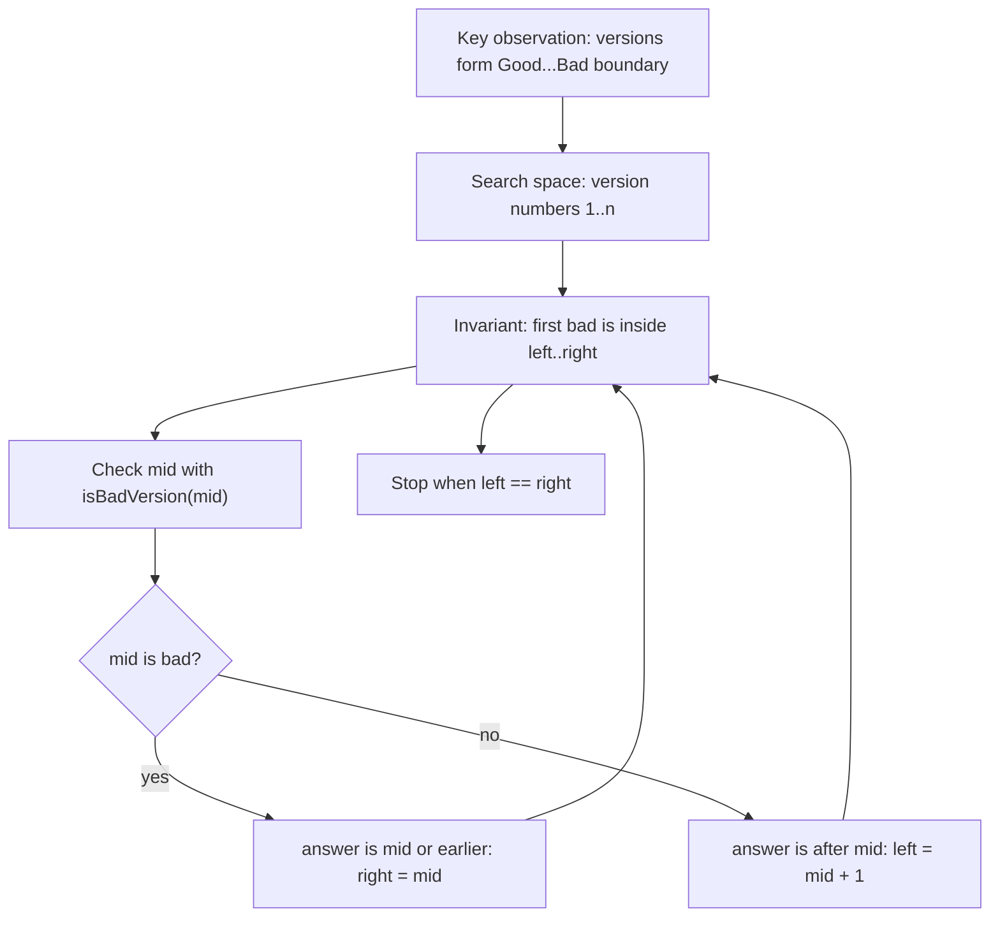
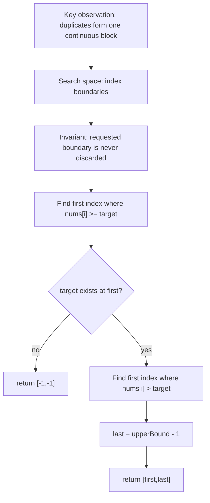
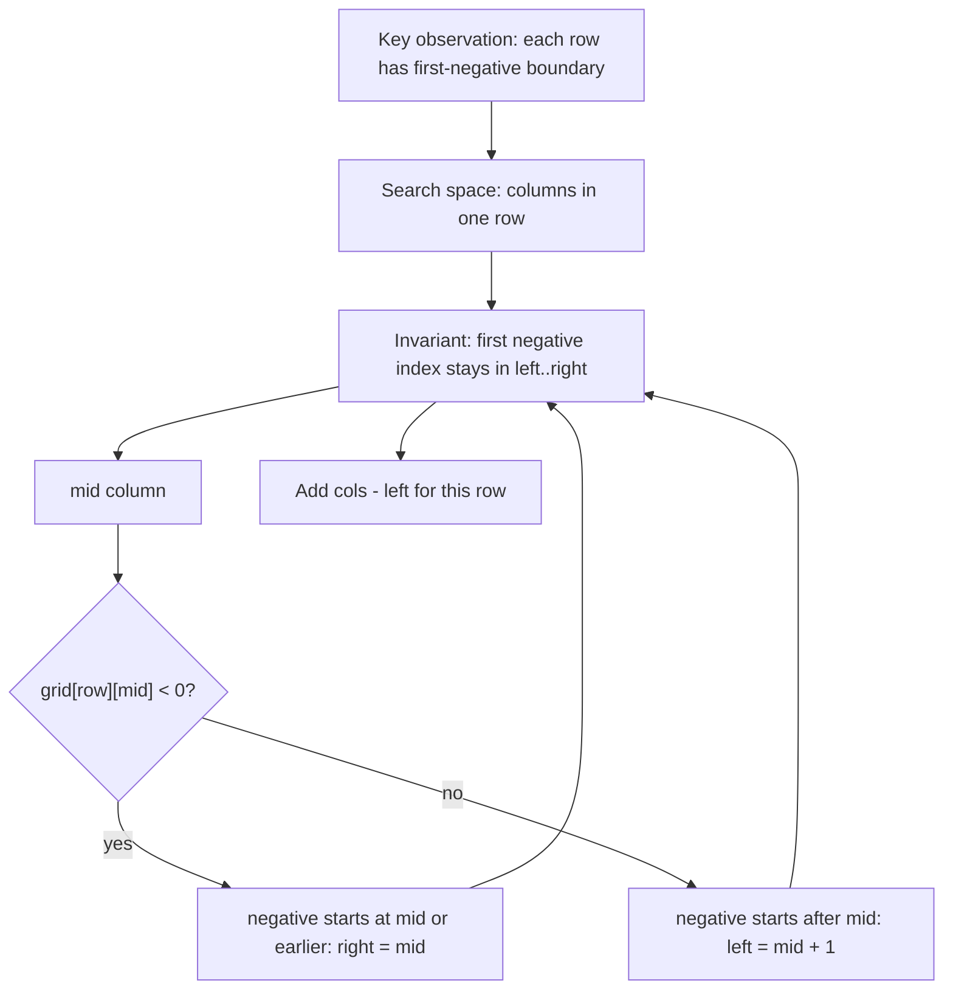

# LC 278 - First Bad Version

## Pattern

Binary Search / Lower / Upper Bound

LeetCode Link: https://leetcode.com/problems/first-bad-version/
Pattern: Binary Search
Category: Boundary Search
Difficulty: Easy
Status:

## 1. Problem Statement

You are given versions `1` to `n`. Once a version is bad, every version after it is also bad. Find the first bad version using the fewest API calls.

## 2. Pattern Recognition

| Item | Notes |
| :--- | :--- |
| Clues | "First bad" and all later versions are bad. |
| Category | Boundary Search |
| Search Space | Version numbers `[1, n]` |
| Monotonic Property | `isBadVersion(version)` is `false` before the answer and `true` from the answer onward. |
| Invariant | The first bad version always remains inside `[left, right]`. |

## 3. Brute Force Approach

- Check versions from `1` to `n`.
- Return the first version where `isBadVersion(version)` is true.

Why inefficient:

- If the first bad version is near the end, it may call the API `n` times.
- The true/false pattern is monotonic, so linear scanning wastes information.

## 4. Intuition Shift / Aha Moment

The versions form a boundary:

```text
Good Good Good Bad Bad Bad
               ^
          first bad
```

- If `mid` is bad, the answer is `mid` or earlier.
- If `mid` is good, the answer must be after `mid`.

So every API call removes half of the version range.

## 5. Optimized Algorithm

Steps:

1. Set `left = 1`, `right = n`.
2. While `left < right`:
   - Find `mid`.
   - If `isBadVersion(mid)` is true, keep the left half including `mid`.
   - Otherwise, discard `mid` and everything before it.
3. Return `left`.

Pseudocode:

```text
left = 1
right = n

while left < right:
    mid = left + (right - left) / 2

    if isBadVersion(mid):
        right = mid
    else:
        left = mid + 1

return left
```

## 6. Dry Run

Example:

```text
n = 5
first bad = 4
```

| Step | left | right | mid | isBadVersion(mid) | Movement |
| :--- | :--- | :--- | :--- | :--- | :--- |
| 1 | 1 | 5 | 3 | false | `left = 4` |
| 2 | 4 | 5 | 4 | true | `right = 4` |
| End | 4 | 4 | - | - | return `4` |

## 7. Edge Cases

- First version is bad.
- Last version is the first bad version.
- Only one version.
- Large `n`, so use overflow-safe midpoint.

## 8. Complexity

| Type | Complexity | Reason |
| :--- | :--- | :--- |
| Time | `O(log n)` | Version range halves each API call. |
| Space | `O(1)` | Only pointer variables are used. |

## 9. C++ Code

```cpp
// The API isBadVersion is defined for you.
// bool isBadVersion(int version);

class Solution {
public:
    int firstBadVersion(int n) {
        int left = 1;
        int right = n;

        while (left < right) {
            int mid = left + (right - left) / 2;

            if (isBadVersion(mid)) {
                right = mid;
            } else {
                left = mid + 1;
            }
        }

        return left;
    }
};
```

## 10. Interview One-Liner

This is a first-true boundary search where a bad `mid` keeps the left side and a good `mid` discards it.

## 11. Image / Visual Reference

TODO: Original note referenced missing image asset `Images/LC_278_First_Bad_Version.png`. Keep this placeholder until the source image is available.


# LC 34 - Find First and Last Position

## Pattern

Binary Search / Lower / Upper Bound

LeetCode Link: https://leetcode.com/problems/find-first-and-last-position-of-element-in-sorted-array/
Pattern: Binary Search
Category: Boundary Search
Difficulty: Medium
Status:

## 1. Problem Statement

Given a sorted array and a target, return the first and last index where the target appears. If it does not appear, return `[-1, -1]`.

## 2. Pattern Recognition

| Item | Notes |
| :--- | :--- |
| Clues | Sorted array, duplicates, first position, last position. |
| Category | Boundary Search |
| Search Space | Index range `[0, n - 1]` |
| Monotonic Property | For first position, `nums[index] >= target` becomes true at the lower bound. For last position, `nums[index] > target` starts after the target block. |
| Invariant | The desired boundary is never discarded while narrowing the range. |

## 3. Brute Force Approach

- Scan the whole array.
- Record the first index where `nums[i] == target`.
- Keep updating the last index while target continues appearing.

Why inefficient:

- It may inspect every element even though the array is sorted.
- Duplicates form a continuous block, so binary search can find both boundaries faster.

## 4. Intuition Shift / Aha Moment

Instead of searching for any target occurrence, search for the target's boundaries.

- First position = first index where `nums[i] >= target`.
- Last position = first index where `nums[i] > target`, then subtract `1`.

This turns the problem into two clean lower-bound searches.

## 5. Optimized Algorithm

Steps:

1. Write a helper `lowerBound(nums, value)` that returns the first index where `nums[index] >= value`.
2. Compute `first = lowerBound(nums, target)`.
3. If `first == n` or `nums[first] != target`, return `[-1, -1]`.
4. Compute `last = upperBound(nums, target) - 1`.
5. Return `[first, last]`.

Pseudocode:

```text
first = lowerBound(target)

if first is out of range or nums[first] != target:
    return [-1, -1]

last = upperBound(target) - 1
return [first, last]
```

## 6. Dry Run

Example:

```text
nums = [5, 7, 7, 8, 8, 10]
target = 8
```

Find first `>= 8`:

| Step | left | right | mid | nums[mid] | Condition | Movement |
| :--- | :--- | :--- | :--- | :--- | :--- | :--- |
| 1 | 0 | 6 | 3 | 8 | `8 >= 8` | `right = 3` |
| 2 | 0 | 3 | 1 | 7 | `7 < 8` | `left = 2` |
| 3 | 2 | 3 | 2 | 7 | `7 < 8` | `left = 3` |

First index = `3`.

Find first `> 8`, result is index `5`, so last index = `5 - 1 = 4`.

Answer: `[3, 4]`

## 7. Edge Cases

- Empty array.
- Target not present.
- Target appears once.
- Target appears at the start.
- Target appears at the end.
- All elements are the target.
- Target smaller or larger than all elements.

## 8. Complexity

| Type | Complexity | Reason |
| :--- | :--- | :--- |
| Time | `O(log n)` | Two binary searches. |
| Space | `O(1)` | Only pointer variables are used. |

## 9. C++ Code

```cpp
class Solution {
private:
    int lowerBound(vector<int>& nums, int target) {
        int left = 0;
        int right = nums.size();

        while (left < right) {
            int mid = left + (right - left) / 2;

            if (nums[mid] >= target) {
                right = mid;
            } else {
                left = mid + 1;
            }
        }

        return left;
    }

    int upperBound(vector<int>& nums, int target) {
        int left = 0;
        int right = nums.size();

        while (left < right) {
            int mid = left + (right - left) / 2;

            if (nums[mid] > target) {
                right = mid;
            } else {
                left = mid + 1;
            }
        }

        return left;
    }

public:
    vector<int> searchRange(vector<int>& nums, int target) {
        int first = lowerBound(nums, target);

        if (first == nums.size() || nums[first] != target) {
            return {-1, -1};
        }

        int last = upperBound(nums, target) - 1;
        return {first, last};
    }
};
```

## 10. Interview One-Liner

Find the target block by binary searching its left boundary and the boundary just after its right end.

## 11. Image / Visual Reference

TODO: Original note referenced missing image asset `Images/LC_34_Find_First_And_Last_Position.png`. Keep this placeholder until the source image is available.


# LC 1351 - Count Negative Numbers in Sorted Matrix

## Pattern

Binary Search / Lower / Upper Bound

LeetCode Link: https://leetcode.com/problems/count-negative-numbers-in-a-sorted-matrix/
Pattern: Binary Search
Category: Boundary Search
Difficulty: Easy
Status:

## 1. Problem Statement

Given a matrix where each row and column is sorted in non-increasing order, count how many values are negative.

## 2. Pattern Recognition

| Item | Notes |
| :--- | :--- |
| Clues | Sorted rows, sorted columns, count negatives. |
| Category | Boundary Search |
| Search Space | Each row's index range `[0, cols - 1]` |
| Monotonic Property | In each row, once values become negative, every value to the right is also negative. |
| Invariant | For a row, the first negative index remains inside the current search range. |

## 3. Brute Force Approach

- Visit every cell.
- Count each value `< 0`.

Why inefficient:

- It checks positive cells even after a row has reached the negative section.
- Sorted rows allow us to jump directly to the first negative value.

## 4. Intuition Shift / Aha Moment

Each row has this shape:

```text
positive positive zero negative negative
                       ^
               first negative
```

If `grid[row][mid] < 0`, then `mid` and all cells to its right are negative candidates, so search left for the first negative.

If `grid[row][mid] >= 0`, negatives can only start after `mid`.

## 5. Optimized Algorithm

Steps:

1. For each row, binary search the first index where value is negative.
2. If first negative index is `idx`, then negatives in that row = `cols - idx`.
3. Add this count for all rows.

Pseudocode:

```text
answer = 0

for each row:
    left = 0
    right = cols

    while left < right:
        mid = left + (right - left) / 2

        if row[mid] < 0:
            right = mid
        else:
            left = mid + 1

    answer += cols - left

return answer
```

## 6. Dry Run

Example:

```text
row = [4, 3, -1, -3]
```

| Step | left | right | mid | row[mid] | Condition | Movement |
| :--- | :--- | :--- | :--- | :--- | :--- | :--- |
| 1 | 0 | 4 | 2 | -1 | `< 0` | `right = 2` |
| 2 | 0 | 2 | 1 | 3 | `>= 0` | `left = 2` |
| End | 2 | 2 | - | - | first negative at `2` | count = `4 - 2 = 2` |

## 7. Edge Cases

- Matrix has no negative numbers.
- Matrix has all negative numbers.
- A row has no negatives.
- A row has only negatives.
- Single row.
- Single column.

## 8. Complexity

| Type | Complexity | Reason |
| :--- | :--- | :--- |
| Time | `O(rows * log cols)` | Binary search each row. |
| Space | `O(1)` | Only counters and pointers are used. |

## 9. C++ Code

```cpp
class Solution {
public:
    int countNegatives(vector<vector<int>>& grid) {
        int rows = grid.size();
        int cols = grid[0].size();
        int negativeCount = 0;

        for (int row = 0; row < rows; row++) {
            int left = 0;
            int right = cols;

            while (left < right) {
                int mid = left + (right - left) / 2;

                if (grid[row][mid] < 0) {
                    right = mid;
                } else {
                    left = mid + 1;
                }
            }

            negativeCount += cols - left;
        }

        return negativeCount;
    }
};
```

## 10. Interview One-Liner

Each row has a first-negative boundary, so binary search that boundary and count everything to its right.

## 11. Image / Visual Reference

TODO: Original note referenced missing image asset `Images/LC_1351_Count_Negative_Numbers_In_Sorted_Matrix.png`. Keep this placeholder until the source image is available.
