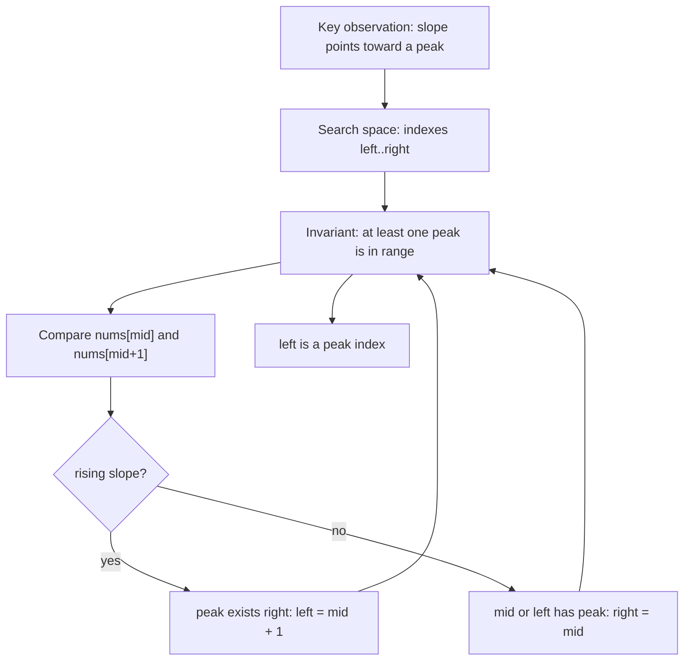
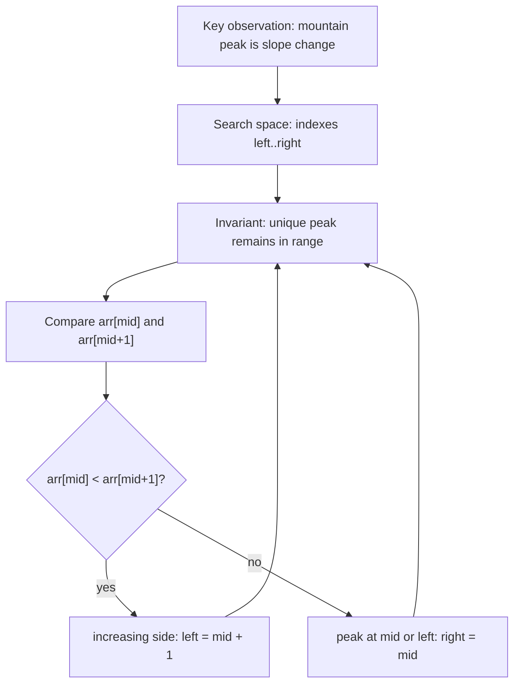
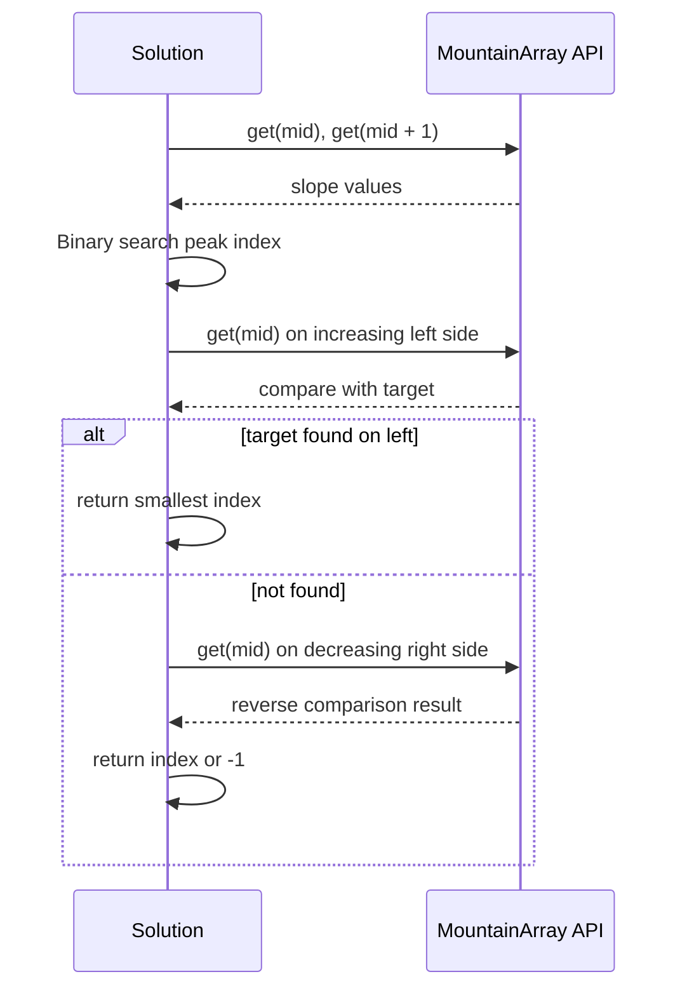

# LC 162 - Find Peak Element

## Pattern

Binary Search / Peak / Valley Search

## Visual Intuition


LeetCode Link: https://leetcode.com/problems/find-peak-element/
Pattern: Binary Search
Category: Peak / Mountain Search
Difficulty: Medium
Status:

## 1. Problem Statement

Given an array where neighboring elements are not equal, return the index of any peak element. A peak is greater than its immediate neighbors.

## 2. Pattern Recognition

| Item | Notes |
| :--- | :--- |
| Clues | Need a peak, not necessarily a specific value. |
| Category | Peak / Mountain Search |
| Search Space | Index range `[0, n - 1]` |
| Monotonic Property | The slope between `nums[mid]` and `nums[mid + 1]` tells which side must contain a peak. |
| Invariant | At least one peak always exists inside `[left, right]`. |

## 3. Brute Force Approach

- Scan each index.
- Check whether it is greater than its valid neighbors.
- Return the first peak found.

Why inefficient:

- It may inspect every element.
- Slope direction lets us discard half the array without checking every index.

## 4. Intuition Shift / Aha Moment

You do not need to know the exact peak immediately. You only need to know which side contains a peak.

- If `nums[mid] < nums[mid + 1]`, we are climbing upward, so a peak must exist on the right.
- If `nums[mid] > nums[mid + 1]`, we are going downward, so `mid` or the left side contains a peak.

## 5. Optimized Algorithm

Steps:

1. Set `left = 0`, `right = n - 1`.
2. While `left < right`:
   - Compute `mid`.
   - Compare `nums[mid]` and `nums[mid + 1]`.
   - If rising, move right.
   - If falling, keep left including `mid`.
3. Return `left`.

Pseudocode:

```text
left = 0
right = n - 1

while left < right:
    mid = left + (right - left) / 2

    if nums[mid] < nums[mid + 1]:
        left = mid + 1
    else:
        right = mid

return left
```

## 6. Dry Run

Example:

```text
nums = [1, 2, 1, 3, 5, 6, 4]
```

| Step | left | right | mid | Compare | Movement |
| :--- | :--- | :--- | :--- | :--- | :--- |
| 1 | 0 | 6 | 3 | `3 < 5` | rising, `left = 4` |
| 2 | 4 | 6 | 5 | `6 > 4` | falling, `right = 5` |
| 3 | 4 | 5 | 4 | `5 < 6` | rising, `left = 5` |
| End | 5 | 5 | - | peak found | return `5` |

## 7. Edge Cases

- One element.
- Peak at the first index.
- Peak at the last index.
- Multiple valid peaks.
- Strictly increasing array.
- Strictly decreasing array.

## 8. Complexity

| Type | Complexity | Reason |
| :--- | :--- | :--- |
| Time | `O(log n)` | Each slope check discards half the range. |
| Space | `O(1)` | Only pointers are used. |

## 9. C++ Code

```cpp
class Solution {
public:
    int findPeakElement(vector<int>& nums) {
        int left = 0;
        int right = nums.size() - 1;

        while (left < right) {
            int mid = left + (right - left) / 2;

            if (nums[mid] < nums[mid + 1]) {
                left = mid + 1;
            } else {
                right = mid;
            }
        }

        return left;
    }
};
```

## 10. Interview One-Liner

The slope at `mid` tells which side must contain a peak, so binary search follows the uphill direction or keeps the falling-side peak.

## 11. Image / Visual Reference

TODO: Original note referenced missing image asset `Images/LC_162_Find_Peak_Element.png`. Keep this placeholder until the source image is available.


# LC 852 - Peak Index in Mountain Array

## Pattern

Binary Search / Peak / Valley Search

LeetCode Link: https://leetcode.com/problems/peak-index-in-a-mountain-array/
Pattern: Binary Search
Category: Peak / Mountain Search
Difficulty: Medium
Status:

## 1. Problem Statement

Given a mountain array that strictly increases and then strictly decreases, return the index of the peak element.

## 2. Pattern Recognition

| Item | Notes |
| :--- | :--- |
| Clues | Mountain array, one peak, increasing then decreasing. |
| Category | Peak / Mountain Search |
| Search Space | Index range `[0, n - 1]` |
| Monotonic Property | Before the peak, `arr[mid] < arr[mid + 1]`; after the peak, `arr[mid] > arr[mid + 1]`. |
| Invariant | The unique peak always remains inside `[left, right]`. |

## 3. Brute Force Approach

- Scan from left to right.
- Return the first index where `arr[i] > arr[i + 1]`.

Why inefficient:

- It can take `O(n)`.
- The mountain slope directly tells whether the peak is left or right of `mid`.

## 4. Intuition Shift / Aha Moment

The peak is the point where the slope changes from rising to falling.

- If `arr[mid] < arr[mid + 1]`, we are on the increasing side, so the peak is to the right.
- Otherwise, we are at or after the peak, so keep the left side including `mid`.

## 5. Optimized Algorithm

Steps:

1. Set `left = 0`, `right = n - 1`.
2. While `left < right`:
   - Compute `mid`.
   - If `arr[mid] < arr[mid + 1]`, move `left = mid + 1`.
   - Else move `right = mid`.
3. Return `left`.

Pseudocode:

```text
while left < right:
    mid = left + (right - left) / 2

    if arr[mid] < arr[mid + 1]:
        left = mid + 1
    else:
        right = mid

return left
```

## 6. Dry Run

Example:

```text
arr = [0, 2, 5, 9, 6, 3, 1]
```

| Step | left | right | mid | Compare | Movement |
| :--- | :--- | :--- | :--- | :--- | :--- |
| 1 | 0 | 6 | 3 | `9 > 6` | falling, `right = 3` |
| 2 | 0 | 3 | 1 | `2 < 5` | rising, `left = 2` |
| 3 | 2 | 3 | 2 | `5 < 9` | rising, `left = 3` |
| End | 3 | 3 | - | peak found | return `3` |

## 7. Edge Cases

- Minimum valid mountain length is `3`.
- Peak near the beginning.
- Peak near the end.
- Do not access `mid + 1` when `mid == right`; use `left < right`.

## 8. Complexity

| Type | Complexity | Reason |
| :--- | :--- | :--- |
| Time | `O(log n)` | Slope check removes half the range. |
| Space | `O(1)` | Only pointers are used. |

## 9. C++ Code

```cpp
class Solution {
public:
    int peakIndexInMountainArray(vector<int>& arr) {
        int left = 0;
        int right = arr.size() - 1;

        while (left < right) {
            int mid = left + (right - left) / 2;

            if (arr[mid] < arr[mid + 1]) {
                left = mid + 1;
            } else {
                right = mid;
            }
        }

        return left;
    }
};
```

## 10. Interview One-Liner

In a mountain array, the peak is exactly where the slope changes, so compare `mid` with `mid + 1` to choose the side.

## 11. Image / Visual Reference

TODO: Original note referenced missing image asset `Images/LC_852_Peak_Index_In_Mountain_Array.png`. Keep this placeholder until the source image is available.


# LC 1095 - Find in Mountain Array

## Pattern

Binary Search / Peak / Valley Search

LeetCode Link: https://leetcode.com/problems/find-in-mountain-array/
Pattern: Binary Search
Category: Peak / Mountain Search
Difficulty: Hard
Status:

## 1. Problem Statement

Given a mountain array through a restricted API and a target value, return the smallest index where the target appears, or `-1` if missing.

## 2. Pattern Recognition

| Item | Notes |
| :--- | :--- |
| Clues | Mountain array, target search, API access, smallest index. |
| Category | Peak / Mountain Search |
| Search Space | First find peak over `[0, n - 1]`, then search both sorted sides. |
| Monotonic Property | Left side is increasing; right side is decreasing. |
| Invariant | The peak search keeps the peak; side searches keep the target if it exists in that side. |

## 3. Brute Force Approach

- Call `get(i)` for every index.
- Return the first index where value equals target.

Why inefficient:

- It can require too many API calls.
- The mountain structure gives two sorted ranges after the peak is found.

## 4. Intuition Shift / Aha Moment

Split the problem into three binary searches:

1. Find the peak using slope.
2. Search the increasing left side normally.
3. If not found, search the decreasing right side with reversed comparison.

Searching the left side first ensures the smallest index is returned.

## 5. Optimized Algorithm

Steps:

1. Find peak index using `get(mid) < get(mid + 1)`.
2. Binary search target in `[0, peak]` as an increasing array.
3. If found, return that index.
4. Binary search target in `[peak + 1, n - 1]` as a decreasing array.
5. Return found index or `-1`.

Pseudocode:

```text
peak = findPeak()

answer = binarySearchIncreasing(0, peak)
if answer != -1:
    return answer

return binarySearchDecreasing(peak + 1, n - 1)
```

## 6. Dry Run

Example:

```text
mountain = [1, 3, 5, 7, 6, 4, 2]
target = 4
```

Find peak:

| Step | left | right | mid | Compare | Movement |
| :--- | :--- | :--- | :--- | :--- | :--- |
| 1 | 0 | 6 | 3 | `7 > 6` | `right = 3` |
| 2 | 0 | 3 | 1 | `3 < 5` | `left = 2` |
| 3 | 2 | 3 | 2 | `5 < 7` | `left = 3` |

Peak index = `3`.

Search left `[0, 3]`: target `4` not found.

Search right `[4, 6]` decreasing:

| Step | left | right | mid | value | Condition | Movement |
| :--- | :--- | :--- | :--- | :--- | :--- | :--- |
| 1 | 4 | 6 | 5 | 4 | found | return `5` |

## 7. Edge Cases

- Target is at the peak.
- Target appears on both sides; return left side first.
- Target smaller than all values.
- Target larger than peak.
- Target missing.
- API call count matters, so avoid unnecessary repeated calls when possible.

## 8. Complexity

| Type | Complexity | Reason |
| :--- | :--- | :--- |
| Time | `O(log n)` | One peak search plus up to two binary searches. |
| Space | `O(1)` | Only pointers are used. |

## 9. C++ Code

```cpp
/**
 * // This is the MountainArray's API interface.
 * // You should not implement it, or speculate about its implementation.
 * class MountainArray {
 *   public:
 *     int get(int index);
 *     int length();
 * };
 */

class Solution {
private:
    int findPeak(MountainArray& mountainArr, int n) {
        int left = 0;
        int right = n - 1;

        while (left < right) {
            int mid = left + (right - left) / 2;

            if (mountainArr.get(mid) < mountainArr.get(mid + 1)) {
                left = mid + 1;
            } else {
                right = mid;
            }
        }

        return left;
    }

    int binarySearch(MountainArray& mountainArr, int target, int left, int right, bool increasing) {
        while (left <= right) {
            int mid = left + (right - left) / 2;
            int value = mountainArr.get(mid);

            if (value == target) {
                return mid;
            }

            if (increasing) {
                if (value < target) {
                    left = mid + 1;
                } else {
                    right = mid - 1;
                }
            } else {
                if (value < target) {
                    right = mid - 1;
                } else {
                    left = mid + 1;
                }
            }
        }

        return -1;
    }

public:
    int findInMountainArray(int target, MountainArray& mountainArr) {
        int n = mountainArr.length();
        int peak = findPeak(mountainArr, n);

        int leftAnswer = binarySearch(mountainArr, target, 0, peak, true);
        if (leftAnswer != -1) {
            return leftAnswer;
        }

        return binarySearch(mountainArr, target, peak + 1, n - 1, false);
    }
};
```

## 10. Interview One-Liner

Find the peak first, then the mountain becomes two sorted arrays: increasing on the left and decreasing on the right.

## 11. Image / Visual Reference

TODO: Original note referenced missing image asset `Images/LC_1095_Find_In_Mountain_Array.png`. Keep this placeholder until the source image is available.
