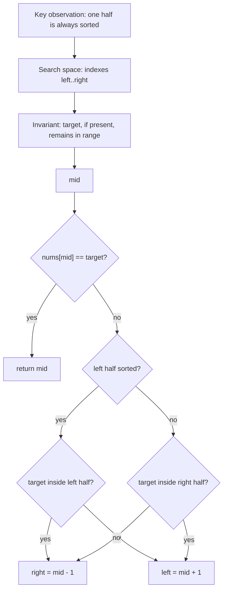
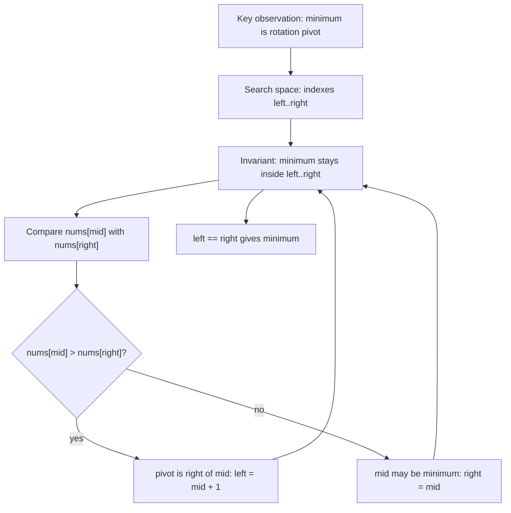
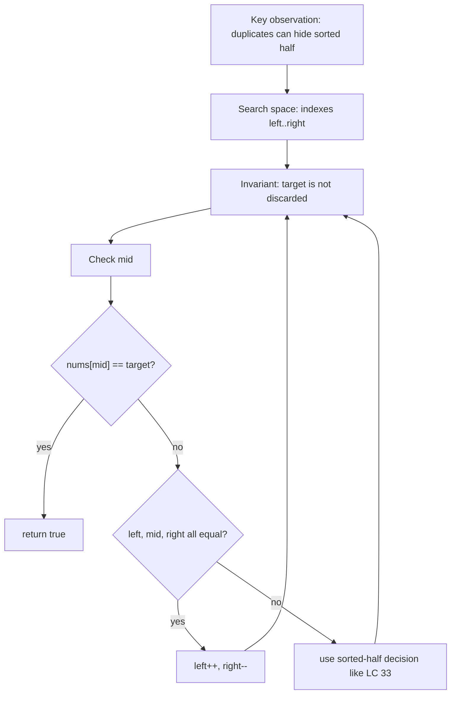
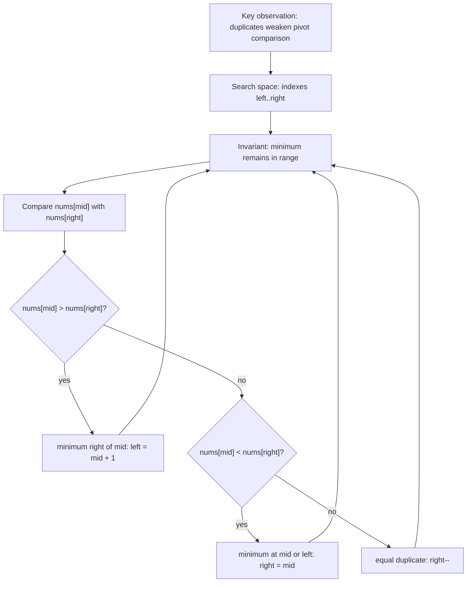

# LC 33 - Search in Rotated Sorted Array

## Pattern

Binary Search / Search in Rotated Array

## Visual Intuition


LeetCode Link: https://leetcode.com/problems/search-in-rotated-sorted-array/
Pattern: Binary Search
Category: Rotated Sorted Array
Difficulty: Medium
Status:

## 1. Problem Statement

Given a sorted array that was rotated at some pivot and contains distinct values, return the index of a target value or `-1` if it is missing.

## 2. Pattern Recognition

| Item | Notes |
| :--- | :--- |
| Clues | Sorted array, rotated, distinct values, search target. |
| Category | Rotated Sorted Array |
| Search Space | Index range `[0, n - 1]` |
| Monotonic Property | At every `mid`, at least one half is still sorted. |
| Invariant | If the target exists, it remains inside `[left, right]` after discarding the impossible half. |

## 3. Brute Force Approach

- Scan every index.
- Return the index where `nums[i] == target`.

Why inefficient:

- It ignores the sorted structure that still exists inside one half.
- Worst case takes `O(n)` instead of using binary search.

## 4. Intuition Shift / Aha Moment

Even after rotation, one side around `mid` is always sorted:

- If `nums[left] <= nums[mid]`, the left half is sorted.
- Otherwise, the right half is sorted.

Once we know the sorted half, we check whether the target lies inside its value range. If not, discard that half.

## 5. Optimized Algorithm

Steps:

1. Set `left = 0`, `right = n - 1`.
2. While `left <= right`:
   - Compute `mid`.
   - If `nums[mid] == target`, return `mid`.
   - Check which half is sorted.
   - If target lies inside the sorted half, keep it.
   - Otherwise, discard it.
3. Return `-1`.

Pseudocode:

```text
while left <= right:
    mid = left + (right - left) / 2

    if nums[mid] == target:
        return mid

    if nums[left] <= nums[mid]:
        left half is sorted
        decide if target is inside it
    else:
        right half is sorted
        decide if target is inside it

return -1
```

## 6. Dry Run

Example:

```text
nums = [4, 5, 6, 7, 0, 1, 2]
target = 0
```

| Step | left | right | mid | nums[mid] | Sorted Half | Movement |
| :--- | :--- | :--- | :--- | :--- | :--- | :--- |
| 1 | 0 | 6 | 3 | 7 | left half `[4,5,6,7]` | target not inside, `left = 4` |
| 2 | 4 | 6 | 5 | 1 | left half `[0,1]` | target inside, `right = 4` |
| 3 | 4 | 4 | 4 | 0 | found | return `4` |

## 7. Edge Cases

- Array has one element.
- Target is the pivot/minimum element.
- Target is at index `0`.
- Target is at the last index.
- Array is not rotated.
- Target does not exist.

## 8. Complexity

| Type | Complexity | Reason |
| :--- | :--- | :--- |
| Time | `O(log n)` | One half is discarded each step. |
| Space | `O(1)` | Only pointers are used. |

## 9. C++ Code

```cpp
class Solution {
public:
    int search(vector<int>& nums, int target) {
        int left = 0;
        int right = nums.size() - 1;

        while (left <= right) {
            int mid = left + (right - left) / 2;

            if (nums[mid] == target) {
                return mid;
            }

            if (nums[left] <= nums[mid]) {
                if (nums[left] <= target && target < nums[mid]) {
                    right = mid - 1;
                } else {
                    left = mid + 1;
                }
            } else {
                if (nums[mid] < target && target <= nums[right]) {
                    left = mid + 1;
                } else {
                    right = mid - 1;
                }
            }
        }

        return -1;
    }
};
```

## 10. Interview One-Liner

In a rotated sorted array, one half is always sorted, so use that half's value range to decide which side can be discarded.

## 11. Image / Visual Reference

TODO: Original note referenced missing image asset `Images/LC_33_Search_In_Rotated_Sorted_Array.png`. Keep this placeholder until the source image is available.


# LC 153 - Find Minimum in Rotated Sorted Array

## Pattern

Binary Search / Search in Rotated Array

LeetCode Link: https://leetcode.com/problems/find-minimum-in-rotated-sorted-array/
Pattern: Binary Search
Category: Rotated Sorted Array
Difficulty: Medium
Status:

## 1. Problem Statement

Given a sorted array with distinct values that may have been rotated, return the minimum element.

## 2. Pattern Recognition

| Item | Notes |
| :--- | :--- |
| Clues | Sorted array, rotated, distinct values, find minimum/pivot. |
| Category | Rotated Sorted Array |
| Search Space | Index range `[0, n - 1]` |
| Monotonic Property | If `nums[mid] > nums[right]`, the minimum is to the right of `mid`; otherwise it is at `mid` or to the left. |
| Invariant | The minimum element always remains inside `[left, right]`. |

## 3. Brute Force Approach

- Scan all elements.
- Track the smallest value.

Why inefficient:

- It takes `O(n)`.
- Rotation still leaves enough sorted structure to discard half the search space.

## 4. Intuition Shift / Aha Moment

Compare `nums[mid]` with `nums[right]`.

- If `nums[mid] > nums[right]`, the right side contains the rotation drop, so the minimum is after `mid`.
- If `nums[mid] <= nums[right]`, the right side is sorted, so the minimum is at `mid` or on the left side.

This directly searches for the pivot/minimum.

## 5. Optimized Algorithm

Steps:

1. Set `left = 0`, `right = n - 1`.
2. While `left < right`:
   - Compute `mid`.
   - If `nums[mid] > nums[right]`, move `left = mid + 1`.
   - Else move `right = mid`.
3. Return `nums[left]`.

Pseudocode:

```text
left = 0
right = n - 1

while left < right:
    mid = left + (right - left) / 2

    if nums[mid] > nums[right]:
        left = mid + 1
    else:
        right = mid

return nums[left]
```

## 6. Dry Run

Example:

```text
nums = [4, 5, 6, 7, 0, 1, 2]
```

| Step | left | right | mid | nums[mid] | nums[right] | Movement |
| :--- | :--- | :--- | :--- | :--- | :--- | :--- |
| 1 | 0 | 6 | 3 | 7 | 2 | `7 > 2`, so `left = 4` |
| 2 | 4 | 6 | 5 | 1 | 2 | `1 <= 2`, so `right = 5` |
| 3 | 4 | 5 | 4 | 0 | 1 | `0 <= 1`, so `right = 4` |
| End | 4 | 4 | - | - | - | return `0` |

## 7. Edge Cases

- Array has one element.
- Array is not rotated.
- Minimum is at index `0`.
- Minimum is at last index.
- Two elements.

## 8. Complexity

| Type | Complexity | Reason |
| :--- | :--- | :--- |
| Time | `O(log n)` | Each comparison discards half the range. |
| Space | `O(1)` | Only pointers are used. |

## 9. C++ Code

```cpp
class Solution {
public:
    int findMin(vector<int>& nums) {
        int left = 0;
        int right = nums.size() - 1;

        while (left < right) {
            int mid = left + (right - left) / 2;

            if (nums[mid] > nums[right]) {
                left = mid + 1;
            } else {
                right = mid;
            }
        }

        return nums[left];
    }
};
```

## 10. Interview One-Liner

Compare `mid` with the right boundary to decide which side contains the rotation drop where the minimum lives.

## 11. Image / Visual Reference

TODO: Original note referenced missing image asset `Images/LC_153_Find_Minimum_In_Rotated_Sorted_Array.png`. Keep this placeholder until the source image is available.


# LC 81 - Search in Rotated Sorted Array II

## Pattern

Binary Search / Search in Rotated Array

LeetCode Link: https://leetcode.com/problems/search-in-rotated-sorted-array-ii/
Pattern: Binary Search
Category: Rotated Sorted Array
Difficulty: Medium
Status:

## 1. Problem Statement

Given a rotated sorted array that may contain duplicates, return whether a target value exists in the array.

## 2. Pattern Recognition

| Item | Notes |
| :--- | :--- |
| Clues | Rotated sorted array, duplicates allowed, search target. |
| Category | Rotated Sorted Array |
| Search Space | Index range `[0, n - 1]` |
| Monotonic Property | At least one half is usually sorted, but duplicates can hide which half. |
| Invariant | If the target exists, it remains inside `[left, right]` after safely discarding impossible or duplicate boundaries. |

## 3. Brute Force Approach

- Scan every element.
- Return `true` if any element equals target.

Why inefficient:

- It takes `O(n)` even when the sorted-half structure can usually remove half the range.
- Duplicates make the worst case hard, but many cases still benefit from binary search.

## 4. Intuition Shift / Aha Moment

This is LC 33 with one extra problem: duplicates can make this comparison unclear:

```text
nums[left] == nums[mid] == nums[right]
```

When that happens, we cannot know which half is sorted, so safely shrink both ends by one. Otherwise, use the normal sorted-half logic.

## 5. Optimized Algorithm

Steps:

1. Set `left = 0`, `right = n - 1`.
2. While `left <= right`:
   - Compute `mid`.
   - If `nums[mid] == target`, return `true`.
   - If `nums[left] == nums[mid] == nums[right]`, do `left++` and `right--`.
   - Else identify the sorted half.
   - Keep the half where target can lie.
3. Return `false`.

Pseudocode:

```text
while left <= right:
    mid = left + (right - left) / 2

    if nums[mid] == target:
        return true

    if nums[left] == nums[mid] == nums[right]:
        left++
        right--
    else if left half sorted:
        decide using target range
    else:
        decide using target range

return false
```

## 6. Dry Run

Example:

```text
nums = [2, 5, 6, 0, 0, 1, 2]
target = 0
```

| Step | left | right | mid | nums[mid] | Sorted Half | Movement |
| :--- | :--- | :--- | :--- | :--- | :--- | :--- |
| 1 | 0 | 6 | 3 | 0 | found | return `true` |

Duplicate ambiguity example:

```text
nums = [1, 0, 1, 1, 1], target = 0
```

| Step | left | right | mid | Condition | Movement |
| :--- | :--- | :--- | :--- | :--- | :--- |
| 1 | 0 | 4 | 2 | `nums[left] == nums[mid] == nums[right]` | `left++`, `right--` |
| 2 | 1 | 3 | 2 | left half sorted, target inside | `right = 1` |
| 3 | 1 | 1 | 1 | `nums[mid] == target` | return `true` |

## 7. Edge Cases

- All elements are same.
- Target missing.
- Target at pivot.
- Target at boundaries.
- Array has one element.
- Duplicates hide the sorted half.

## 8. Complexity

| Type | Complexity | Reason |
| :--- | :--- | :--- |
| Time | Average `O(log n)`, worst `O(n)` | Duplicate trimming may shrink only one step at a time. |
| Space | `O(1)` | Only pointers are used. |

## 9. C++ Code

```cpp
class Solution {
public:
    bool search(vector<int>& nums, int target) {
        int left = 0;
        int right = nums.size() - 1;

        while (left <= right) {
            int mid = left + (right - left) / 2;

            if (nums[mid] == target) {
                return true;
            }

            if (nums[left] == nums[mid] && nums[mid] == nums[right]) {
                left++;
                right--;
            } else if (nums[left] <= nums[mid]) {
                if (nums[left] <= target && target < nums[mid]) {
                    right = mid - 1;
                } else {
                    left = mid + 1;
                }
            } else {
                if (nums[mid] < target && target <= nums[right]) {
                    left = mid + 1;
                } else {
                    right = mid - 1;
                }
            }
        }

        return false;
    }
};
```

## 10. Interview One-Liner

Use rotated-array sorted-half logic, but when duplicates hide the sorted side, shrink both boundaries safely.

## 11. Image / Visual Reference

TODO: Original note referenced missing image asset `Images/LC_81_Search_In_Rotated_Sorted_Array_II.png`. Keep this placeholder until the source image is available.


# LC 154 - Find Minimum in Rotated Sorted Array II

## Pattern

Binary Search / Search in Rotated Array

LeetCode Link: https://leetcode.com/problems/find-minimum-in-rotated-sorted-array-ii/
Pattern: Binary Search
Category: Rotated Sorted Array
Difficulty: Hard
Status:

## 1. Problem Statement

Given a rotated sorted array that may contain duplicates, return the minimum element.

## 2. Pattern Recognition

| Item | Notes |
| :--- | :--- |
| Clues | Rotated sorted array, duplicates allowed, find minimum. |
| Category | Rotated Sorted Array |
| Search Space | Index range `[0, n - 1]` |
| Monotonic Property | Comparing `nums[mid]` with `nums[right]` usually identifies which side contains the minimum; equality only allows safe boundary shrink. |
| Invariant | The minimum always remains inside `[left, right]`. |

## 3. Brute Force Approach

- Scan all values.
- Return the smallest value found.

Why inefficient:

- It always takes `O(n)`.
- Most rotated sorted arrays still allow binary-search-style elimination.

## 4. Intuition Shift / Aha Moment

This is LC 153 with duplicates.

- If `nums[mid] > nums[right]`, the minimum is to the right.
- If `nums[mid] < nums[right]`, the minimum is at `mid` or to the left.
- If `nums[mid] == nums[right]`, we cannot know the side, but removing `right` is safe because `nums[right]` duplicates `nums[mid]`.

## 5. Optimized Algorithm

Steps:

1. Set `left = 0`, `right = n - 1`.
2. While `left < right`:
   - Compute `mid`.
   - If `nums[mid] > nums[right]`, move `left = mid + 1`.
   - If `nums[mid] < nums[right]`, move `right = mid`.
   - Else move `right--`.
3. Return `nums[left]`.

Pseudocode:

```text
while left < right:
    mid = left + (right - left) / 2

    if nums[mid] > nums[right]:
        left = mid + 1
    else if nums[mid] < nums[right]:
        right = mid
    else:
        right--

return nums[left]
```

## 6. Dry Run

Example:

```text
nums = [2, 2, 2, 0, 1]
```

| Step | left | right | mid | nums[mid] | nums[right] | Movement |
| :--- | :--- | :--- | :--- | :--- | :--- | :--- |
| 1 | 0 | 4 | 2 | 2 | 1 | `2 > 1`, so `left = 3` |
| 2 | 3 | 4 | 3 | 0 | 1 | `0 < 1`, so `right = 3` |
| End | 3 | 3 | - | - | - | return `0` |

Duplicate equality example:

```text
nums = [1, 3, 3, 3]
```

| Step | left | right | mid | nums[mid] | nums[right] | Movement |
| :--- | :--- | :--- | :--- | :--- | :--- | :--- |
| 1 | 0 | 3 | 1 | 3 | 3 | equal, so `right--` |
| 2 | 0 | 2 | 1 | 3 | 3 | equal, so `right--` |
| 3 | 0 | 1 | 0 | 1 | 3 | `1 < 3`, so `right = 0` |

## 7. Edge Cases

- All elements are equal.
- Array has one element.
- Array is not rotated.
- Minimum appears multiple times.
- Minimum is at the end.
- Duplicates cause worst-case linear behavior.

## 8. Complexity

| Type | Complexity | Reason |
| :--- | :--- | :--- |
| Time | Average `O(log n)`, worst `O(n)` | Equality may force `right--` one step at a time. |
| Space | `O(1)` | Only pointers are used. |

## 9. C++ Code

```cpp
class Solution {
public:
    int findMin(vector<int>& nums) {
        int left = 0;
        int right = nums.size() - 1;

        while (left < right) {
            int mid = left + (right - left) / 2;

            if (nums[mid] > nums[right]) {
                left = mid + 1;
            } else if (nums[mid] < nums[right]) {
                right = mid;
            } else {
                right--;
            }
        }

        return nums[left];
    }
};
```

## 10. Interview One-Liner

Use the LC 153 pivot logic, but when duplicates make `mid` and `right` equal, safely shrink `right` without losing the minimum.

## 11. Image / Visual Reference

TODO: Original note referenced missing image asset `Images/LC_154_Find_Minimum_In_Rotated_Sorted_Array_II.png`. Keep this placeholder until the source image is available.
