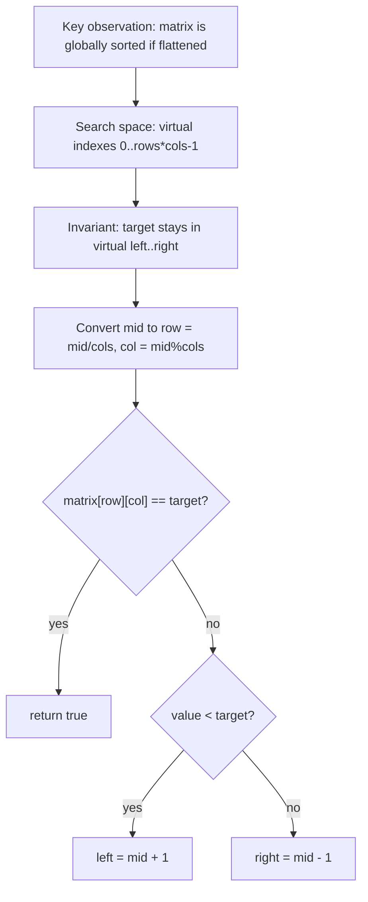
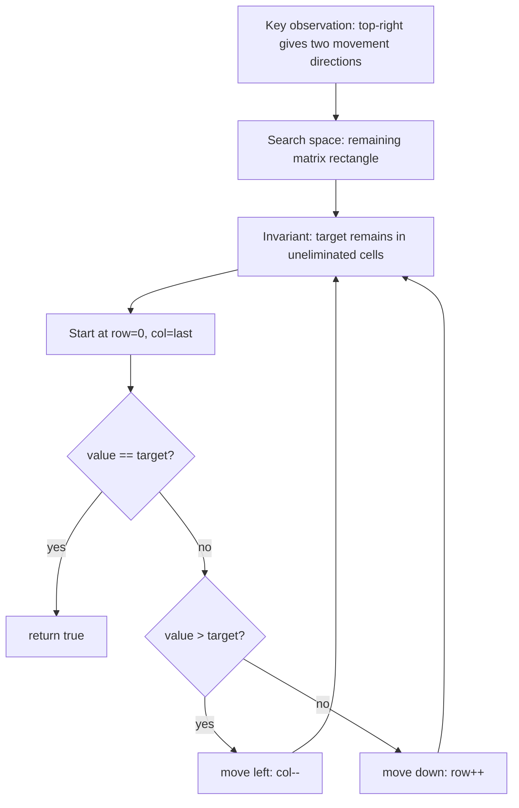
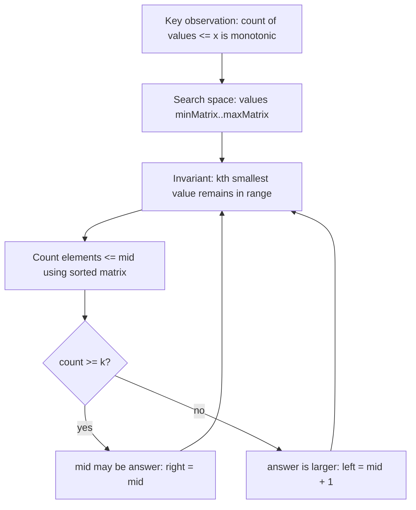

# LC 74 - Search a 2D Matrix

TODO: Review final placement. Original category is 2D Binary Search, which is not part of the requested Binary Search target folder list.

LeetCode Link: https://leetcode.com/problems/search-a-2d-matrix/
Pattern: Binary Search
Category: 2D Binary Search
Difficulty: Medium
Status:

## 1. Problem Statement

Given a matrix where each row is sorted and each row starts after the previous row's last value, determine whether a target exists.

## 2. Pattern Recognition

| Item               | Notes                                                                            |
| :----------------- | :------------------------------------------------------------------------------- |
| Clues              | Matrix has full row-major sorted order.                                          |
| Category           | 2D Binary Search                                                                 |
| Search Space       | Virtual 1D index range `[0, rows * cols - 1]`                                    |
| Monotonic Property | If the matrix is flattened row by row, values are sorted.                        |
| Invariant          | If the target exists, it remains inside the virtual index range `[left, right]`. |

## 3. Brute Force Approach

- Check every cell.
- Return true if any cell equals target.

Why inefficient:

- It takes `O(rows * cols)`.
- The matrix behaves like one sorted array, so binary search can be used.

## 4. Intuition Shift / Aha Moment

### Intuition: Shelves That Form One Continuous Catalogue

Imagine books placed across shelves. Every shelf is sorted, and the first book on the next shelf comes after the last book on the previous shelf. The shelf breaks are physical only; logically, this is one sorted catalogue.

Use one running example:

```text
matrix = [[1, 3, 5],
          [7, 9, 11]], target = 9

logical order: 1  3  5  7  9  11
index:         0  1  2  3  4   5
```

Searching every row separately ignores this stronger global order. Instead, binary-search logical indices and translate an index back to a cell:

```text
row = index / columns
col = index % columns
```

### Invariant

If `target` exists, its logical flattened index remains inside `[left, right]`. Matrix row boundaries never affect this invariant.

### Example Walkthrough

```text
left = 0, right = 5
mid = 2 -> matrix[2/3][2%3] = matrix[0][2] = 5
                                    ^
```

`5 < 9`, so indices `0..2` cannot contain `9`. We move right, not row-by-row, because every logical position before `mid` is also smaller.

```text
left = 3, right = 5
mid = 4 -> matrix[1][1] = 9
                         ^ found
```

### Edge Case / Correction

This flattening works only because each row starts after the previous row ends. If rows and columns are individually sorted but row ranges overlap, as in LC 240, the matrix is not one globally sorted array.

### Final Recall

```text
Treat the matrix as one sorted array.
Binary-search indices 0 through rows*cols-1.
Map mid with row = mid/cols and col = mid%cols.
Discard by value exactly as in ordinary binary search.
```

## 5. Optimized Algorithm

Steps:

1. Let `rows = matrix.size()` and `cols = matrix[0].size()`.
2. Set `left = 0`, `right = rows * cols - 1`.
3. Convert each `mid` into `(row, col)`.
4. Compare `matrix[row][col]` with target.
5. Move left or right like normal binary search.

Pseudocode:

```text
left = 0
right = rows * cols - 1

while left <= right:
    mid = left + (right - left) / 2
    row = mid / cols
    col = mid % cols

    compare matrix[row][col] with target
```

## 6. Dry Run

Example:

```text
matrix = [[1,3,5],
          [7,9,11]]
target = 9
```

Virtual flattened array:

```text
[1, 3, 5, 7, 9, 11]
```

| Step | left | right | mid | row,col | value | Movement          |
| :--- | :--- | :---- | :-- | :------ | :---- | :---------------- |
| 1    | 0    | 5     | 2   | `(0,2)` | 5     | `5 < 9`, left = 3 |
| 2    | 3    | 5     | 4   | `(1,1)` | 9     | found             |

## 7. Edge Cases

- Empty matrix.
- One row.
- One column.
- Target smaller than first value.
- Target larger than last value.
- Target not present.

## 8. Complexity

| Type  | Complexity            | Reason                                  |
| :---- | :-------------------- | :-------------------------------------- |
| Time  | `O(log(rows * cols))` | Binary search over all cells virtually. |
| Space | `O(1)`                | No flattened copy is created.           |

## 9. C++ Code

```cpp
class Solution {
public:
    bool searchMatrix(vector<vector<int>>& matrix, int target) {
        int rows = matrix.size();
        int cols = matrix[0].size();

        int left = 0;
        int right = rows * cols - 1;

        while (left <= right) {
            int mid = left + (right - left) / 2;
            int row = mid / cols;
            int col = mid % cols;
            int value = matrix[row][col];

            if (value == target) {
                return true;
            }

            if (value < target) {
                left = mid + 1;
            } else {
                right = mid - 1;
            }
        }

        return false;
    }
};
```

## 10. Interview One-Liner

The matrix is globally sorted in row-major order, so binary search it as a virtual 1D array.

## 11. Image / Visual Reference

TODO: Original note referenced missing image asset `Images/LC_74_Search_A_2D_Matrix.png`. Keep this placeholder until the source image is available.



# LC 240 - Search a 2D Matrix II

TODO: Review final placement. Original category is 2D Binary Search, which is not part of the requested Binary Search target folder list.

LeetCode Link: https://leetcode.com/problems/search-a-2d-matrix-ii/
Pattern: Binary Search
Category: 2D Binary Search
Difficulty: Medium
Status:

## 1. Problem Statement

Given a matrix where every row and every column is sorted in increasing order, determine whether a target exists.

## 2. Pattern Recognition

| Item               | Notes                                                                         |
| :----------------- | :---------------------------------------------------------------------------- |
| Clues              | Rows sorted, columns sorted, but not globally flattened sorted.               |
| Category           | 2D Binary Search                                                              |
| Search Space       | Matrix cells, usually from top-right or bottom-left corner.                   |
| Monotonic Property | From top-right, moving left decreases value and moving down increases value.  |
| Invariant          | The target, if it exists, remains in the remaining rectangle after each move. |

## 3. Brute Force Approach

- Scan every cell.
- Return true if target is found.

Why inefficient:

- It takes `O(rows * cols)`.
- Sorted rows and columns allow eliminating one row or one column each step.

## 4. Intuition Shift / Aha Moment

### Intuition: Stand Where One Move Eliminates a Whole Direction

Think of a building where room numbers increase when you move right and also when you move down. You want a position where comparing one room number with the target tells you an entire direction that is impossible.

Use this example throughout:

```text
matrix = [ 1   4   7  11
           2   5   8  12
           3   6   9  16
          10  13  14  17 ], target = 14
```

The top-left corner is unhelpful: both right and down are larger. The center is also ambiguous. At the top-right corner, however, left is smaller and down is larger. That gives one legal direction for either comparison.

### Invariant

The remaining candidate region is the rectangle from the current row downwards and from column `0` through the current column. Every removed row or column is proven unable to contain the target.

### Example Walkthrough

```text
row = 0, col = 3
 1   4   7 [11]   11 < 14
```

Why move down instead of left? Everything left in this row is `<= 11`, so the entire row is too small. Moving down removes exactly that impossible row.

```text
row = 1, col = 3 -> [12] < 14 -> remove row 1
row = 2, col = 3 -> [16] > 14
```

Why move left instead of up? Everything below `16` in this column is `>= 16`, so the entire column is too large. Moving left removes that impossible column.

```text
row = 2, col = 2 -> [9] < 14 -> remove row 2
row = 3, col = 2 -> [14] found
```

### Edge Case / Correction

Starting at top-right or bottom-left works because each comparison gives opposite monotonic directions. Starting at top-left or bottom-right does not provide that one-direction elimination.

### Final Recall

```text
Start at top-right.
Too large: discard its whole column, move left.
Too small: discard its whole row, move down.
Equal: found.
The candidate rectangle shrinks by one row or one column each step.
```

## 5. Optimized Algorithm

Steps:

1. Start at `row = 0`, `col = cols - 1`.
2. While inside the matrix:
   - Compare `matrix[row][col]` with target.
   - If equal, return true.
   - If too large, move left.
   - If too small, move down.
3. Return false.

Pseudocode:

```text
row = 0
col = cols - 1

while row < rows and col >= 0:
    if matrix[row][col] == target:
        return true
    else if matrix[row][col] > target:
        col--
    else:
        row++

return false
```

## 6. Dry Run

Example:

```text
matrix = [[1, 4, 7],
          [2, 5, 8],
          [3, 6, 9]]
target = 6
```

| Step | row | col | value | Condition | Movement    |
| :--- | :-- | :-- | :---- | :-------- | :---------- |
| 1    | 0   | 2   | 7     | `7 > 6`   | move left   |
| 2    | 0   | 1   | 4     | `4 < 6`   | move down   |
| 3    | 1   | 1   | 5     | `5 < 6`   | move down   |
| 4    | 2   | 1   | 6     | found     | return true |

## 7. Edge Cases

- Empty matrix.
- One row.
- One column.
- Target smaller than all values.
- Target larger than all values.
- Matrix is not globally flattened sorted, so do not use LC 74 logic.

## 8. Complexity

| Type  | Complexity       | Reason                                   |
| :---- | :--------------- | :--------------------------------------- |
| Time  | `O(rows + cols)` | Each move removes one row or one column. |
| Space | `O(1)`           | Only row and column pointers are used.   |

## 9. C++ Code

```cpp
class Solution {
public:
    bool searchMatrix(vector<vector<int>>& matrix, int target) {
        int rows = matrix.size();
        int cols = matrix[0].size();

        int row = 0;
        int col = cols - 1;

        while (row < rows && col >= 0) {
            int value = matrix[row][col];

            if (value == target) {
                return true;
            }

            if (value > target) {
                col--;
            } else {
                row++;
            }
        }

        return false;
    }
};
```

## 10. Interview One-Liner

From the top-right corner, every comparison eliminates either the current column or the current row.

## 11. Image / Visual Reference

TODO: Original note referenced missing image asset `Images/LC_240_Search_A_2D_Matrix_II.png`. Keep this placeholder until the source image is available.



# LC 378 - Kth Smallest Element in Sorted Matrix

TODO: Review final placement. Original category is 2D Binary Search / value-space search. The requested target tree has no 2D category.

LeetCode Link: https://leetcode.com/problems/kth-smallest-element-in-a-sorted-matrix/
Pattern: Binary Search
Category: 2D Binary Search
Difficulty: Medium
Status:

## 1. Problem Statement

Given an `n x n` matrix where every row and column is sorted, return the kth smallest value in the matrix.

## 2. Pattern Recognition

| Item               | Notes                                                                           |
| :----------------- | :------------------------------------------------------------------------------ |
| Clues              | kth smallest, sorted rows and columns, value order.                             |
| Category           | 2D Binary Search                                                                |
| Search Space       | Value range `[matrix[0][0], matrix[n - 1][n - 1]]`                              |
| Monotonic Property | As candidate value `mid` increases, count of elements `<= mid` never decreases. |
| Invariant          | The kth smallest value remains inside `[left, right]`.                          |

## 3. Brute Force Approach

- Put all matrix values into a list.
- Sort the list.
- Return the kth value.

Why inefficient:

- Sorting all `n^2` values costs extra time and memory.
- The sorted matrix lets us count how many values are `<= mid` efficiently.

## Search Space Design

1. Actual answer being searched:
   - The kth smallest value itself.
   - We are not searching a matrix index; we are searching the numeric value that could be the kth smallest.

2. Lower bound `low`:
   - `low = matrix[0][0]`.
   - Because rows and columns are sorted, the top-left cell is the smallest value in the matrix.
   - The kth smallest value can never be smaller than the smallest matrix value.

3. Upper bound `high`:
   - `high = matrix[n - 1][n - 1]`.
   - Because rows and columns are sorted, the bottom-right cell is the largest value in the matrix.
   - The kth smallest value can never be larger than the largest matrix value.

4. Why answer lies inside `[low, high]`:
   - Every matrix value lies between the smallest and largest matrix values.
   - Since the kth smallest is one of those values, it must also lie in this range.

Search Space:

```text
[matrix[0][0] ------------------------ matrix[n-1][n-1]]
 smallest value                       largest value
```

### Bound Validation

- Could the answer ever be smaller than `low`?
  - No. There is no matrix value smaller than the top-left value.
- Could the answer ever be larger than `high`?
  - No. There is no matrix value larger than the bottom-right value.

Real-world meaning:

- `low` is the smallest possible candidate value.
- `high` is the largest possible candidate value.
- Binary search asks: "Are there already at least `k` values less than or equal to this candidate?"

## 4. Intuition Shift / Aha Moment

### Intuition: Ask a Rank Question, Not a Location Question

The `k`th smallest value is difficult to locate directly because matrix rows overlap. Instead, imagine setting a price ceiling `x` and asking: "How many entries are affordable at price `x`?"

Use one matrix:

```text
matrix = [ 1   5   9
          10  11  13
          12  13  15 ], k = 5
```

If fewer than five values are `<= x`, the fifth value must be larger. If at least five are `<= x`, then `x` is large enough, but perhaps unnecessarily large. This turns value space into a monotonic boundary:

```text
x:       small -------- correct -------- large
count>=k: false false ... true true true
```

### Invariant

`left` is a possible lower value and `right` is a value known to be large enough. The smallest value whose rank count is at least `k` always remains inside `[left, right]`.

### Example Walkthrough

Count `<= mid` using the bottom-left corner: too large moves up; affordable moves right and contributes all cells above it in that column.

```text
left = 1, right = 15
mid = 8, count(<=8) = 2
```

Only `1, 5` qualify. Why discard `8` and below? Their counts cannot exceed two, because lowering a ceiling never adds values.

```text
left = 9, right = 15
mid = 12, count(<=12) = 6
```

Why keep `12` instead of returning it? We only proved that 12 is sufficient; the smallest sufficient value may be lower.

```text
mid = 10, count = 4 -> left = 11
mid = 11, count = 5 -> right = 11
left == right == 11
```

### Edge Case / Correction

Do not binary-search matrix indices here: index order is not global. Duplicates are handled naturally because the predicate counts `<= mid`, and the first sufficient value is still the kth order statistic.

### Final Recall

```text
Search values from matrix minimum to maximum.
For mid, count matrix entries <= mid.
Count < k: ceiling is too small, move left up.
Count >= k: ceiling works, keep mid and search smaller.
First sufficient ceiling is the kth smallest value.
```

## 5. Optimized Algorithm

Steps:

1. Set `left = smallest matrix value`, `right = largest matrix value`.
2. While `left < right`:
   - Compute `mid`.
   - Count values `<= mid`.
   - If count `>= k`, move `right = mid`.
   - Else move `left = mid + 1`.
3. Return `left`.

Counting trick:

- Start from bottom-left.
- If `matrix[row][col] <= mid`, then all values above in that column are also `<= mid`; add `row + 1` and move right.
- Else move up.

Pseudocode:

```text
left = matrix[0][0]
right = matrix[n - 1][n - 1]

while left < right:
    mid = left + (right - left) / 2
    count = countLessEqual(mid)

    if count >= k:
        right = mid
    else:
        left = mid + 1

return left
```

## 6. Dry Run

Example:

```text
matrix = [[1, 5, 9],
          [10, 11, 13],
          [12, 13, 15]]
k = 8
```

| Step | left | right | mid | Count <= mid | Movement                 |
| :--- | :--- | :---- | :-- | :----------- | :----------------------- |
| 1    | 1    | 15    | 8   | 2            | count < 8, `left = 9`    |
| 2    | 9    | 15    | 12  | 6            | count < 8, `left = 13`   |
| 3    | 13   | 15    | 14  | 8            | count >= 8, `right = 14` |
| 4    | 13   | 14    | 13  | 8            | count >= 8, `right = 13` |
| End  | 13   | 13    | -   | -            | return `13`              |

## 7. Edge Cases

- `k == 1`, return smallest.
- `k == n * n`, return largest.
- Duplicate values.
- Negative values.
- Do not assume the kth value is at a simple row/column index.

## 8. Complexity

| Type  | Complexity             | Reason                           |
| :---- | :--------------------- | :------------------------------- |
| Time  | `O(n log(valueRange))` | Each count is `O(n)`.            |
| Space | `O(1)`                 | No extra sorted list is created. |

## 9. C++ Code

```cpp
class Solution {
private:
    int countLessEqual(vector<vector<int>>& matrix, int target) {
        int n = matrix.size();
        int row = n - 1;
        int col = 0;
        int count = 0;

        while (row >= 0 && col < n) {
            if (matrix[row][col] <= target) {
                count += row + 1;
                col++;
            } else {
                row--;
            }
        }

        return count;
    }

public:
    int kthSmallest(vector<vector<int>>& matrix, int k) {
        int n = matrix.size();
        int left = matrix[0][0];
        int right = matrix[n - 1][n - 1];

        while (left < right) {
            int mid = left + (right - left) / 2;

            if (countLessEqual(matrix, mid) >= k) {
                right = mid;
            } else {
                left = mid + 1;
            }
        }

        return left;
    }
};
```

## 10. Interview One-Liner

The kth smallest value is found by binary searching values and counting how many matrix elements are less than or equal to each candidate.

## 11. Image / Visual Reference

TODO: Original note referenced missing image asset `Images/LC_378_Kth_Smallest_Element_In_Sorted_Matrix.png`. Keep this placeholder until the source image is available.


