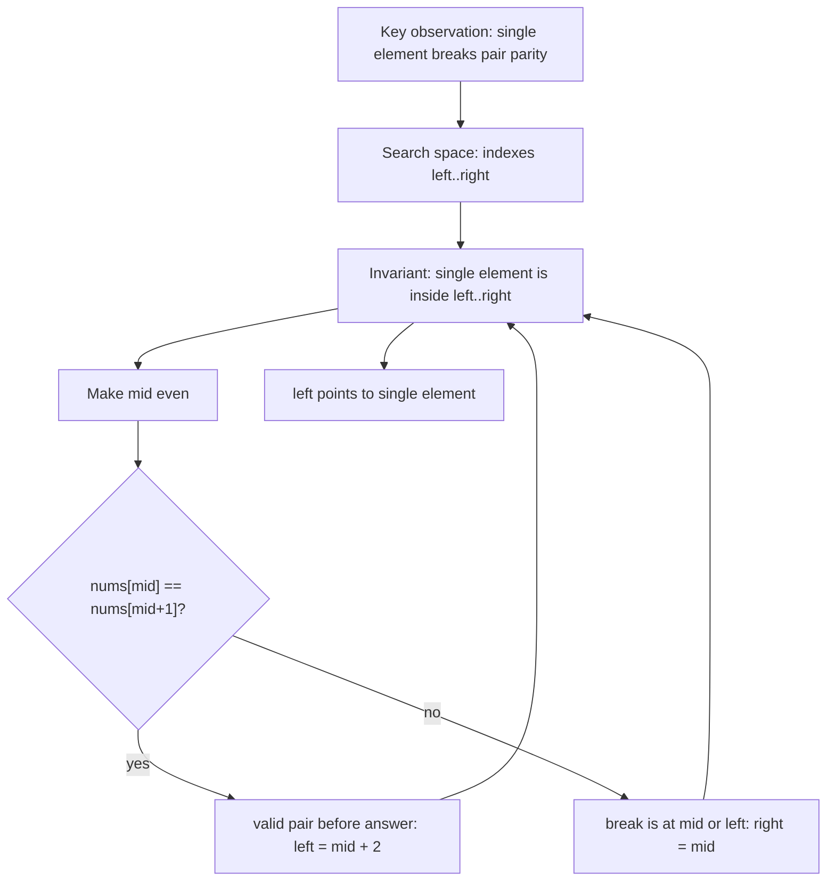
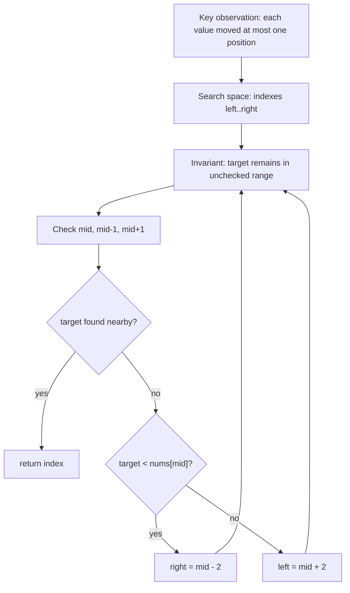

# LC 540 - Single Element in Sorted Array

TODO: Review final placement. Original category is Index Twist, which is not part of the requested Binary Search target folder list.

LeetCode Link: https://leetcode.com/problems/single-element-in-a-sorted-array/
Pattern: Binary Search
Category: Index Twist
Difficulty: Medium
Status:

## 1. Problem Statement

Given a sorted array where every element appears exactly twice except one element that appears once, return the single element.

## 2. Pattern Recognition

| Item | Notes |
| :--- | :--- |
| Clues | Sorted array, pairs, exactly one single element. |
| Category | Index Twist |
| Search Space | Index range `[0, n - 1]` |
| Monotonic Property | Before the single element, pairs start at even indexes; after it, pairs start at odd indexes. |
| Invariant | The single element always remains inside `[left, right]`. |

## 3. Brute Force Approach

- Scan the array and compare neighboring elements.
- Return the element that does not match its neighbor.

Why inefficient:

- It uses `O(n)` time.
- The sorted pair structure gives enough information to discard half the array.

## 4. Intuition Shift / Aha Moment

### Intuition: The Single Value Shifts Pair Alignment

Imagine paired seats. Before the unpaired passenger, every pair starts at an even index. After that passenger occupies one seat alone, every later pair starts at an odd index.

```text
nums  = [1, 1, 2, 3, 3, 4, 4, 8, 8]
index =  0  1  2  3  4  5  6  7  8
                ^ single

before single: pair starts 0, ...
after single:  pair starts 3, 5, 7
```

So we are not searching values. We are searching the first index where pair alignment breaks.

### Invariant

The unique element remains inside `[left, right]`. After forcing `mid` to an even index, `nums[mid] == nums[mid+1]` proves the singleton is strictly to the right; inequality proves it is at `mid` or to the left.

### Example Walkthrough

```text
left=0, right=8, mid=4 (already even)
nums[4]=3, nums[5]=4 -> pair broken
             ^  ^
```

Why keep `mid` by setting `right=mid`? `nums[mid]` itself could be the singleton. Discarding it would be unsafe.

```text
left=0, right=4, mid=2
nums[2]=2, nums[3]=3 -> broken again -> right=2

left=0, right=2, mid=1 -> normalize to even mid=0
nums[0]=1, nums[1]=1 -> intact pair -> left=2
```

Now `left == right == 2`, the singleton.

### Edge Case / Correction

Always compare an even pair start with `mid+1`. Without normalizing odd `mid`, the same equality can describe the second member of a healthy pair and lead to the wrong side.

### Final Recall

```text
Search the alignment break, not the value.
Make mid even.
mid and mid+1 equal: intact pair, single is right.
Different: break is at mid or left, keep mid.
left == right is the single index.
```

## 5. Optimized Algorithm

Steps:

1. Set `left = 0`, `right = n - 1`.
2. While `left < right`:
   - Compute `mid`.
   - If `mid` is odd, move it one step left so it points to the first index of a pair.
   - If `nums[mid] == nums[mid + 1]`, discard this valid pair and everything before it.
   - Else, keep the left half including `mid`.
3. Return `nums[left]`.

Pseudocode:

```text
left = 0
right = n - 1

while left < right:
    mid = left + (right - left) / 2
    if mid is odd:
        mid = mid - 1

    if nums[mid] == nums[mid + 1]:
        left = mid + 2
    else:
        right = mid

return nums[left]
```

## 6. Dry Run

Example:

```text
nums = [1, 1, 2, 3, 3, 4, 4]
```

| Step | left | right | mid | Check | Movement |
| :--- | :--- | :--- | :--- | :--- | :--- |
| 1 | 0 | 6 | 3 -> 2 | `nums[2] != nums[3]` | `right = 2` |
| 2 | 0 | 2 | 1 -> 0 | `nums[0] == nums[1]` | `left = 2` |
| End | 2 | 2 | - | single found | return `nums[2] = 2` |

## 7. Edge Cases

- Array has one element.
- Single element is at the beginning.
- Single element is at the end.
- Single element is in the middle.
- Always ensure `mid + 1` is valid by using `left < right`.

## 8. Complexity

| Type | Complexity | Reason |
| :--- | :--- | :--- |
| Time | `O(log n)` | Half the search space is removed each step. |
| Space | `O(1)` | Only pointers are used. |

## 9. C++ Code

```cpp
class Solution {
public:
    int singleNonDuplicate(vector<int>& nums) {
        int left = 0;
        int right = nums.size() - 1;

        while (left < right) {
            int mid = left + (right - left) / 2;

            if (mid % 2 == 1) {
                mid--;
            }

            if (nums[mid] == nums[mid + 1]) {
                left = mid + 2;
            } else {
                right = mid;
            }
        }

        return nums[left];
    }
};
```

## 10. Interview One-Liner

The single element shifts pair alignment, so checking whether an even index still starts a valid pair tells which half contains the answer.

## 11. Image / Visual Reference

TODO: Original note referenced missing image asset `Images/LC_540_Single_Element_In_Sorted_Array.png`. Keep this placeholder until the source image is available.


# Binary Search in Nearly Sorted Array

TODO: Review final placement. Original category is Index Twist, which is not part of the requested Binary Search target folder list.

LeetCode Link:
Pattern: Binary Search
Category: Index Twist
Difficulty:
Status:

## 1. Problem Statement

Given a nearly sorted array where each element may be at its correct sorted position, one position left, or one position right, find the index of a target value.

## 2. Pattern Recognition

| Item | Notes |
| :--- | :--- |
| Clues | Array is almost sorted, target may be near `mid`. |
| Category | Index Twist |
| Search Space | Index range `[0, n - 1]` |
| Monotonic Property | After checking `mid`, `mid - 1`, and `mid + 1`, values on one side can still be discarded using sorted order. |
| Invariant | If the target exists, it remains inside the unsearched range after the nearby positions are checked. |

## 3. Brute Force Approach

- Scan every index.
- Return the index where `arr[i] == target`.

Why inefficient:

- It ignores that the array is still mostly sorted.
- After checking the local neighborhood around `mid`, binary search can remove almost half the array.

## 4. Intuition Shift / Aha Moment

### Intuition: Every Item May Have Slipped by One Seat

Start with a sorted row, then allow each item to move at most one position from where ordinary binary search expects it. If `mid` is not the target, the target may still be hiding at `mid-1` or `mid+1`.

```text
arr = [10, 3, 40, 20, 50, 80, 70], target = 70
index  0  1   2   3   4   5   6
```

After checking those three nearby seats, we can discard more aggressively than normal: none of them can contain the target.

### Invariant

If the target exists, it remains in `[left, right]`. Before discarding a side, `mid-1`, `mid`, and `mid+1` have all been checked, so the next possible range starts two positions beyond `mid`.

### Example Walkthrough

```text
left=0, right=6, mid=3
arr[2], arr[3], arr[4] = 40, 20, 50
                         ^ checked neighborhood
```

`70` is larger than `arr[mid]=20`. Why move to `mid+2`, not `mid+1`? Index `4` was explicitly checked, so keeping it adds no possibility.

```text
left=5, right=6, mid=5
arr[4], arr[5], arr[6] = 50, 80, 70
                                  ^ found
```

### Edge Case / Correction

Check bounds before reading neighbors. This method depends on the displacement guarantee of at most one index; without that guarantee, comparing only three positions cannot justify discarding a half.

### Final Recall

```text
At mid, check mid, mid-1, and mid+1.
If target is smaller than arr[mid], jump right to mid-2.
If larger, jump left to mid+2.
The extra jump is valid because both neighboring positions were checked.
```

## 5. Optimized Algorithm

Steps:

1. Set `left = 0`, `right = n - 1`.
2. While `left <= right`:
   - Compute `mid`.
   - Check `arr[mid]`.
   - Check `arr[mid - 1]` if valid.
   - Check `arr[mid + 1]` if valid.
   - If `target < arr[mid]`, move `right = mid - 2`.
   - Else move `left = mid + 2`.
3. Return `-1` if not found.

Pseudocode:

```text
while left <= right:
    mid = left + (right - left) / 2

    check mid
    check mid - 1
    check mid + 1

    if target < arr[mid]:
        right = mid - 2
    else:
        left = mid + 2

return -1
```

## 6. Dry Run

Example:

```text
arr = [10, 3, 40, 20, 50, 80, 70]
target = 40
```

| Step | left | right | mid | Checks | Movement |
| :--- | :--- | :--- | :--- | :--- | :--- |
| 1 | 0 | 6 | 3 | `arr[3]=20`, `arr[2]=40` | found at `2` |

Answer: `2`

Another movement example:

```text
arr = [10, 3, 40, 20, 50, 80, 70], target = 70
```

| Step | left | right | mid | Checks | Movement |
| :--- | :--- | :--- | :--- | :--- | :--- |
| 1 | 0 | 6 | 3 | `20, 40, 50` | `target > arr[mid]`, so `left = 5` |
| 2 | 5 | 6 | 5 | `80, 70` | found at `6` |

## 7. Edge Cases

- Empty array.
- One element.
- Target at index `0`.
- Target at last index.
- Need boundary checks before accessing `mid - 1` or `mid + 1`.
- Target not present.

## 8. Complexity

| Type | Complexity | Reason |
| :--- | :--- | :--- |
| Time | `O(log n)` | Each step removes almost half the range. |
| Space | `O(1)` | Only pointers are used. |

## 9. C++ Code

```cpp
int searchNearlySorted(vector<int>& nums, int target) {
    int left = 0;
    int right = nums.size() - 1;

    while (left <= right) {
        int mid = left + (right - left) / 2;

        if (nums[mid] == target) {
            return mid;
        }

        if (mid - 1 >= left && nums[mid - 1] == target) {
            return mid - 1;
        }

        if (mid + 1 <= right && nums[mid + 1] == target) {
            return mid + 1;
        }

        if (target < nums[mid]) {
            right = mid - 2;
        } else {
            left = mid + 2;
        }
    }

    return -1;
}
```

## 10. Interview One-Liner

Because each value can move by at most one position, checking `mid` and its two neighbors restores the normal binary-search discard rule.

## 11. Image / Visual Reference

TODO: Original note referenced missing image asset `Images/Binary_Search_In_Nearly_Sorted_Array.png`. Keep this placeholder until the source image is available.
