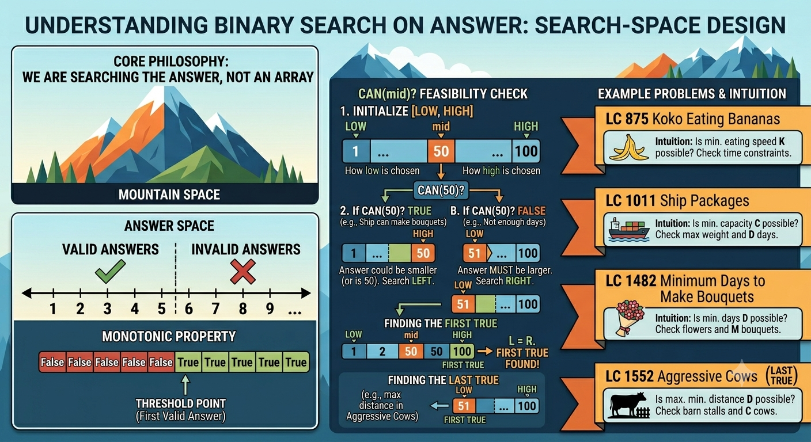

# Binary Search on Answer

# Category: Binary Search On Answer

## Core Idea

Search the answer range, not the input array.

The key function is:

```text
can(mid)
```

## Recognition Signals

- Minimum feasible value.
- Maximum feasible value.
- Optimize answer.
- Capacity, speed, distance, days, allocation, time.

## Invariant

```text
If mid works, then one entire side of possible answers also works.
```

## Problem Ladder

| Order | Problem | Label | Concept |
| :--- | :--- | :--- | :--- |
| 1 | Nth Root of Number | MUST DO | Numerical search |
| 2 | Divide Two Numbers Using Binary Search | Variant | Search quotient |
| 3 | Koko Eating Bananas (875) | MUST DO | Min feasible speed |
| 4 | Capacity to Ship Packages Within D Days (1011) | MUST DO | Min feasible capacity |
| 5 | Minimum Days to Make Bouquets (1482) | MUST DO | Min feasible days |
| 6 | Aggressive Cows / Magnetic Force (1552) | MUST DO | Max feasible distance |
| 7 | Split Array Largest Sum (410) | MUST DO | Minimize maximum partition |
| 8 | EKO SPOJ | Variant | Max cutting height |
| 9 | PRATA SPOJ | Advanced | Time feasibility search |

## What Makes This Category Different

The array may not be sorted. The answer space is monotonic because feasibility changes predictably.

## Common Mistakes

- Not proving `can(mid)` is monotonic.
- Setting `left` and `right` too loose or too narrow.
- Mixing min-feasible and max-feasible update rules.
- Overflow in `mid`, multiplication, or feasibility checks.

## Problem List

- Nth Root of Number
- Divide Two Numbers Using Binary Search
- LC 875 - Koko Eating Bananas
- LC 1011 - Capacity to Ship Packages Within D Days
- LC 1482 - Minimum Days to Make Bouquets
- LC 1552 - Aggressive Cows / Magnetic Force
- LC 410 - Split Array Largest Sum
- EKO SPOJ
- PRATA SPOJ

## Solutions

See [solutions.md](solutions.md).

## Visual Intuition



This image explains answer-space search and the monotonic feasible/infeasible boundary.