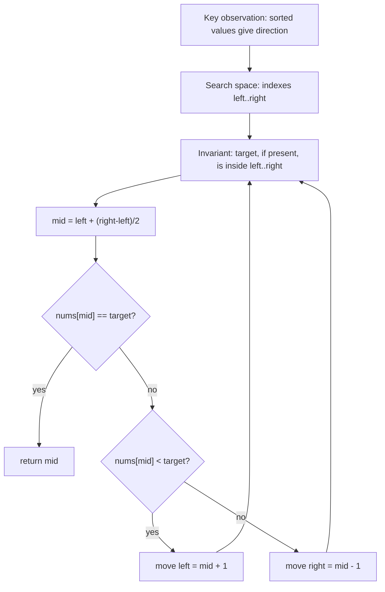

# LC 704 - Binary Search

## Pattern

Binary Search / Classic Binary Search

LeetCode Link: https://leetcode.com/problems/binary-search/
Pattern: Binary Search
Category: Classic Binary Search
Difficulty: Easy
Status:

## 1. Problem Statement

Given a sorted integer array and a target value, return the index of the target if it exists. If the target is not present, return `-1`.

## 2. Pattern Recognition

| Item | Notes |
| :--- | :--- |
| Clues | The array is sorted, and we need to find one exact target. |
| Category | Classic Binary Search |
| Search Space | Index range `[0, n - 1]` |
| Monotonic Property | Values increase from left to right, so comparing `nums[mid]` with `target` tells which half cannot contain the answer. |
| Invariant | If the target exists, it always remains inside the current range `[left, right]`. |

## 3. Brute Force Approach

- Scan every index from left to right.
- If `nums[i] == target`, return `i`.
- If the loop ends, return `-1`.

Why inefficient:

- It ignores the sorted order.
- Worst case checks all `n` elements even though half the array can be discarded after one comparison.

## 4. Intuition Shift / Aha Moment

The sorted order gives direction.

- If `nums[mid] == target`, we found the answer.
- If `nums[mid] < target`, every index `<= mid` is too small, so move right.
- If `nums[mid] > target`, every index `>= mid` is too large, so move left.

Each step removes half of the remaining search space.

## 5. Optimized Algorithm

Steps:

1. Set `left = 0`, `right = n - 1`.
2. While `left <= right`:
   - Compute `mid = left + (right - left) / 2`.
   - If `nums[mid] == target`, return `mid`.
   - If `nums[mid] < target`, search the right half.
   - Else, search the left half.
3. If the loop ends, the target does not exist.

Pseudocode:

```text
left = 0
right = n - 1

while left <= right:
    mid = left + (right - left) / 2

    if nums[mid] == target:
        return mid
    else if nums[mid] < target:
        left = mid + 1
    else:
        right = mid - 1

return -1
```

## 6. Dry Run

Example:

```text
nums = [-1, 0, 3, 5, 9, 12]
target = 9
```

| Step | left | right | mid | nums[mid] | Condition | Movement |
| :--- | :--- | :--- | :--- | :--- | :--- | :--- |
| 1 | 0 | 5 | 2 | 3 | `3 < 9` | `left = mid + 1 = 3` |
| 2 | 3 | 5 | 4 | 9 | `9 == 9` | return `4` |

Answer: `4`

## 7. Edge Cases

- Empty array: return `-1`.
- One element and it matches target.
- One element and it does not match target.
- Target smaller than first element.
- Target larger than last element.
- Negative numbers.
- Target not present between two existing values.

## 8. Complexity

| Type | Complexity | Reason |
| :--- | :--- | :--- |
| Time | `O(log n)` | Search space halves each step. |
| Space | `O(1)` | Only pointers are used. |

## 9. C++ Code

```cpp
class Solution {
public:
    int search(vector<int>& nums, int target) {
        int left = 0;
        int right = nums.size() - 1;

        while (left <= right) {
            int mid = left + (right - left) / 2;

            if (nums[mid] == target) {
                return mid;
            }

            if (nums[mid] < target) {
                left = mid + 1;
            } else {
                right = mid - 1;
            }
        }

        return -1;
    }
};
```

## 10. Interview One-Liner

Because the array is sorted, every midpoint comparison proves one half impossible, so we keep only the half where the target can still exist.

## 11. Image / Visual Reference

TODO: Original note referenced missing image asset `Images/LC_704_Binary_Search.png`. Keep this placeholder until the source image is available.
