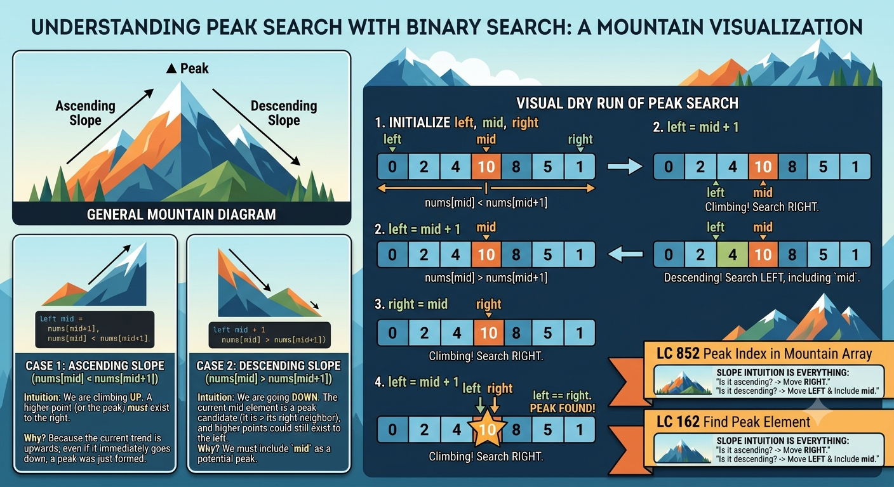

# Peak / Valley Search

# Category: Peak / Mountain Search

## Core Idea

Search using slope direction instead of direct target comparison.

## Recognition Signals

- Peak element.
- Mountain array.
- Neighbor comparison like `nums[mid] < nums[mid + 1]`.

## Invariant

```text
Slope direction tells which side must contain a peak.
```

## Problem Ladder

| Order | Problem | Label | Concept |
| :--- | :--- | :--- | :--- |
| 1 | Find Peak Element (162) | MUST DO | Slope analysis |
| 2 | Peak Index in Mountain Array (852) | MUST DO | Unique peak |
| 3 | Find in Mountain Array (1095) | Advanced | Peak + binary search |

## What Makes This Category Different

You compare neighbors, not target values. The goal is often a local or global peak.

## Common Mistakes

- Accessing `mid + 1` when `mid` can be the last index.
- Using exact-target logic instead of slope logic.
- Forgetting that LC 162 allows any valid peak.

## Problem List

- LC 162 - Find Peak Element
- LC 852 - Peak Index in Mountain Array
- LC 1095 - Find in Mountain Array

## Solutions

See [solutions.md](solutions.md).

## Visual Intuition



This image explains why comparing 
ums[mid] and 
ums[mid + 1] tells us which slope still contains a peak.