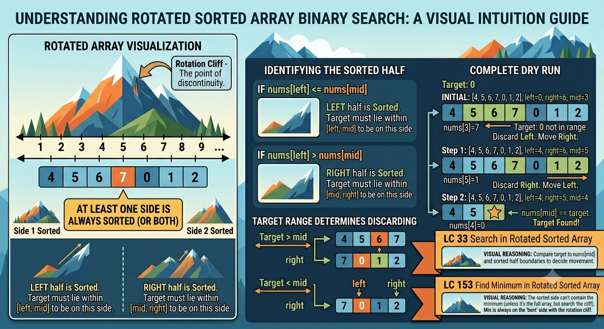

# Search in Rotated Array

# Category: Rotated Sorted Array

## Core Idea

The array is modified, but at least one side of `mid` remains sorted.

## Recognition Signals

- Sorted array was rotated.
- Need to find target or minimum.
- Duplicates may weaken the sorted-half decision.

## Invariant

```text
At least one side is sorted, or duplicates must be trimmed safely.
```

## Problem Ladder

| Order | Problem | Label | Concept |
| :--- | :--- | :--- | :--- |
| 1 | Search in Rotated Sorted Array (33) | MUST DO | One side always sorted |
| 2 | Find Minimum in Rotated Sorted Array (153) | MUST DO | Rotation pivot |
| 3 | Search in Rotated Sorted Array II (81) | Variant | Duplicates |
| 4 | Find Minimum in Rotated Sorted Array II (154) | Advanced | Duplicates + pivot |

## What Makes This Category Different

You first identify the sorted half, then decide whether the target or pivot can live there.

## Common Mistakes

- Checking target range before identifying the sorted half.
- Mishandling duplicates in LC 81 / LC 154.
- Using normal binary search on a rotated array.

## Problem List

- LC 33 - Search in Rotated Sorted Array
- LC 153 - Find Minimum in Rotated Sorted Array
- LC 81 - Search in Rotated Sorted Array II
- LC 154 - Find Minimum in Rotated Sorted Array II

## Solutions

See [solutions.md](solutions.md).

## Visual Intuition



This image explains the sorted-half decision used to discard one side of a rotated array.