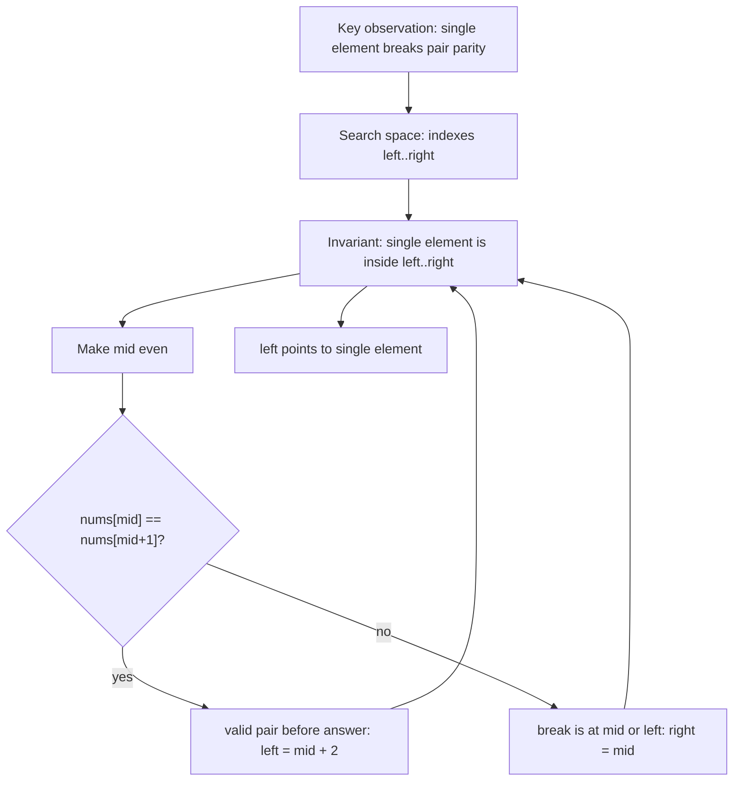
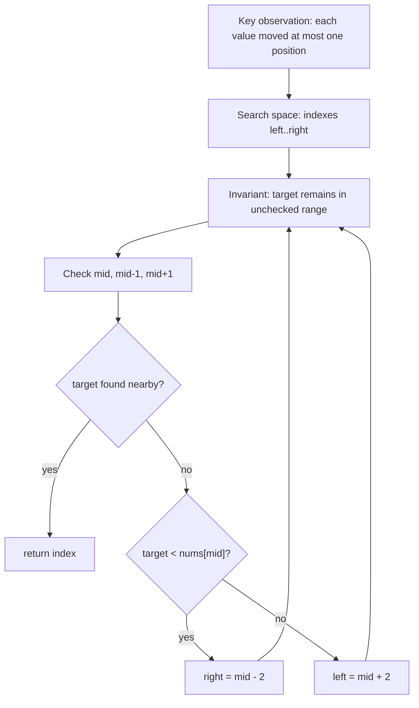
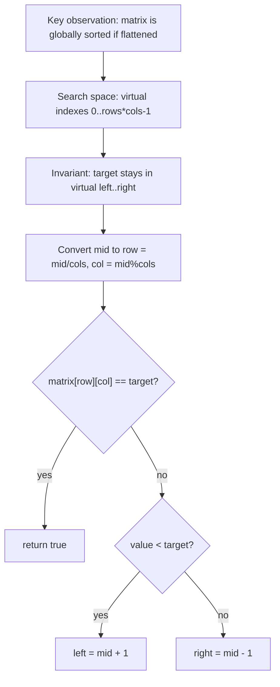
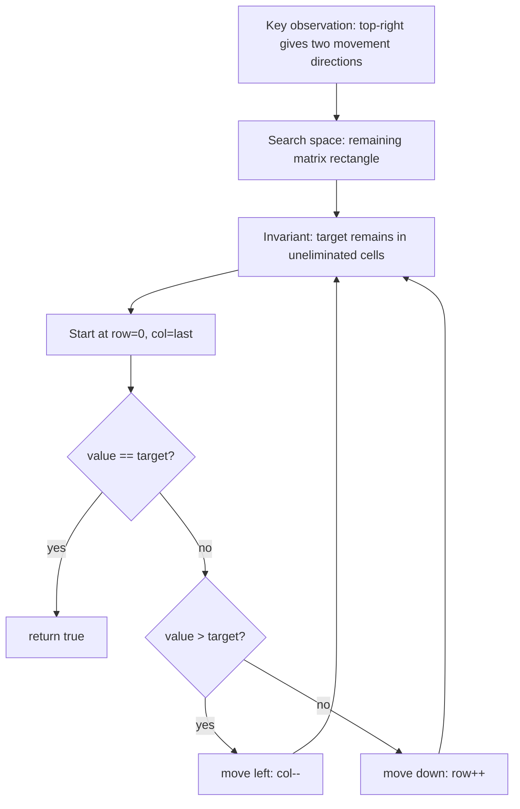
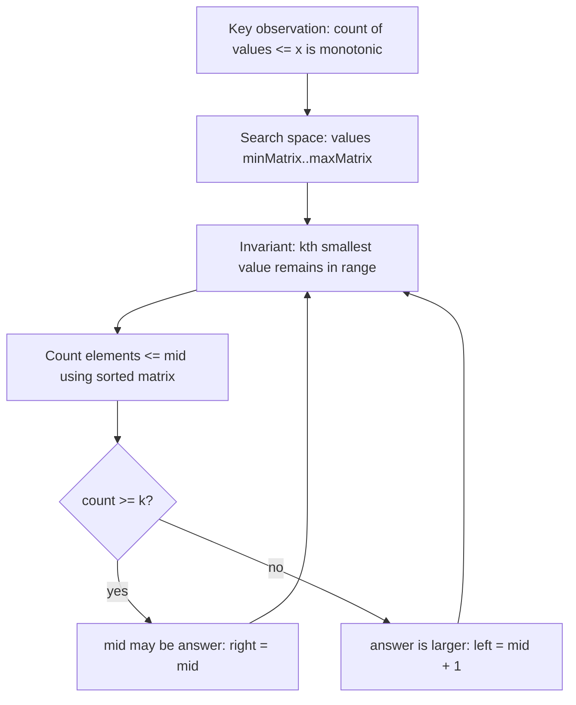
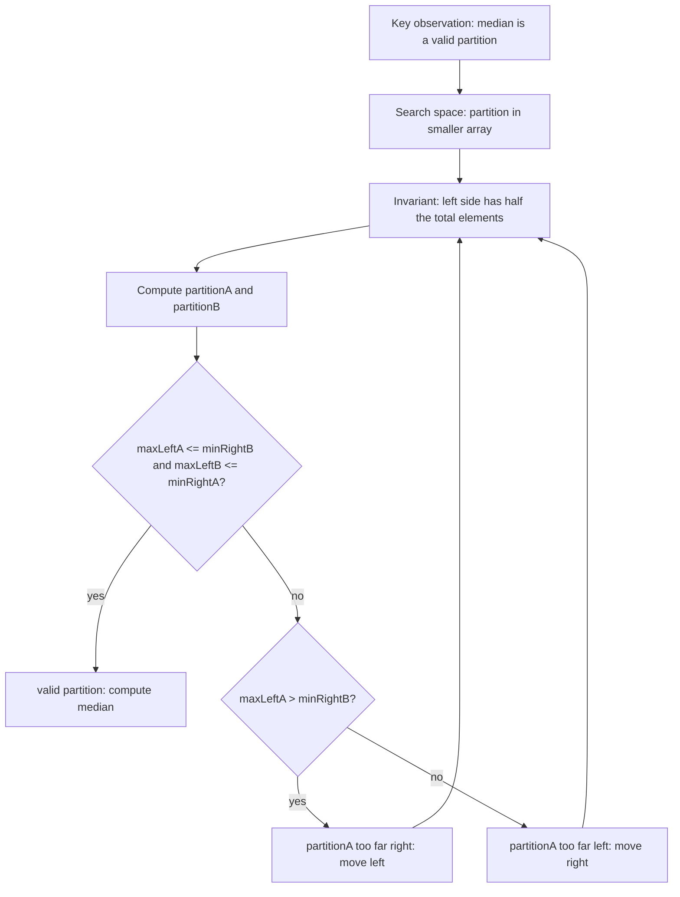

# LC 540 - Single Element in Sorted Array

TODO: Review final placement. Original category is Index Twist, which is not part of the requested Binary Search target folder list.

LeetCode Link: https://leetcode.com/problems/single-element-in-a-sorted-array/
Pattern: Binary Search
Category: Index Twist
Difficulty: Medium
Status:

## 1. Problem Statement

Given a sorted array where every element appears exactly twice except one element that appears once, return the single element.

## 2. Pattern Recognition

| Item | Notes |
| :--- | :--- |
| Clues | Sorted array, pairs, exactly one single element. |
| Category | Index Twist |
| Search Space | Index range `[0, n - 1]` |
| Monotonic Property | Before the single element, pairs start at even indexes; after it, pairs start at odd indexes. |
| Invariant | The single element always remains inside `[left, right]`. |

## 3. Brute Force Approach

- Scan the array and compare neighboring elements.
- Return the element that does not match its neighbor.

Why inefficient:

- It uses `O(n)` time.
- The sorted pair structure gives enough information to discard half the array.

## 4. Intuition Shift / Aha Moment

In a perfect paired array:

```text
index: 0 1 2 3 4 5
value: a a b b c c
```

Pairs start at even indexes. The single element breaks this alignment.

- If `mid` is made even and `nums[mid] == nums[mid + 1]`, the single element is after this pair.
- Otherwise, the single element is at `mid` or before it.

## 5. Optimized Algorithm

Steps:

1. Set `left = 0`, `right = n - 1`.
2. While `left < right`:
   - Compute `mid`.
   - If `mid` is odd, move it one step left so it points to the first index of a pair.
   - If `nums[mid] == nums[mid + 1]`, discard this valid pair and everything before it.
   - Else, keep the left half including `mid`.
3. Return `nums[left]`.

Pseudocode:

```text
left = 0
right = n - 1

while left < right:
    mid = left + (right - left) / 2
    if mid is odd:
        mid = mid - 1

    if nums[mid] == nums[mid + 1]:
        left = mid + 2
    else:
        right = mid

return nums[left]
```

## 6. Dry Run

Example:

```text
nums = [1, 1, 2, 3, 3, 4, 4]
```

| Step | left | right | mid | Check | Movement |
| :--- | :--- | :--- | :--- | :--- | :--- |
| 1 | 0 | 6 | 3 -> 2 | `nums[2] != nums[3]` | `right = 2` |
| 2 | 0 | 2 | 1 -> 0 | `nums[0] == nums[1]` | `left = 2` |
| End | 2 | 2 | - | single found | return `nums[2] = 2` |

## 7. Edge Cases

- Array has one element.
- Single element is at the beginning.
- Single element is at the end.
- Single element is in the middle.
- Always ensure `mid + 1` is valid by using `left < right`.

## 8. Complexity

| Type | Complexity | Reason |
| :--- | :--- | :--- |
| Time | `O(log n)` | Half the search space is removed each step. |
| Space | `O(1)` | Only pointers are used. |

## 9. C++ Code

```cpp
class Solution {
public:
    int singleNonDuplicate(vector<int>& nums) {
        int left = 0;
        int right = nums.size() - 1;

        while (left < right) {
            int mid = left + (right - left) / 2;

            if (mid % 2 == 1) {
                mid--;
            }

            if (nums[mid] == nums[mid + 1]) {
                left = mid + 2;
            } else {
                right = mid;
            }
        }

        return nums[left];
    }
};
```

## 10. Interview One-Liner

The single element shifts pair alignment, so checking whether an even index still starts a valid pair tells which half contains the answer.

## 11. Image / Visual Reference

TODO: Original note referenced missing image asset `Images/LC_540_Single_Element_In_Sorted_Array.png`. Keep this placeholder until the source image is available.


# Binary Search in Nearly Sorted Array

TODO: Review final placement. Original category is Index Twist, which is not part of the requested Binary Search target folder list.

LeetCode Link:
Pattern: Binary Search
Category: Index Twist
Difficulty:
Status:

## 1. Problem Statement

Given a nearly sorted array where each element may be at its correct sorted position, one position left, or one position right, find the index of a target value.

## 2. Pattern Recognition

| Item | Notes |
| :--- | :--- |
| Clues | Array is almost sorted, target may be near `mid`. |
| Category | Index Twist |
| Search Space | Index range `[0, n - 1]` |
| Monotonic Property | After checking `mid`, `mid - 1`, and `mid + 1`, values on one side can still be discarded using sorted order. |
| Invariant | If the target exists, it remains inside the unsearched range after the nearby positions are checked. |

## 3. Brute Force Approach

- Scan every index.
- Return the index where `arr[i] == target`.

Why inefficient:

- It ignores that the array is still mostly sorted.
- After checking the local neighborhood around `mid`, binary search can remove almost half the array.

## 4. Intuition Shift / Aha Moment

In a nearly sorted array, `target` may not be exactly at `mid`, but if it belongs near `mid`, it can only be at:

```text
mid - 1, mid, or mid + 1
```

Once those three positions are checked:

- If `target < arr[mid]`, it must be on the left side before `mid - 1`.
- If `target > arr[mid]`, it must be on the right side after `mid + 1`.

## 5. Optimized Algorithm

Steps:

1. Set `left = 0`, `right = n - 1`.
2. While `left <= right`:
   - Compute `mid`.
   - Check `arr[mid]`.
   - Check `arr[mid - 1]` if valid.
   - Check `arr[mid + 1]` if valid.
   - If `target < arr[mid]`, move `right = mid - 2`.
   - Else move `left = mid + 2`.
3. Return `-1` if not found.

Pseudocode:

```text
while left <= right:
    mid = left + (right - left) / 2

    check mid
    check mid - 1
    check mid + 1

    if target < arr[mid]:
        right = mid - 2
    else:
        left = mid + 2

return -1
```

## 6. Dry Run

Example:

```text
arr = [10, 3, 40, 20, 50, 80, 70]
target = 40
```

| Step | left | right | mid | Checks | Movement |
| :--- | :--- | :--- | :--- | :--- | :--- |
| 1 | 0 | 6 | 3 | `arr[3]=20`, `arr[2]=40` | found at `2` |

Answer: `2`

Another movement example:

```text
arr = [10, 3, 40, 20, 50, 80, 70], target = 70
```

| Step | left | right | mid | Checks | Movement |
| :--- | :--- | :--- | :--- | :--- | :--- |
| 1 | 0 | 6 | 3 | `20, 40, 50` | `target > arr[mid]`, so `left = 5` |
| 2 | 5 | 6 | 5 | `80, 70` | found at `6` |

## 7. Edge Cases

- Empty array.
- One element.
- Target at index `0`.
- Target at last index.
- Need boundary checks before accessing `mid - 1` or `mid + 1`.
- Target not present.

## 8. Complexity

| Type | Complexity | Reason |
| :--- | :--- | :--- |
| Time | `O(log n)` | Each step removes almost half the range. |
| Space | `O(1)` | Only pointers are used. |

## 9. C++ Code

```cpp
int searchNearlySorted(vector<int>& nums, int target) {
    int left = 0;
    int right = nums.size() - 1;

    while (left <= right) {
        int mid = left + (right - left) / 2;

        if (nums[mid] == target) {
            return mid;
        }

        if (mid - 1 >= left && nums[mid - 1] == target) {
            return mid - 1;
        }

        if (mid + 1 <= right && nums[mid + 1] == target) {
            return mid + 1;
        }

        if (target < nums[mid]) {
            right = mid - 2;
        } else {
            left = mid + 2;
        }
    }

    return -1;
}
```

## 10. Interview One-Liner

Because each value can move by at most one position, checking `mid` and its two neighbors restores the normal binary-search discard rule.

## 11. Image / Visual Reference

TODO: Original note referenced missing image asset `Images/Binary_Search_In_Nearly_Sorted_Array.png`. Keep this placeholder until the source image is available.


# LC 74 - Search a 2D Matrix

TODO: Review final placement. Original category is 2D Binary Search, which is not part of the requested Binary Search target folder list.

LeetCode Link: https://leetcode.com/problems/search-a-2d-matrix/
Pattern: Binary Search
Category: 2D Binary Search
Difficulty: Medium
Status:

## 1. Problem Statement

Given a matrix where each row is sorted and each row starts after the previous row's last value, determine whether a target exists.

## 2. Pattern Recognition

| Item | Notes |
| :--- | :--- |
| Clues | Matrix has full row-major sorted order. |
| Category | 2D Binary Search |
| Search Space | Virtual 1D index range `[0, rows * cols - 1]` |
| Monotonic Property | If the matrix is flattened row by row, values are sorted. |
| Invariant | If the target exists, it remains inside the virtual index range `[left, right]`. |

## 3. Brute Force Approach

- Check every cell.
- Return true if any cell equals target.

Why inefficient:

- It takes `O(rows * cols)`.
- The matrix behaves like one sorted array, so binary search can be used.

## 4. Intuition Shift / Aha Moment

Treat the matrix as a sorted 1D array without actually flattening it.

For a virtual index `mid`:

```text
row = mid / cols
col = mid % cols
```

Now apply normal binary search.

## 5. Optimized Algorithm

Steps:

1. Let `rows = matrix.size()` and `cols = matrix[0].size()`.
2. Set `left = 0`, `right = rows * cols - 1`.
3. Convert each `mid` into `(row, col)`.
4. Compare `matrix[row][col]` with target.
5. Move left or right like normal binary search.

Pseudocode:

```text
left = 0
right = rows * cols - 1

while left <= right:
    mid = left + (right - left) / 2
    row = mid / cols
    col = mid % cols

    compare matrix[row][col] with target
```

## 6. Dry Run

Example:

```text
matrix = [[1,3,5],
          [7,9,11]]
target = 9
```

Virtual flattened array:

```text
[1, 3, 5, 7, 9, 11]
```

| Step | left | right | mid | row,col | value | Movement |
| :--- | :--- | :--- | :--- | :--- | :--- | :--- |
| 1 | 0 | 5 | 2 | `(0,2)` | 5 | `5 < 9`, left = 3 |
| 2 | 3 | 5 | 4 | `(1,1)` | 9 | found |

## 7. Edge Cases

- Empty matrix.
- One row.
- One column.
- Target smaller than first value.
- Target larger than last value.
- Target not present.

## 8. Complexity

| Type | Complexity | Reason |
| :--- | :--- | :--- |
| Time | `O(log(rows * cols))` | Binary search over all cells virtually. |
| Space | `O(1)` | No flattened copy is created. |

## 9. C++ Code

```cpp
class Solution {
public:
    bool searchMatrix(vector<vector<int>>& matrix, int target) {
        int rows = matrix.size();
        int cols = matrix[0].size();

        int left = 0;
        int right = rows * cols - 1;

        while (left <= right) {
            int mid = left + (right - left) / 2;
            int row = mid / cols;
            int col = mid % cols;
            int value = matrix[row][col];

            if (value == target) {
                return true;
            }

            if (value < target) {
                left = mid + 1;
            } else {
                right = mid - 1;
            }
        }

        return false;
    }
};
```

## 10. Interview One-Liner

The matrix is globally sorted in row-major order, so binary search it as a virtual 1D array.

## 11. Image / Visual Reference

TODO: Original note referenced missing image asset `Images/LC_74_Search_A_2D_Matrix.png`. Keep this placeholder until the source image is available.


# LC 240 - Search a 2D Matrix II

TODO: Review final placement. Original category is 2D Binary Search, which is not part of the requested Binary Search target folder list.

LeetCode Link: https://leetcode.com/problems/search-a-2d-matrix-ii/
Pattern: Binary Search
Category: 2D Binary Search
Difficulty: Medium
Status:

## 1. Problem Statement

Given a matrix where every row and every column is sorted in increasing order, determine whether a target exists.

## 2. Pattern Recognition

| Item | Notes |
| :--- | :--- |
| Clues | Rows sorted, columns sorted, but not globally flattened sorted. |
| Category | 2D Binary Search |
| Search Space | Matrix cells, usually from top-right or bottom-left corner. |
| Monotonic Property | From top-right, moving left decreases value and moving down increases value. |
| Invariant | The target, if it exists, remains in the remaining rectangle after each move. |

## 3. Brute Force Approach

- Scan every cell.
- Return true if target is found.

Why inefficient:

- It takes `O(rows * cols)`.
- Sorted rows and columns allow eliminating one row or one column each step.

## 4. Intuition Shift / Aha Moment

Start at the top-right corner.

- If current value equals target, return true.
- If current value is greater than target, move left because everything below is even larger.
- If current value is smaller than target, move down because everything left is even smaller.

Each move discards a row or column.

## 5. Optimized Algorithm

Steps:

1. Start at `row = 0`, `col = cols - 1`.
2. While inside the matrix:
   - Compare `matrix[row][col]` with target.
   - If equal, return true.
   - If too large, move left.
   - If too small, move down.
3. Return false.

Pseudocode:

```text
row = 0
col = cols - 1

while row < rows and col >= 0:
    if matrix[row][col] == target:
        return true
    else if matrix[row][col] > target:
        col--
    else:
        row++

return false
```

## 6. Dry Run

Example:

```text
matrix = [[1, 4, 7],
          [2, 5, 8],
          [3, 6, 9]]
target = 6
```

| Step | row | col | value | Condition | Movement |
| :--- | :--- | :--- | :--- | :--- | :--- |
| 1 | 0 | 2 | 7 | `7 > 6` | move left |
| 2 | 0 | 1 | 4 | `4 < 6` | move down |
| 3 | 1 | 1 | 5 | `5 < 6` | move down |
| 4 | 2 | 1 | 6 | found | return true |

## 7. Edge Cases

- Empty matrix.
- One row.
- One column.
- Target smaller than all values.
- Target larger than all values.
- Matrix is not globally flattened sorted, so do not use LC 74 logic.

## 8. Complexity

| Type | Complexity | Reason |
| :--- | :--- | :--- |
| Time | `O(rows + cols)` | Each move removes one row or one column. |
| Space | `O(1)` | Only row and column pointers are used. |

## 9. C++ Code

```cpp
class Solution {
public:
    bool searchMatrix(vector<vector<int>>& matrix, int target) {
        int rows = matrix.size();
        int cols = matrix[0].size();

        int row = 0;
        int col = cols - 1;

        while (row < rows && col >= 0) {
            int value = matrix[row][col];

            if (value == target) {
                return true;
            }

            if (value > target) {
                col--;
            } else {
                row++;
            }
        }

        return false;
    }
};
```

## 10. Interview One-Liner

From the top-right corner, every comparison eliminates either the current column or the current row.

## 11. Image / Visual Reference

TODO: Original note referenced missing image asset `Images/LC_240_Search_A_2D_Matrix_II.png`. Keep this placeholder until the source image is available.


# LC 378 - Kth Smallest Element in Sorted Matrix

TODO: Review final placement. Original category is 2D Binary Search / value-space search. The requested target tree has no 2D category.

LeetCode Link: https://leetcode.com/problems/kth-smallest-element-in-a-sorted-matrix/
Pattern: Binary Search
Category: 2D Binary Search
Difficulty: Medium
Status:

## 1. Problem Statement

Given an `n x n` matrix where every row and column is sorted, return the kth smallest value in the matrix.

## 2. Pattern Recognition

| Item | Notes |
| :--- | :--- |
| Clues | kth smallest, sorted rows and columns, value order. |
| Category | 2D Binary Search |
| Search Space | Value range `[matrix[0][0], matrix[n - 1][n - 1]]` |
| Monotonic Property | As candidate value `mid` increases, count of elements `<= mid` never decreases. |
| Invariant | The kth smallest value remains inside `[left, right]`. |

## 3. Brute Force Approach

- Put all matrix values into a list.
- Sort the list.
- Return the kth value.

Why inefficient:

- Sorting all `n^2` values costs extra time and memory.
- The sorted matrix lets us count how many values are `<= mid` efficiently.

## Search Space Design

1. Actual answer being searched:
   - The kth smallest value itself.
   - We are not searching a matrix index; we are searching the numeric value that could be the kth smallest.

2. Lower bound `low`:
   - `low = matrix[0][0]`.
   - Because rows and columns are sorted, the top-left cell is the smallest value in the matrix.
   - The kth smallest value can never be smaller than the smallest matrix value.

3. Upper bound `high`:
   - `high = matrix[n - 1][n - 1]`.
   - Because rows and columns are sorted, the bottom-right cell is the largest value in the matrix.
   - The kth smallest value can never be larger than the largest matrix value.

4. Why answer lies inside `[low, high]`:
   - Every matrix value lies between the smallest and largest matrix values.
   - Since the kth smallest is one of those values, it must also lie in this range.

Search Space:

```text
[matrix[0][0] ------------------------ matrix[n-1][n-1]]
 smallest value                       largest value
```

### Bound Validation

- Could the answer ever be smaller than `low`?
  - No. There is no matrix value smaller than the top-left value.
- Could the answer ever be larger than `high`?
  - No. There is no matrix value larger than the bottom-right value.

Real-world meaning:

- `low` is the smallest possible candidate value.
- `high` is the largest possible candidate value.
- Binary search asks: "Are there already at least `k` values less than or equal to this candidate?"

## 4. Intuition Shift / Aha Moment

Do not binary search indexes. Binary search the answer value.

For a candidate `mid`:

- Count how many matrix values are `<= mid`.
- If count is at least `k`, the kth smallest is `mid` or smaller.
- If count is less than `k`, the kth smallest is larger.

## 5. Optimized Algorithm

Steps:

1. Set `left = smallest matrix value`, `right = largest matrix value`.
2. While `left < right`:
   - Compute `mid`.
   - Count values `<= mid`.
   - If count `>= k`, move `right = mid`.
   - Else move `left = mid + 1`.
3. Return `left`.

Counting trick:

- Start from bottom-left.
- If `matrix[row][col] <= mid`, then all values above in that column are also `<= mid`; add `row + 1` and move right.
- Else move up.

Pseudocode:

```text
left = matrix[0][0]
right = matrix[n - 1][n - 1]

while left < right:
    mid = left + (right - left) / 2
    count = countLessEqual(mid)

    if count >= k:
        right = mid
    else:
        left = mid + 1

return left
```

## 6. Dry Run

Example:

```text
matrix = [[1, 5, 9],
          [10, 11, 13],
          [12, 13, 15]]
k = 8
```

| Step | left | right | mid | Count <= mid | Movement |
| :--- | :--- | :--- | :--- | :--- | :--- |
| 1 | 1 | 15 | 8 | 2 | count < 8, `left = 9` |
| 2 | 9 | 15 | 12 | 6 | count < 8, `left = 13` |
| 3 | 13 | 15 | 14 | 8 | count >= 8, `right = 14` |
| 4 | 13 | 14 | 13 | 8 | count >= 8, `right = 13` |
| End | 13 | 13 | - | - | return `13` |

## 7. Edge Cases

- `k == 1`, return smallest.
- `k == n * n`, return largest.
- Duplicate values.
- Negative values.
- Do not assume the kth value is at a simple row/column index.

## 8. Complexity

| Type | Complexity | Reason |
| :--- | :--- | :--- |
| Time | `O(n log(valueRange))` | Each count is `O(n)`. |
| Space | `O(1)` | No extra sorted list is created. |

## 9. C++ Code

```cpp
class Solution {
private:
    int countLessEqual(vector<vector<int>>& matrix, int target) {
        int n = matrix.size();
        int row = n - 1;
        int col = 0;
        int count = 0;

        while (row >= 0 && col < n) {
            if (matrix[row][col] <= target) {
                count += row + 1;
                col++;
            } else {
                row--;
            }
        }

        return count;
    }

public:
    int kthSmallest(vector<vector<int>>& matrix, int k) {
        int n = matrix.size();
        int left = matrix[0][0];
        int right = matrix[n - 1][n - 1];

        while (left < right) {
            int mid = left + (right - left) / 2;

            if (countLessEqual(matrix, mid) >= k) {
                right = mid;
            } else {
                left = mid + 1;
            }
        }

        return left;
    }
};
```

## 10. Interview One-Liner

The kth smallest value is found by binary searching values and counting how many matrix elements are less than or equal to each candidate.

## 11. Image / Visual Reference

TODO: Original note referenced missing image asset `Images/LC_378_Kth_Smallest_Element_In_Sorted_Matrix.png`. Keep this placeholder until the source image is available.


# LC 4 - Median of Two Sorted Arrays

TODO: Review final placement. Original category is Special Partition Search, not Binary Search on Answer in these notes.

LeetCode Link: https://leetcode.com/problems/median-of-two-sorted-arrays/
Pattern: Binary Search
Category: Binary Search on Partition
Difficulty: Hard
Status:

## 1. Problem Statement

Given two sorted arrays, find the median value of the combined sorted order without fully merging both arrays.

## 2. Pattern Recognition

| Item | Notes |
| :--- | :--- |
| Clues | Two sorted arrays, median, required logarithmic time. |
| Category | Binary Search on Partition |
| Search Space | Partition position in the smaller array |
| Monotonic Property | If the left partition of array A is too large, move partition left; if too small, move partition right. |
| Invariant | The correct partition keeps exactly half the elements on the left and satisfies `maxLeft <= minRight`. |

## 3. Brute Force Approach

- Merge both arrays like merge sort.
- Find the middle element or average of two middle elements.

Why inefficient:

- Full merge takes `O(m + n)` time and extra space.
- Since both arrays are already sorted, we only need the correct partition, not the full merged array.

## 4. Intuition Shift / Aha Moment

Median splits the combined sorted array into two halves.

Instead of merging, choose a partition:

```text
left half size = (m + n + 1) / 2
```

For a valid partition:

```text
max(left side) <= min(right side)
```

Binary search only the smaller array's partition. The other array's partition is forced by the required left-half size.

## 5. Optimized Algorithm

Steps:

1. Always binary search the smaller array.
2. Let `partitionA` be the cut in array A.
3. Let `partitionB = halfSize - partitionA`.
4. Read boundary values:
   - `maxLeftA`
   - `minRightA`
   - `maxLeftB`
   - `minRightB`
5. If both left sides are `<=` both right sides, partition is valid.
6. If `maxLeftA > minRightB`, move partitionA left.
7. Else move partitionA right.

Pseudocode:

```text
if nums1 is larger:
    swap arrays

left = 0
right = size of smaller array
half = (m + n + 1) / 2

while left <= right:
    partitionA = midpoint
    partitionB = half - partitionA

    if valid partition:
        return median
    else if maxLeftA > minRightB:
        right = partitionA - 1
    else:
        left = partitionA + 1
```

## 6. Dry Run

Example:

```text
nums1 = [1, 3]
nums2 = [2]
```

Search smaller array:

```text
A = [2]
B = [1, 3]
total = 3
half = 2
```

| Step | left | right | partitionA | partitionB | Boundary Check | Movement |
| :--- | :--- | :--- | :--- | :--- | :--- | :--- |
| 1 | 0 | 1 | 0 | 2 | `maxLeftB = 3 > minRightA = 2` | A has too few left elements, move right |
| 2 | 1 | 1 | 1 | 1 | `maxLeftA = 2 <= minRightB = 3` and `maxLeftB = 1 <= minRightA = INF` | valid |

Odd total length:

```text
median = max(maxLeftA, maxLeftB) = max(2, 1) = 2
```

## 7. Edge Cases

- One array is empty.
- Total length is odd.
- Total length is even.
- All elements of one array are smaller than the other.
- Duplicate values.
- Very different array sizes.
- Use sentinel values for empty partition sides.

## 8. Complexity

| Type | Complexity | Reason |
| :--- | :--- | :--- |
| Time | `O(log(min(m, n)))` | Binary search only the smaller array's partition. |
| Space | `O(1)` | No merged array is created. |

## 9. C++ Code

```cpp
class Solution {
public:
    double findMedianSortedArrays(vector<int>& nums1, vector<int>& nums2) {
        if (nums1.size() > nums2.size()) {
            return findMedianSortedArrays(nums2, nums1);
        }

        int m = nums1.size();
        int n = nums2.size();
        int left = 0;
        int right = m;
        int halfSize = (m + n + 1) / 2;

        while (left <= right) {
            int partitionA = left + (right - left) / 2;
            int partitionB = halfSize - partitionA;

            int maxLeftA = (partitionA == 0) ? INT_MIN : nums1[partitionA - 1];
            int minRightA = (partitionA == m) ? INT_MAX : nums1[partitionA];

            int maxLeftB = (partitionB == 0) ? INT_MIN : nums2[partitionB - 1];
            int minRightB = (partitionB == n) ? INT_MAX : nums2[partitionB];

            if (maxLeftA <= minRightB && maxLeftB <= minRightA) {
                if ((m + n) % 2 == 1) {
                    return max(maxLeftA, maxLeftB);
                }

                return (max(maxLeftA, maxLeftB) + min(minRightA, minRightB)) / 2.0;
            }

            if (maxLeftA > minRightB) {
                right = partitionA - 1;
            } else {
                left = partitionA + 1;
            }
        }

        return 0.0;
    }
};
```

## 10. Interview One-Liner

The median is found by binary searching a valid partition where every value on the combined left half is less than or equal to every value on the combined right half.

## 11. Image / Visual Reference

TODO: Original note referenced missing image asset `Images/LC_4_Median_Of_Two_Sorted_Arrays.png`. Keep this placeholder until the source image is available.
