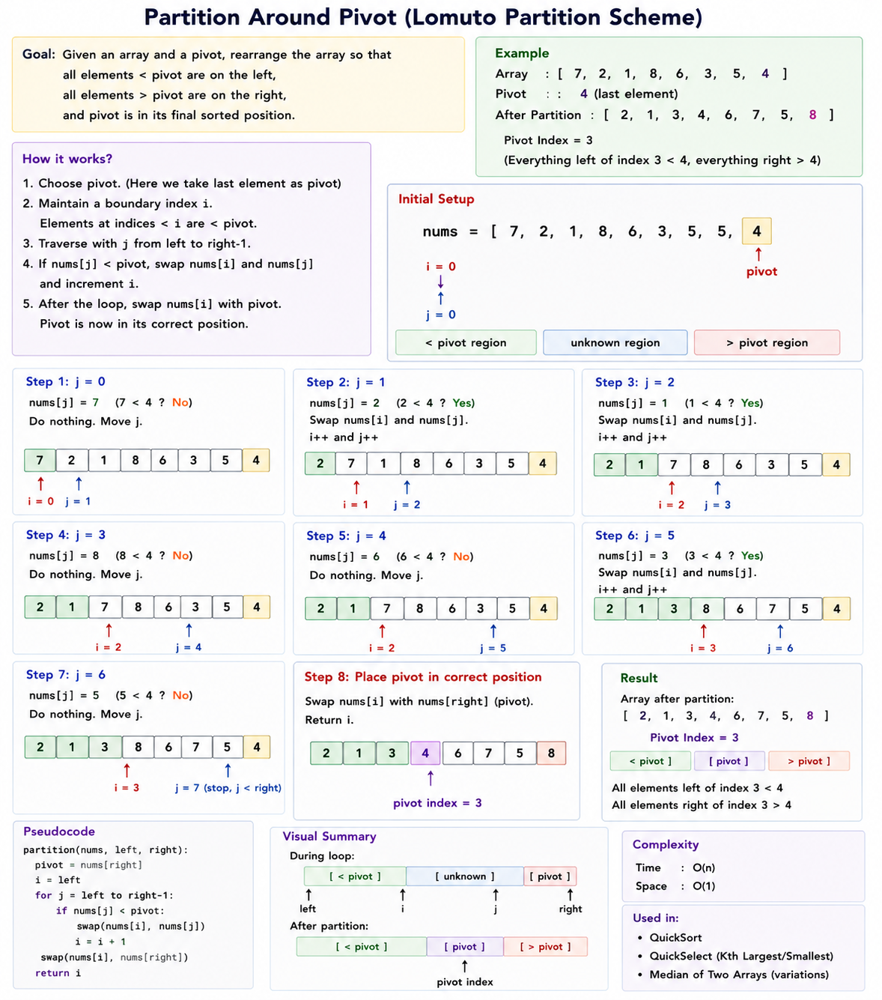

# Move Negative Numbers to One Side

https://youtu.be/T9tzE3NeZl8?si=KrOLZ8jp4Ttau4uF

This is a classic **Array Partitioning Two Pointer** problem.

---

---

# 1. Core Pattern Recognition

Problem:

```text
Move all negative numbers to left side
Move all positive numbers to right side
```

Example:

```text
[-1, 2, -3, 4, -5, 6]
```

Output:

```text
[-1, -3, -5, 4, 2, 6]
```

Order doesn't matter.

---

# 2. Naive Starting Point

Create two arrays.

```text
negative[]
positive[]
```

Traverse array.

Store accordingly.

Combine later.

---

Example:

```text
[-1,2,-3,4,-5]
```

Build:

```text
negative = [-1,-3,-5]
positive = [2,4]
```

Result:

```text
[-1,-3,-5,2,4]
```

Works.

---

Problem:

```text
Extra Space O(N)
```

---

# 3. Intuition Shift (Aha Moment)

We don't care about order.

That changes everything.

---

Example:

```text
[-1,2,-3,4,-5,6]
```

Pointers:

```text
L                 R
↓                 ↓

[-1,2,-3,4,-5,6]
```

---

### Left Side

Find first wrong element.

Wrong means:

```text
positive number
```

because left side should contain negatives.

---

Left stops at:

```text
2
```

---

### Right Side

Find first wrong element.

Wrong means:

```text
negative number
```

because right side should contain positives.

---

Right stops at:

```text
-5
```

---

Swap.

```text
[-1,-5,-3,4,2,6]
```

---

Move inward.

Done.

---

## Aha Moment

Instead of moving every negative:

```text
Find misplaced elements
and swap them.
```

---

# Visual Understanding

Initial:

```text
[-1, 2, -3, 4, -5, 6]
     ↑           ↑
     L           R
```

Wrong pair:

```text
2
-5
```

Swap.

---

After swap:

```text
[-1,-5,-3,4,2,6]
```

Move both pointers.

---

Final:

```text
[-1,-5,-3,4,2,6]
```

All negatives left.

All positives right.

---

# 4. Conceptual Algorithm

---

Initialize:

```text
left = 0
right = n-1
```

---

Move left until:

```text
nums[left] >= 0
```

Found misplaced positive.

---

Move right until:

```text
nums[right] < 0
```

Found misplaced negative.

---

If:

```text
left < right
```

Swap.

```text
swap(nums[left], nums[right])
```

---

Continue until:

```text
left >= right
```

---

# Dry Run

Example:

```text
[-1,2,-3,4,-5,6]
```

---

Start:

```text
left=0
right=5
```

---

Move left:

```text
-1 correct

stop at 2
```

---

Move right:

```text
6 correct

stop at -5
```

---

Swap:

```text
[-1,-5,-3,4,2,6]
```

---

Continue.

---

Eventually:

```text
[-1,-5,-3,4,2,6]
```

Partition complete.

---

# 5. Edge Cases

### All Negative

```text
[-1,-2,-3]
```

No swaps.

---

### All Positive

```text
[1,2,3]
```

No swaps.

---

### Single Element

```text
[-5]
```

Works.

---

### Zero Present

Need decision.

Usually:

```text
negative < 0

non-negative >= 0
```

So:

```text
0 treated as positive side
```

---

# Complexity

Time:

```text
O(N)
```

Each pointer moves once.

---

Space:

```text
O(1)
```

---

# C++ Code (Student Style)

```cpp
#include <bits/stdc++.h>
using namespace std;

void moveNegative(vector<int>& nums) {

    int left = 0;
    int right = nums.size() - 1;

    while (left < right) {

        while (left < right && nums[left] < 0) {
            left++;
        }

        while (left < right && nums[right] >= 0) {
            right--;
        }

        if (left < right) {
            swap(nums[left], nums[right]);
        }
    }
}
```

---

# LC 75. Sort Colors

https://youtu.be/KDiZ3jGXxO8?si=lvQd17n9y6nAlnl1

**Pattern:** Two Pointers → Array Partitioning (Dutch National Flag Algorithm)

This is arguably the **most important Array Partitioning interview problem**.

---

# 1. Core Pattern Recognition

Problem:

```text
nums contains only:

0 = Red
1 = White
2 = Blue

Sort in-place.
```

Example:

```text
[2,0,2,1,1,0]
```

Output:

```text
[0,0,1,1,2,2]
```

---

# 2. Naive Starting Point

### Method 1: Sort

```cpp
sort(nums.begin(), nums.end());
```

Complexity:

```text
O(N log N)
```

Interview usually expects:

```text
O(N)
```

---

### Method 2: Counting

Count:

```text
0 count
1 count
2 count
```

Then rewrite array.

Example:

```text
0 -> 2 times
1 -> 2 times
2 -> 2 times
```

Build:

```text
[0,0,1,1,2,2]
```

Time:

```text
O(N)
```

Space:

```text
O(1)
```

Works.

But interviewer usually asks:

```text
Can you do it in ONE pass?
```

---

# 3. Intuition Shift (Aha Moment)

Instead of sorting:

```text
Keep three regions.
```

---

## Goal

Maintain:

```text
[0-region][1-region][2-region]
```

---

Example:

```text
[2,0,2,1,1,0]
```

Initially:

```text
[ unknown unknown unknown unknown unknown unknown ]
```

---

Use 3 pointers:

```text
low
mid
high
```

---

Meaning:

```text
0 ... low-1
=> all 0s

low ... mid-1
=> all 1s

mid ... high
=> (unexplored )

high+1 ... end
=> all 2s
```

---

# Visual Representation

Initial:

```text
[2,0,2,1,1,0]

L
M
          H
```

---

## If nums[mid] == 0

It belongs to left side.

Swap:

```text
nums[low]
nums[mid]
```

Then:

```text
low++
mid++
```

---

## If nums[mid] == 1

Already in correct region.

Just:

```text
mid++
```

---

## If nums[mid] == 2

Belongs to right side.

Swap:

```text
nums[mid]
nums[high]
```

Then:

```text
high--
```

Notice:

```text
DON'T move mid
```

because swapped value needs checking.

---

# Why Mid Doesn't Move For 2?

Example:

```text
[2,0,1]
```

Swap:

```text
2 with high
```

Result:

```text
[1,0,2]
```

Now:

```text
mid points to 1
```

Need to process it.

So:

```text
only high--
```

---

# The Aha Moment

We are continuously shrinking:

```text
unknown region
```

until:

```text
mid > high
```

---

# 4. Conceptual Algorithm

Initialize:

```text
low = 0
mid = 0
high = n-1
```

---

While:

```text
mid <= high
```

---

### Case 1

```text
nums[mid] == 0
```

Swap:

```text
low ↔ mid
```

Move:

```text
low++
mid++
```

---

### Case 2

```text
nums[mid] == 1
```

Just:

```text
mid++
```

---

### Case 3

```text
nums[mid] == 2
```

Swap:

```text
mid ↔ high
```

Move:

```text
high--
```

Only.

---

# Dry Run

Example:

```text
[2,0,2,1,1,0]
```

---

Start:

```text
low=0
mid=0
high=5
```

---

### nums[mid]=2

Swap:

```text
index 0 and 5
```

Result:

```text
[0,0,2,1,1,2]
```

high--

```text
high=4
```

---

### nums[mid]=0

Swap low and mid.

Move:

```text
low=1
mid=1
```

---

### nums[mid]=0

Swap.

Move:

```text
low=2
mid=2
```

---

### nums[mid]=2

Swap with high.

Result:

```text
[0,0,1,1,2,2]
```

high--

```text
3
```

---

### nums[mid]=1

mid++

---

### nums[mid]=1

mid++

---

Done.

---

# Region Visualization

At all times:

```text
|----0s----|----1s----|--unknown--|----2s----|

0        low        mid        high
```

Unknown region keeps shrinking.

---

# 5. Edge Cases

### All 0s

```text
[0,0,0]
```

Works.

---

### All 1s

```text
[1,1,1]
```

Works.

---

### All 2s

```text
[2,2,2]
```

Works.

---

### Single Element

```text
[0]
```

Works.

---

# Complexity

Time:

```text
O(N)
```

Single pass.

---

Space:

```text
O(1)
```

---

# C++ Code (Student Style)

```cpp
#include <bits/stdc++.h>
using namespace std;

class Solution {
public:
    void sortColors(vector<int>& nums) {

        int low = 0;
        int mid = 0;
        int high = nums.size() - 1;

        while (mid <= high) {

            if (nums[mid] == 0) {

                swap(nums[low], nums[mid]);

                low++;
                mid++;
            }
            else if (nums[mid] == 1) {

                mid++;
            }
            else {

                swap(nums[mid], nums[high]);

                high--;
            }
        }
    }
};
```

---

# Quick Sort- pivot Last element

https://youtu.be/xew1z47P6OM?si=dbi-NVTzJyohNmMf



```cpp
int partition(vector<int>& nums, int left, int right) {

    int pivot = nums[right];

    int i = left;

    for (int j = left; j < right; j++) {

        if (nums[j] < pivot) {

            swap(nums[i], nums[j]);

            i++;
        }
    }

    swap(nums[i], nums[right]);

    return i;
}
```
