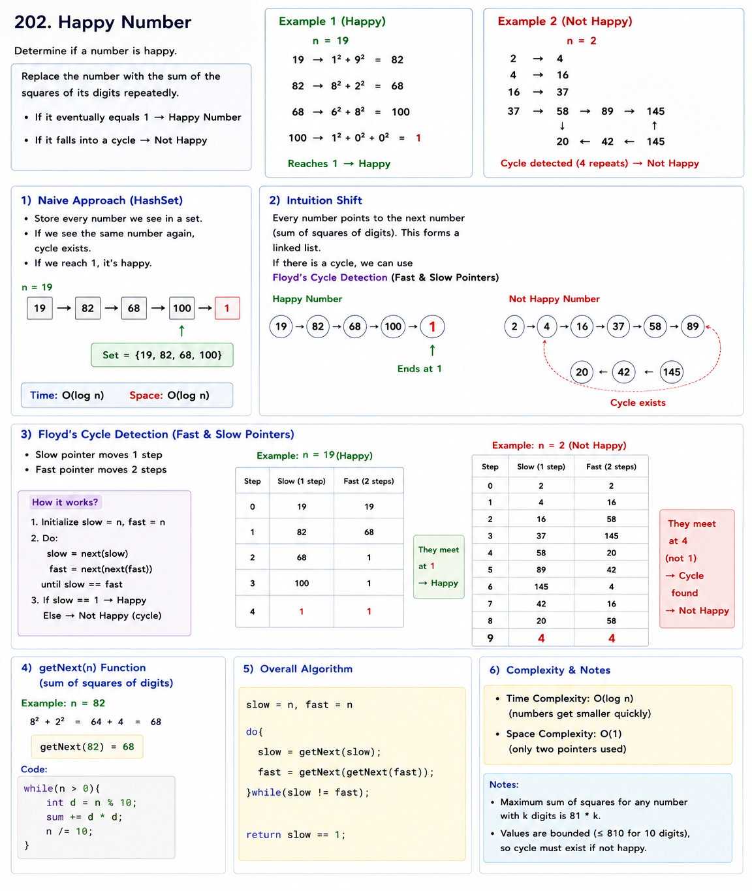

# Happy Number

https://youtu.be/LkD0D0Xy-ro?si=yjlOJ6vnr3vVuMPE



```cpp
#include <bits/stdc++.h>
using namespace std;

class Solution {
public:

    int getNext(int n) {
        int sum = 0;

        while (n > 0) {
            int digit = n % 10;
            sum += digit * digit;
            n /= 10;
        }

        return sum;
    }

    bool isHappy(int n) {

        int slow = n;
        int fast = n;

        do {
            slow = getNext(slow);

            fast = getNext(getNext(fast));

        } while (slow != fast);

        return slow == 1;
    }
};

```

# LC 287. Find the Duplicate Number

https://youtu.be/49HrEGt6D2s?si=6N7SzaojEpTl8t63

**Pattern:** Floyd Cycle Detection (Fast & Slow Pointers)

This is one of the most famous interview problems because:

```text
Looks like an array problem

Actually solved as a Linked List Cycle problem
```

---

# 1. Core Pattern Recognition

Problem:

```text
Given n+1 integers

Numbers are in range [1,n]

Exactly one number appears more than once.

Find that duplicate.

Without modifying array.
O(1) extra space.
```

Example:

```text
nums = [1,3,4,2,2]

Output = 2
```

---

## Clues

Whenever you see:

```text
n+1 numbers

values between 1 and n

one duplicate

cannot modify array

constant extra space
```

Think:

```text
There must be a cycle hidden somewhere.
```

---

# 2. Naive Starting Point

### Method 1: HashSet

```cpp
seen = {}

for num:
    if already exists:
        return num
```

Time:

```text
O(N)
```

Space:

```text
O(N)
```

Not allowed.

---

### Method 2: Sort

```text
Sort array

Check adjacent elements
```

Time:

```text
O(N log N)
```

Also modifies array.

Not allowed.

---

# 3. Intuition Shift (The Aha Moment)

This is the hardest part.

---

## Treat Array as a Linked List

Given:

```text
nums = [1,3,4,2,2]
```

Indices:

```text
0 1 2 3 4
```

Values:

```text
1 3 4 2 2
```

Interpret as:

```text
index -> value
```

So:

```text
0 → 1
1 → 3
3 → 2
2 → 4
4 → 2
```

Visual:

```text
0
↓
1
↓
3
↓
2
↓
4
↑  ↓
└──┘
```

---

Notice:

```text
2 appears twice
```

because:

```text
3 → 2
4 → 2
```

Two arrows enter node 2.

That creates a cycle.

---

## Why Duplicate Creates Cycle?

Problem guarantees:

```text
n+1 nodes
n possible values
```

Pigeonhole Principle:

```text
At least one value must repeat.
```

Repeated value means:

```text
Two indices point to same node.
```

Eventually:

```text
A cycle forms.
```

---

# Visual Example

Array:

```text
[3,1,3,4,2]
```

Interpretation:

```text
0 → 3
3 → 4
4 → 2
2 → 3
```

Cycle:

```text
3 → 4
↑   ↓
2 ←─┘
```

Duplicate:

```text
3
```

---

# 4. Floyd Cycle Detection

Exactly same as LC 141.

---

## Phase 1: Find Meeting Point

Initialize:

```text
slow = nums[0]
fast = nums[0]
```

Move:

```text
slow = nums[slow]

fast = nums[nums[fast]]
```

Eventually:

```text
slow == fast
```

inside cycle.

---

## Phase 2: Find Entrance of Cycle

Now:

```text
slow = nums[0]

fast stays where they met
```

Move both:

```text
slow = nums[slow]
fast = nums[fast]
```

one step each.

Where they meet:

```text
= duplicate number
```

---

# Why Phase 2 Works?

Exactly same proof as:

```text
Linked List Cycle II
```

The entrance of cycle is the duplicate value.

---

# Dry Run

Example:

```text
nums = [1,3,4,2,2]
```

---

### Phase 1

Start:

```text
slow = 1
fast = 1
```

---

Move:

```text
slow = nums[1] = 3

fast = nums[nums[1]]
     = nums[3]
     = 2
```

---

Move:

```text
slow = nums[3] = 2

fast = nums[nums[2]]
     = nums[4]
     = 2
```

Meet:

```text
slow = 2
fast = 2
```

---

### Phase 2

Reset:

```text
slow = nums[0] = 1

fast = 2
```

---

Move:

```text
slow = nums[1] = 3

fast = nums[2] = 4
```

---

Move:

```text
slow = nums[3] = 2

fast = nums[4] = 2
```

Meet:

```text
2
```

Answer:

```text
Duplicate = 2
```

---

# 5. Edge Cases

### Smallest Case

```text
[1,1]
```

Answer:

```text
1
```

---

### Duplicate Repeated Many Times

```text
[2,2,2,2,2]
```

Still works.

---

### Duplicate Near End

```text
[1,4,3,2,4]
```

Works.

---

# Complexity

Time:

```text
O(N)
```

Phase 1:

```text
O(N)
```

Phase 2:

```text
O(N)
```

Total:

```text
O(N)
```

---

Space:

```text
O(1)
```

No extra data structures.

---

# C++ Code (Student Style)

```cpp
#include <bits/stdc++.h>
using namespace std;

class Solution {
public:
    int findDuplicate(vector<int>& nums) {

        int slow = nums[0];
        int fast = nums[0];

        // Phase 1: Find meeting point
        do {
            slow = nums[slow];
            fast = nums[nums[fast]];
        } while (slow != fast);

        // Phase 2: Find cycle entrance
        slow = nums[0];

        while (slow != fast) {
            slow = nums[slow];
            fast = nums[fast];
        }

        return slow;
    }
};
```

---
