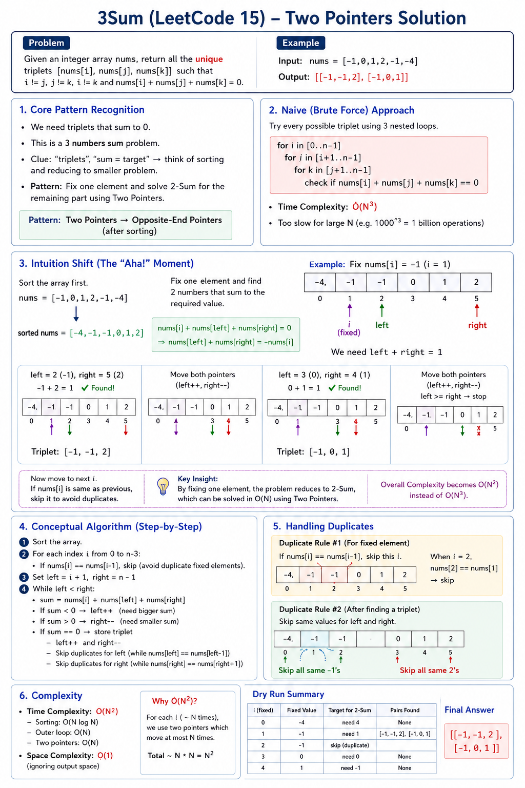
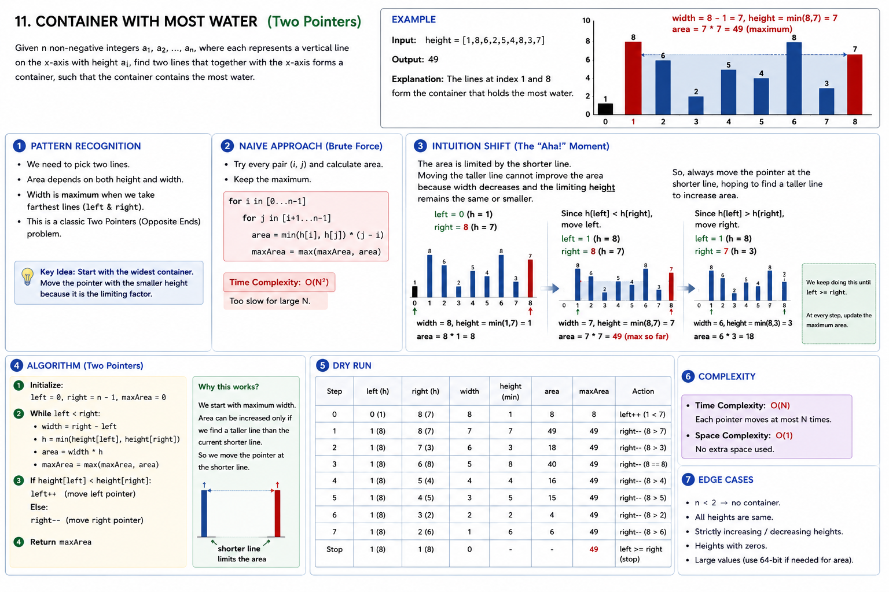

## Problem: Two Sum — Two Pointers Version

Usually this means:

> Given a sorted array and a target, find two numbers whose sum equals target.

Example:

```text
nums = [2, 7, 11, 15], target = 9
answer = 2 + 7
```

---

## 1. Core Pattern Recognition

This fits **Two Pointers → Opposite-end pointer**.

### Clues in the problem

You should think of two pointers when you see:

```text
sorted array
find pair
sum equals target
two numbers
left + right comparison
```

The biggest clue is:

```text
Array is sorted
```

Because sorted order gives direction.

If sum is too small, move left forward.
If sum is too large, move right backward.

---

## 2. Naive Starting Point

Brute force idea:

```text
Check every pair.
```

For each `i`, try every `j`.

Example:

```text
2 + 7
2 + 11
2 + 15
7 + 11
7 + 15
11 + 15
```

Problem:

```text
O(N^2)
```

It repeats too much work because it does not use sorted order.

---

## 3. Intuition Shift

Array:

```text
[2, 7, 11, 15], target = 9
```

Start:

```text
left = 0  -> 2
right = 3 -> 15
sum = 17
```

17 is too big.

Because array is sorted, `15` is already the largest number.
So pairing `15` with anything after `2` will also be too big.

So we safely move:

```text
right--
```

Now:

```text
left = 0  -> 2
right = 1 -> 7
sum = 9
```

Found answer.

The aha moment:

```text
Sorted array lets us eliminate many pairs at once.
```

---

## 4. Conceptual Algorithm

```text
left = 0
right = n - 1

while left < right:
    sum = nums[left] + nums[right]

    if sum == target:
        answer found

    else if sum < target:
        left++

    else:
        right--
```

Why?

```text
sum too small  -> need bigger number -> move left forward
sum too large -> need smaller number -> move right backward
```

---

## 5. Edge Cases & Complexity

Edge cases:

```text
array size less than 2
negative numbers
duplicate values
no valid pair
target very small or very large
```

Complexity:

```text
Time: O(N)
Space: O(1)
```

Because each pointer moves at most `N` times.

---

## C++ Code — Student Style

For sorted array:

```cpp
#include <bits/stdc++.h>
using namespace std;

vector<int> twoSum(vector<int>& nums, int target) {
    int left = 0;
    int right = nums.size() - 1;

    while (left < right) {
        int sum = nums[left] + nums[right];

        if (sum == target) {
            return {left, right};
        }
        else if (sum < target) {
            left++;
        }
        else {
            right--;
        }
    }

    return {-1, -1};
}
```

Note: LeetCode **1. Two Sum** original array is not sorted, so hash map is usually used. Two-pointer version applies when array is sorted, like **167. Two Sum II - Input Array Is Sorted**.

# LC 15. 3Sum



**Pattern:** Two Pointers -> Opposite-End Pointers

Core idea:

```text
Sort the array.
Fix one number.
Use two pointers to find the remaining pair.
Skip duplicates so each triplet appears once.
```

---

## 1. Core Pattern Recognition

Problem:

```text
Find all unique triplets:
nums[i] + nums[left] + nums[right] == 0
```

Clues:

```text
triplets
unique combinations
sum equals target
array order does not matter
```

Think:

```text
Sort
Fix one element
Run Two Sum on the remaining suffix
```

---

## 2. Naive Starting Point

Brute force:

```text
Try every i, j, k triplet.
Store valid triplets in a set to remove duplicates.
```

Problem:

```text
Time: O(N^3)
```

It does not use sorted order and repeatedly checks combinations that can be skipped.

---

## 3. Intuition Shift

After sorting, fixing `nums[i]` turns the problem into:

```text
Find two numbers in nums[i+1 ... n-1]
whose sum is -nums[i]
```

Example:

```text
nums = [-1, 0, 1, 2, -1, -4]
sorted = [-4, -1, -1, 0, 1, 2]
```

Fix:

```text
i = 1 -> nums[i] = -1
target pair sum = 1
left = 2 -> -1
right = 5 -> 2
sum = -1 + 2 = 1
```

Triplet found:

```text
[-1, -1, 2]
```

Aha moment:

```text
Sorted order tells us whether to move left or right,
and duplicate skipping keeps the answer unique.
```

---

## 4. Conceptual Algorithm

```text
sort nums

for i from 0 to n-3:
    if nums[i] is same as previous:
        skip it

    left = i + 1
    right = n - 1

    while left < right:
        sum = nums[i] + nums[left] + nums[right]

        if sum == 0:
            store triplet
            left++
            right--
            skip duplicate left values
            skip duplicate right values

        else if sum < 0:
            left++

        else:
            right--
```

Pointer logic:

```text
sum too small -> need bigger value -> left++
sum too large -> need smaller value -> right--
```

---

## 5. Edge Cases & Complexity

Edge cases:

```text
less than 3 numbers
all zeros
duplicate values
no valid triplet
negative and positive mix
```

Complexity:

```text
Time: O(N^2)
Space: O(1), ignoring output
```

---

## C++ Code - Student Style

```cpp
#include <bits/stdc++.h>
using namespace std;

class Solution {
public:
    vector<vector<int>> threeSum(vector<int>& nums) {
        vector<vector<int>> ans;
        int n = nums.size();

        sort(nums.begin(), nums.end());

        for (int i = 0; i < n - 2; i++) {
            if (i > 0 && nums[i] == nums[i - 1]) {
                continue;
            }

            int left = i + 1;
            int right = n - 1;

            while (left < right) {
                int sum = nums[i] + nums[left] + nums[right];

                if (sum == 0) {
                    ans.push_back({nums[i], nums[left], nums[right]});

                    left++;
                    right--;

                    while (left < right && nums[left] == nums[left - 1]) {
                        left++;
                    }

                    while (left < right && nums[right] == nums[right + 1]) {
                        right--;
                    }
                }
                else if (sum < 0) {
                    left++;
                }
                else {
                    right--;
                }
            }
        }

        return ans;
    }
};
```

Interview recall line:

```text
3Sum = sort + fix one number + two-pointer 2Sum + skip duplicates.
```

---

## 1. Core Pattern Recognition

**3Sum Closest** fits perfectly into the **Opposite-End Pointer** (or Two-Pointer Convergence) subpattern, usually executed after sorting the array.

### The Clues & Keywords:

- **"Three numbers" / "Triplets":** Whenever a problem asks for a combination of 2, 3, or 4 elements to meet a condition, a nested loops approach can often be optimized by fixing one or more elements and using pointers for the rest.
- **"Closest to target":** This implies a optimization/distance problem. To efficiently find something "closest" without checking every single combination, we need a way to look at a sum and know whether to make our next guess _larger_ or _smaller_.
- **No order constraint on indices:** The problem asks for the sum of the values, not their original indices. This is the ultimate green light that we can **sort the array** first without breaking the problem requirements.

---

## 2. The "Naive" Starting Point

The most straightforward brute-force approach is to generate every possible triplet using three nested loops.

```text
For i from 0 to n-3:
    For j from i+1 to n-2:
        For k from j+1 to n-1:
            Calculate sum = nums[i] + nums[j] + nums[k]
            If |sum - target| < |closest_sum - target|, update closest_sum

```

### Why it is inefficient & where it does redundant work:

- **Complexity:** It takes $O(N^3)$ time complexity. If $N = 1000$, $N^3$ is 1 billion operations, which will cause a Time Limit Exceeded (TLE) error.
- **Redundant Work:** The brute force approach is completely blind. Imagine the array is sorted: `[1, 2, 3, 10, 20]`, and your target is `7`. If your loops pick `1`, `2`, and `20` (sum = 23), a smart algorithm would realize, _"Wow, 23 is way too big. Since the array is sorted, replacing 20 with 10 will bring me closer."_ The brute force approach doesn't do this; it will stubbornly keep testing `1, 3, 20` anyway, wasting time on combinations that are guaranteed to be worse.

---

## 3. The Intuition Shift

The "Aha!" moment comes from **sorting the array** and utilizing the property of ordered numbers to guide our search.

Instead of guessing blindly, what if we fix **one** number (let's call it `nums[i]`), and then turn the remaining problem into a modified **2Sum** problem?

### The Visual Shift (Example):

Let's take `nums = [-1, 2, 1, -4]`, `target = 1`.
First, we **sort** it: `[-4, -1, 1, 2]`.

Fix the first element: `i = 0` (`nums[i] = -4`).
Now, we need two other numbers from the remaining elements `[-1, 1, 2]` to get as close to our remaining target as possible.

We place our two pointers at the **opposite ends** of the remaining array:

- `left` pointer at `-1`
- `right` pointer at `2`
- **Current Sum:** $-4 + (-1) + 2 = -3$.
- **Is it the closest so far?** Yes, distance to target `1` is $|-3 - 1| = 4$.
- **The Decision:** Our sum ($-3$) is _less than_ our target ($1$). Because the array is sorted, if we want a bigger sum to get closer to $1$, moving the `right` pointer inward will only make the sum _smaller_ (bad). Therefore, we **must move the `left` pointer to the right** to increase our sum.

By moving `left`, we skipped checking combinations that we mathematically knew would be too small. This turns an $O(N^2)$ search for the remaining two numbers into a linear $O(N)$ sweep.

---

## 4. Conceptual Algorithm (No Code)

Here is how the optimized algorithm flows:

1. **Sort** the input array in ascending order.
2. Initialize a variable `closest_sum` with a large dummy value (or the sum of the first three elements).
3. Loop through the array from `i = 0` to `n - 3`. This `nums[i]` represents our fixed first element.
4. For each `i`, set up two pointers:

- `left = i + 1`
- `right = nums.size() - 1`

5. While `left < right`:

- Calculate the `current_sum = nums[i] + nums[left] + nums[right]`.
- If `current_sum` is exactly equal to `target`, return `current_sum` immediately (you can't get any closer than a distance of 0!).
- If the absolute difference `|current_sum - target|` is smaller than `|closest_sum - target|`, update `closest_sum = current_sum`.
- **Move the pointers:**
- If `current_sum < target`, we need a larger value, so increment `left++`.
- If `current_sum > target`, we need a smaller value, so decrement `right--`.

6. Return `closest_sum` after all loops finish.

---

## 5. Edge Cases & Complexity

### Edge Cases to watch out for:

- **Array size is exactly 3:** The loops should safely handle this and return the sum of those 3 numbers.
- **Negative numbers/targets:** Your distance calculation must use absolute values (`abs()`) to correctly handle negative sums and targets.
- **Multiple closest values:** (e.g., target is 2, sums could be 1 or 3). The condition `|current_sum - target| < |closest_sum - target|` naturally handles this by keeping the first one it encounters unless a strictly closer one appears.

### Complexity Targets:

- **Time Complexity:** $O(N^2)$. Sorting takes $O(N \log N)$. The outer loop runs $N$ times, and the inner two-pointer sweep takes $O(N)$ time. $O(N \log N) + O(N^2) = O(N^2)$.
- **Space Complexity:** $O(1)$ to $O(N)$ depending on the implementation of the sorting algorithm in C++ (`std::sort` typically takes $O(\log N)$ auxiliary space for the recursive call stack).

---

## The C++ Implementation

Here is how a clean, interview-ready student solution looks:

```cpp
#include <vector>
#include <algorithm>
#include <cmath>
#include <climits>

class Solution {
public:
    int threeSumClosest(std::vector<int>& nums, int target) {
        int n = nums.size();
        // Step 1: Sort the array to enable the two-pointer approach
        std::sort(nums.begin(), nums.end());

        // Initialize closest_sum with the first possible triplet sum
        int closest_sum = nums[0] + nums[1] + nums[2];

        // Step 2: Fix the first element one by one
        for (int i = 0; i < n - 2; ++i) {
            // Optimization: Skip duplicate values for the fixed element to avoid redundant calculations
            if (i > 0 && nums[i] == nums[i - 1]) continue;

            int left = i + 1;
            int right = n - 1;

            // Step 3: Two-pointer convergence
            while (left < right) {
                int current_sum = nums[i] + nums[left] + nums[right];

                // If we found the exact target, no need to look further
                if (current_sum == target) {
                    return current_sum;
                }

                // Update closest_sum if the current triplet is closer to the target
                if (std::abs(current_sum - target) < std::abs(closest_sum - target)) {
                    closest_sum = current_sum;
                }

                // Adjust pointers based on the comparison with target
                if (current_sum < target) {
                    left++;
                } else {
                    right--;
                }
            }
        }

        return closest_sum;
    }
};

```

# LC 18. 4Sum

**Pattern:** Two Pointers → Opposite-End Pointers
**Core idea:**

```text
Fix 2 numbers
+
Solve remaining 2-Sum using two pointers
```

---

## 1. Core Pattern Recognition

Problem:

```text
Find all unique quadruplets:
nums[a] + nums[b] + nums[c] + nums[d] == target
```

Clues:

```text
4 numbers
quadruplets
sum equals target
unique answers
```

Think:

```text
Sort
Fix first number
Fix second number
Use two pointers for remaining two numbers
```

4Sum is just an extension of 3Sum.

---

## 2. Naive Starting Point

Brute force:

```text
For i from 0 to n-4:
    For j from i+1 to n-3:
        For k from j+1 to n-2:
            For l from k+1 to n-1:
                If nums[i] + nums[j] + nums[k] + nums[l] == target:
                    Add to a Set (to handle duplicates)
```

Check every quadruplet.

Time:

```text
O(N^4)
```

Very slow.

Redundant work:

```text
It keeps checking combinations without using sorted order.
It also creates duplicate quadruplets again and again.
```

---

## 3. Intuition Shift

Suppose:

```text
nums = [1,0,-1,0,-2,2]
target = 0
```

Sort:

```text
[-2,-1,0,0,1,2]
```

Fix first number:

```text
-2
```

Fix second number:

```text
-1
```

Now problem becomes:

```text
Need two numbers whose sum = 3
```

Because:

```text
target - (-2) - (-1) = 3
```

Remaining part:

```text
[0,0,1,2]
```

Use two pointers:

```text
left = 0
right = 2

0 + 2 = 2
```

Too small, move left.

Then:

```text
1 + 2 = 3
```

Found:

```text
[-2,-1,1,2]
```

Aha moment:

```text
4Sum = fix 2 numbers + Two Sum
```

---

## 4. Conceptual Algorithm

```text
sort nums

for i from 0 to n-4:
    skip duplicate i

    for j from i+1 to n-3:
        skip duplicate j

        left = j+1
        right = n-1

        while left < right:
            sum = nums[i] + nums[j] + nums[left] + nums[right]

            if sum == target:
                store quadruplet
                move left and right
                skip duplicate left and right

            else if sum < target:
                left++

            else:
                right--
```

Pointer logic:

```text
sum too small  -> need bigger value -> left++
sum too large -> need smaller value -> right--
```

---

## 5. Edge Cases & Complexity

Important edge cases:

```text
nums size < 4
duplicate values
all zeros
negative numbers
large integer values
no valid quadruplet
```

Complexity:

```text
Sorting: O(N log N)
Main loops + two pointers: O(N^3)

Total Time: O(N^3)
Space: O(1), ignoring output
```

---

## C++ Code — Student Style

```cpp
#include <bits/stdc++.h>
using namespace std;

class Solution {
public:
    vector<vector<int>> fourSum(vector<int>& nums, int target) {
        vector<vector<int>> ans;
        int n = nums.size();

        sort(nums.begin(), nums.end());

        for (int i = 0; i < n - 3; i++) {

            if (i > 0 && nums[i] == nums[i - 1]) {
                continue;
            }

            for (int j = i + 1; j < n - 2; j++) {

                if (j > i + 1 && nums[j] == nums[j - 1]) {
                    continue;
                }

                int left = j + 1;
                int right = n - 1;

                while (left < right) {
                    long long sum = 0;
                    sum += nums[i];
                    sum += nums[j];
                    sum += nums[left];
                    sum += nums[right];

                    if (sum == target) {
                        ans.push_back({nums[i], nums[j], nums[left], nums[right]});

                        left++;
                        right--;

                        while (left < right && nums[left] == nums[left - 1]) {
                            left++;
                        }

                        while (left < right && nums[right] == nums[right + 1]) {
                            right--;
                        }
                    }
                    else if (sum < target) {
                        left++;
                    }
                    else {
                        right--;
                    }
                }
            }
        }

        return ans;
    }
};
```

Key interview line:

```text
Use long long for sum because nums[i] can be large and integer overflow may happen.
```

# LC 11. Container With Most Water


**Pattern:** Two Pointers → Opposite-End Pointers

Core idea:

```text
Start from widest container.
Move the pointer with smaller height.
```

---

## 1. Core Pattern Recognition

Problem:

```text
Given heights of vertical lines, choose two lines that hold the most water.
```

Area formula:

```text
area = min(height[left], height[right]) * (right - left)
```

Clues:

```text
two boundaries
maximize area
left and right lines
width depends on distance
array of heights
```

This strongly suggests:

```text
left pointer at start
right pointer at end
```

---

## 2. Naive Starting Point

Brute force:

```text
Try every pair of lines.
```

For each pair:

```text
area = min(height[i], height[j]) * (j - i)
```

Time:

```text
O(N²)
```

Problem:

```text
It checks many pairs even when we already know some cannot give better area.
```

---

## 3. Intuition Shift

Example:

```text
height = [1,8,6,2,5,4,8,3,7]
```

Start:

```text
left = 0  height = 1
right = 8 height = 7
width = 8
area = min(1,7) * 8 = 8
```

Now which pointer should move?

The area is limited by the smaller wall:

```text
min(1,7) = 1
```

If we move the taller wall `7`, width decreases and smaller height is still `1`.

So it cannot help.

Therefore move the smaller wall: may be we get a big height than Area containerd can increase (Greedy choice )

```text
left++
```

Aha moment:

```text
Water is always limited by the shorter wall.
To possibly improve area, move the shorter wall and search for a taller one.
```

---

## 4. Conceptual Algorithm

```text
left = 0
right = n - 1
maxArea = 0

while left < right:
    width = right - left
    height = min(height[left], height[right])
    area = width * height

    update maxArea

    if height[left] < height[right]:
        left++
    else:
        right--
```

Why this works:

```text
Width always decreases.
So the only way to get a bigger area is to find a taller minimum height.
That is why we move the smaller height pointer.
```

---

## 5. Edge Cases & Complexity

Edge cases:

```text
only two lines
all heights same
strictly increasing heights
strictly decreasing heights
very small heights
very large heights
```

Complexity:

```text
Time: O(N)
Space: O(1)
```

Each pointer moves inward at most `N` times.

---

## C++ Code — Student Style

```cpp
#include <bits/stdc++.h>
using namespace std;

class Solution {
public:
    int maxArea(vector<int>& height) {
        int left = 0;
        int right = height.size() - 1;

        int maxWater = 0;

        while (left < right) {
            int width = right - left;
            int h = min(height[left], height[right]);
            int area = width * h;

            maxWater = max(maxWater, area);

            if (height[left] < height[right]) {
                left++;
            }
            else {
                right--;
            }
        }

        return maxWater;
    }
};
```

Interview one-line intuition:

```text
Move the shorter wall because the shorter wall limits the water.
```

## Trapping Rainwater

Inituition and Logic:

```cpp
#include <bits/stdc++.h>
using namespace std;

class Solution {
public:
    int trap(vector<int>& height) {
        int n = height.size();

        if (n < 3) {
            return 0;
        }

        int left = 0;
        int right = n - 1;

        int leftMax = 0;
        int rightMax = 0;

        int water = 0;

        while (left < right) {
            if (height[left] < height[right]) {
                if (height[left] >= leftMax) {
                    leftMax = height[left];
                }
                else {
                    water += leftMax - height[left];
                }

                left++;
            }
            else {
                if (height[right] >= rightMax) {
                    rightMax = height[right];
                }
                else {
                    water += rightMax - height[right];
                }

                right--;
            }
        }

        return water;
    }
};

```
